# Banco de questões do 6º ano - OMU

70 questões. O texto abaixo é extraído automaticamente e inclui respostas/resoluções. Consulte os recortes para figuras, tabelas e notação matemática.

## OMU26-6ANO-Q01
Edição: 26ª | Publicação: 2025 | Páginas: 34

1) No período de 2018 até 2023, uma indústria produziu quantidades diferentes de
geladeiras conforme o gráfico a seguir.
Com as informações do gráfico e sabendo que nos anos seguintes continuará com o
mesmo padrão de crescimento, quantas geladeiras serão produzidas no ano de 2028?
Resposta:
Sara de Mello Hamerski e Frederico de Almeida Genezini
Colégio Sinodal Gustavo Adolfo - Lajeado

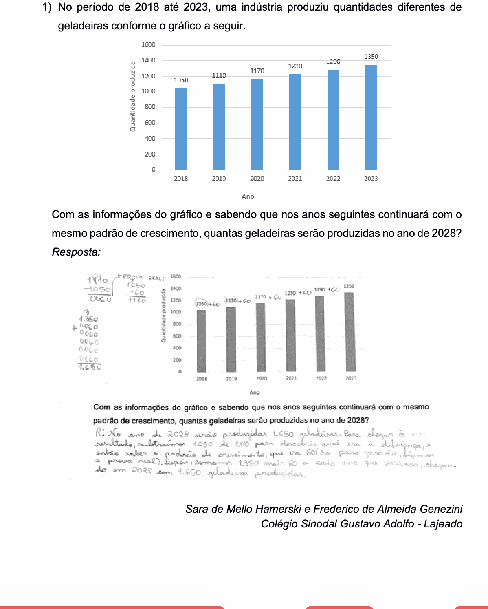

## OMU26-6ANO-Q02
Edição: 26ª | Publicação: 2025 | Páginas: 35, 36

2) Marli tem três copos, um pequeno, um médio e um grande. Com o copo pequeno cheio
ela consegue encher do copo médio. Se usar o copo médio cheio, ela conseguirá
3
encher do copo gra7nde. Marli enche um copo pequeno e um médio e coloca tudo
7
no copo1 0grande. O que acontecerá no copo grande?
A) Ele vai transbordar.
B) Ele ficará totalmente cheio.
C) Ele ficará preenchido de sua capacidade.
10
D) Ele ficará preenchido 17 de sua capacidade.
7
E) Ele ficará preenchido 10 de sua capacidade.
4
Resposta: 7

Felipe Augusto Calsing e Bruno Zanoni Belmonte
Colégio Sinodal Gustavo Adolfo - Lajeado

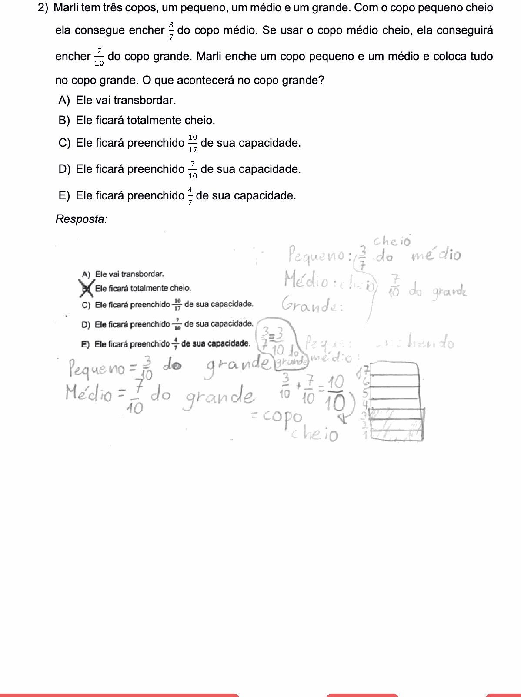
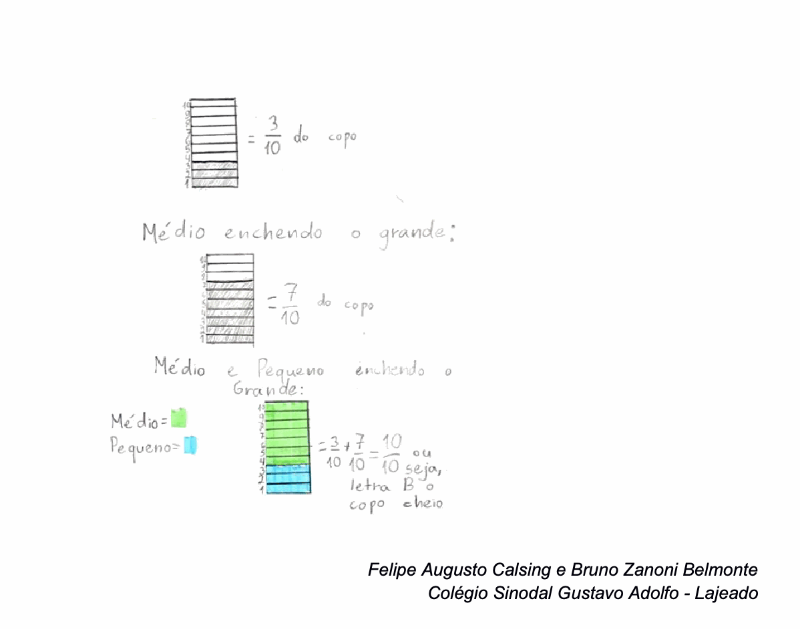

## OMU26-6ANO-Q03
Edição: 26ª | Publicação: 2025 | Páginas: 36

3) Marlene desenhou dentro de um quadrado os seguintes quadrados menores: um
quadrado com área de 16cm2, cinco quadrados com 4 cm2 de área cada um; treze
quadrados de 1 cm2 de área cada um. Verificou que desta forma não sobrou nenhum
espaço no quadrado desenhado inicialmente. Quanto mede o lado do primeiro
quadrado desenhado por Marlene?
Resposta:
Nicolas L Warken e Pedro Augusto Zanotelli
Colégio Bom Jesus São Miguel – Arroio do Meio

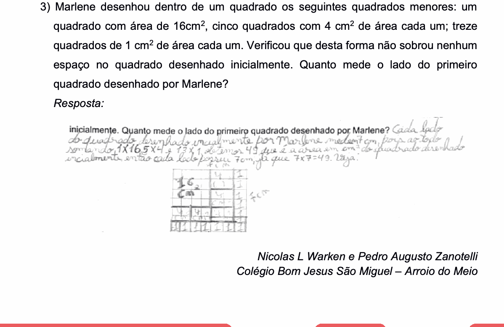

## OMU26-6ANO-Q04
Edição: 26ª | Publicação: 2025 | Páginas: 37

4) Célia estava brincando de somar números de dois algarismos, ambos diferentes de
zero. Esses números tinham os mesmos 2 algarismos, mas de ordem trocada, assim
chamou-os de números contrários. Por exemplo, somou 28 e 82 encontrando 110.
Qual dos números a seguir não pode ser a soma de dois números contrários?
A) 99
B) 77
C) 66
D) 181
E) 165
Resposta:
Helena M Gotze e Lara L Oliveira
Colégio Teutônia - Teutônia

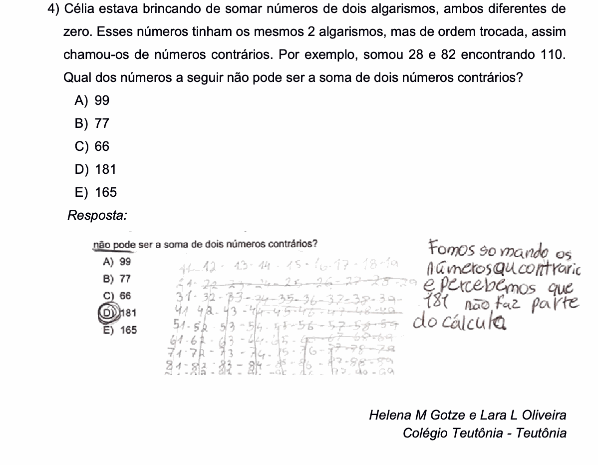

## OMU26-6ANO-Q05
Edição: 26ª | Publicação: 2025 | Páginas: 37

5) Marina foi ao supermercado e observou que o valor de meio quilo de queijo mussarela
custava R$28,90. Ela comprou 150 gramas desse queijo. Quanto ela pagou por sua
compra?
Resposta:
Bruno Dutra e Augusto Rafael B Rohrig
Colégio Teutônia - Teutônia

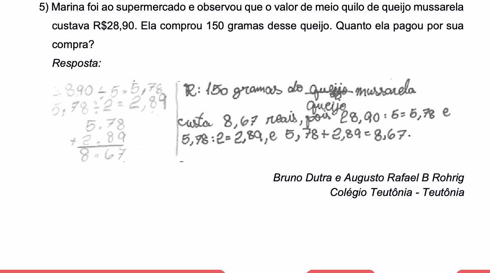

## OMU26-6ANO-Q06
Edição: 26ª | Publicação: 2025 | Páginas: 38

6) Observe as seguintes operações:
0 # 7 = 7
1 # 8 = 16
3 # 12 = 48
Seguindo o mesmo padrão, qual é o valor de 5 # 17 = _____
Resposta:
Valentina Lagemann Chilanti e Arthur Cima
Colégio Evangélico Alberto Torres - Lajeado

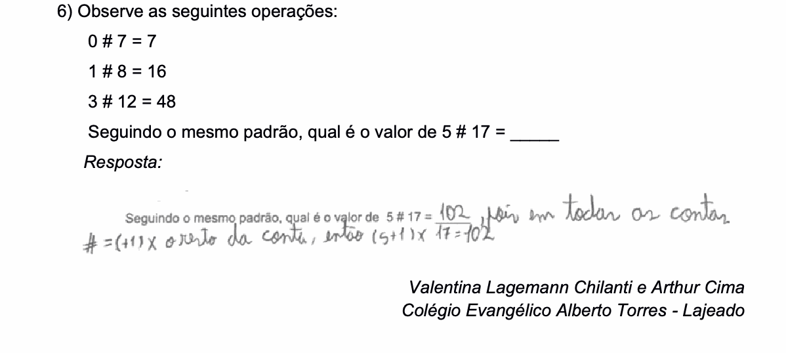

## OMU26-6ANO-Q07
Edição: 26ª | Publicação: 2025 | Páginas: 38, 39

7) Carla visualizou duas pilhas de vasos conforme figura a seguir.
Ela sabe que os vasos são todos do mesmo tamanho e possuem borda idêntica. Dessa
forma qual é a altura de cada um dos vasos?
Resposta:

Felipe Augusto Calsing e Bruno Zanoni Belmonte
Colégio Sinodal Gustavo Adolfo - Lajeado

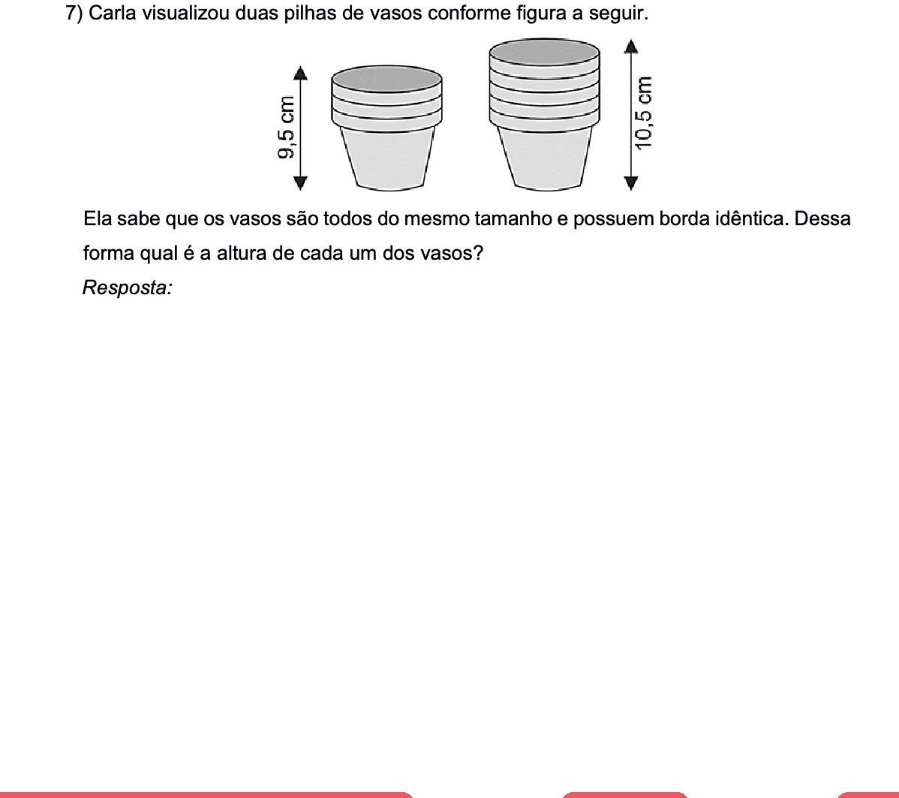
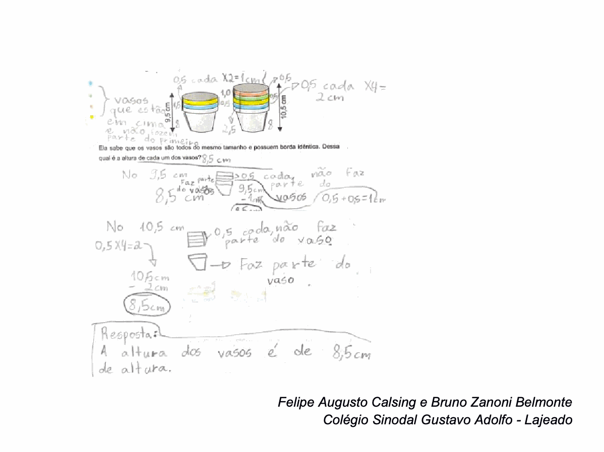

## OMU26-6ANO-Q08
Edição: 26ª | Publicação: 2025 | Páginas: 39, 40

8) No quadro abaixo, foram escritos alguns números naturais, de zero a nove, de tal
forma que a soma dos números de cada coluna é um múltiplo de cinco e a soma dos
números de cada linha é um múltiplo de três.
a 3 5
b 2 3
4 0 2
Com essas informações, qual o valor de a e de b?
a = ____ b = _____
Resposta:

Maria Clara Biasibetti Kehl e Rafaela Gaio Dorigon
Colégio Bom Jesus São Miguel – Arroio do Meio

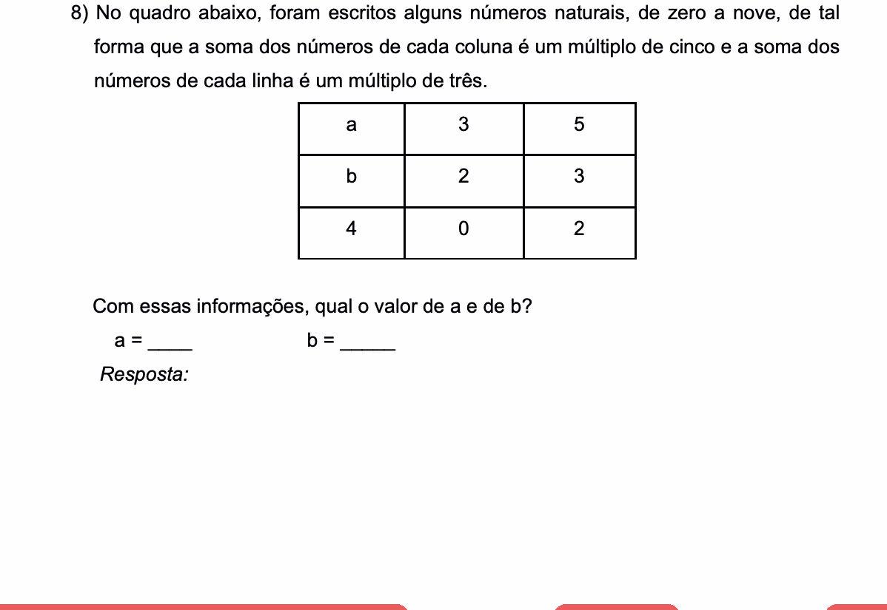
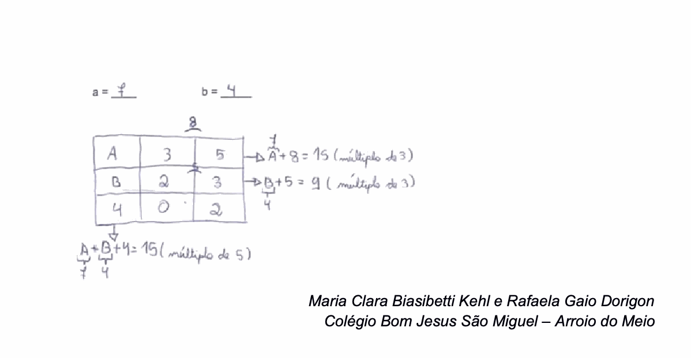

## OMU26-6ANO-Q09
Edição: 26ª | Publicação: 2025 | Páginas: 40

9) Três amigos (Carlos, Eduarda e Lucas) se reuniram e combinaram de comprar uma
pizza. Cada um deles contribuiu com o valor que tinha no bolso. Assim, Carlos
contribuiu com R$9,00, Eduarda com R$15,00 e Lucas com R$21,00. Sabe-se que a
pizza foi toda consumida e que foi dividida proporcionalmente ao valor que cada um
contribuiu. Dessa forma, que fração da pizza coube a cada um dos três amigos?
A) Carlos , Eduarda , Lucas
1 3 1
B) Carlos 3, Eduarda 5, Lucas 4
1 1 7
C) Carlos 5, Eduarda 3, Lucas 15
1 1 1
D) Carlos 5, Eduarda 3, Lucas 2
1 1 2
E) Carlos 6, Eduarda 4, Lucas 5
1 1 2
Resposta: 8 4 6
Rafael Kunrath de Almeida e Luiza Soares Trapp
Colégio Sinodal Conventos - Lajeado

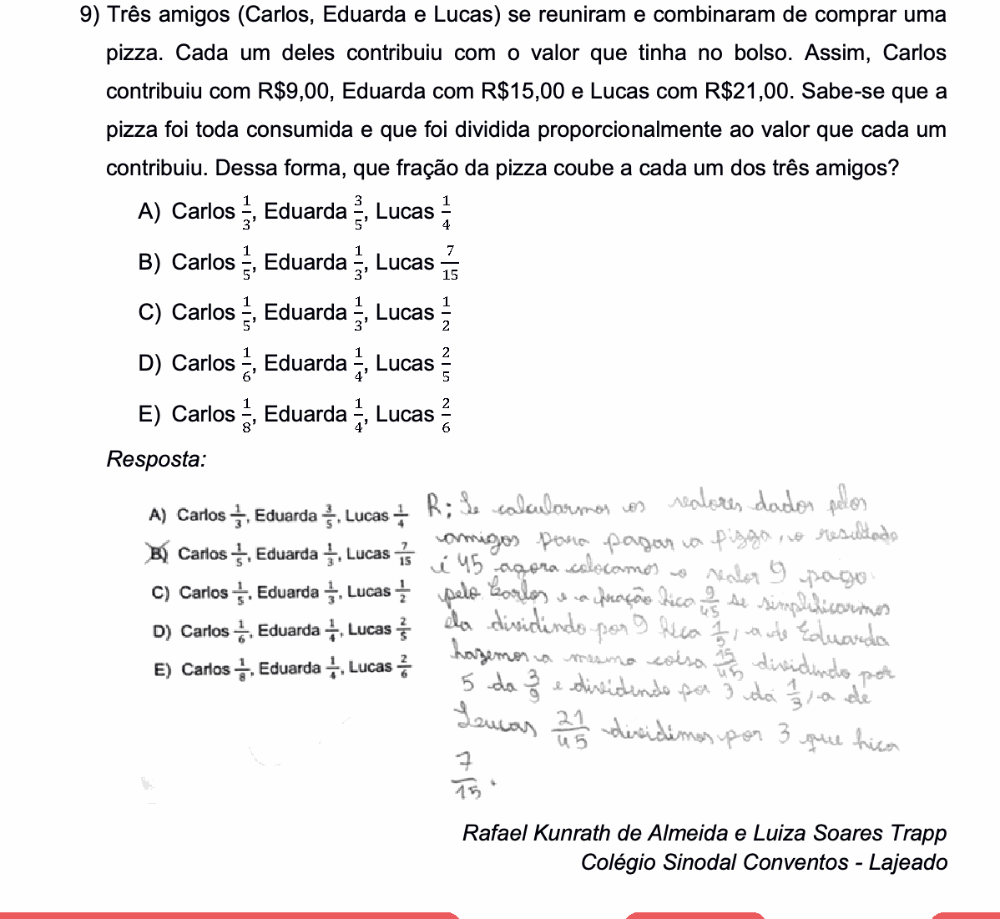

## OMU26-6ANO-Q10
Edição: 26ª | Publicação: 2025 | Páginas: 41

10) José Luís costumava dar 5 voltas ao redor de uma praça quadrada, partindo do ponto
P e em direção da seta, conforme mostra a figura abaixo. Certo dia, ele encontrou sua
namorada e parou para conversar. Neste momento, ele já havia completado do total
3
do percurso para completar as 5 voltas. Escreva a letra da figura que7 indica,
aproximadamente, o local em que José Luís parou para conversar com sua namorada.
Resposta:
Pedro B Webel e Vicente Ângelo Domenich
Colégio Evangélico Alberto Torres - Lajeado

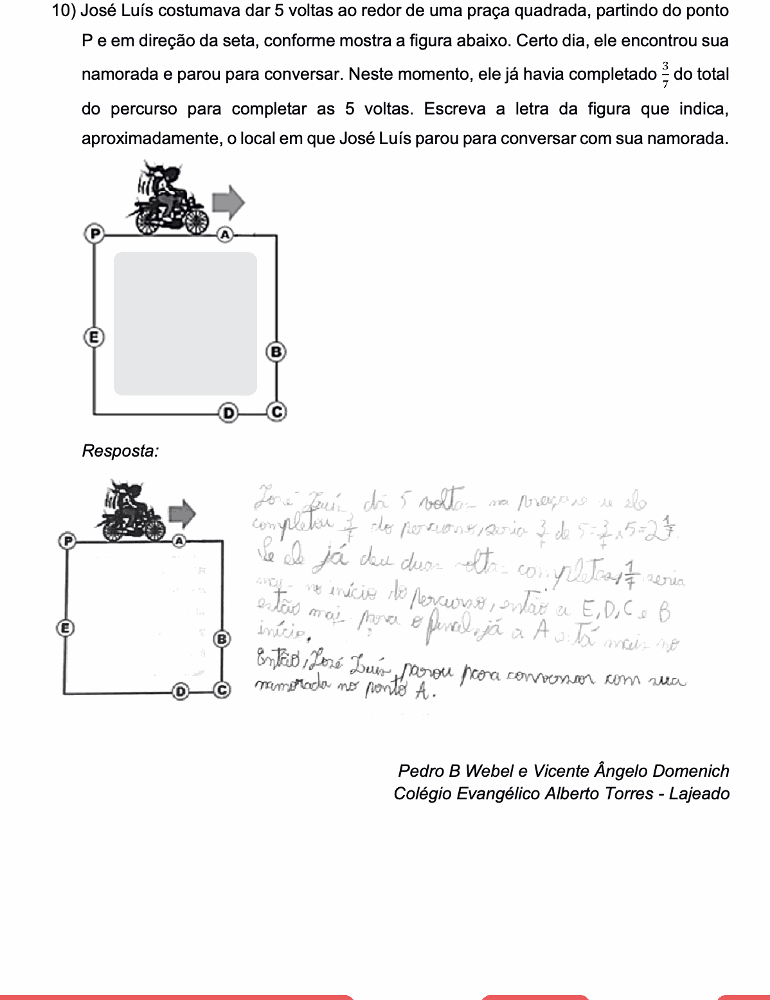

## OMU22-6ANO-Q01
Edição: 22ª | Publicação: 2020 | Páginas: 32

1) O pedreiro está decorando de azulejos pretos e cinzas a parede do banheiro,
conforme o desenho que segue.
4ª fila
3ª fila
2ª fila
1ª fila
O desenho inteiro tem dez filas de azulejos. Quantos azulejos pretos o pedreiro
usará ao todo para formar esse desenho?
Gabriela Schmidt e Martina Borgoni
Colégio Evangélico Alberto Torres – Lajeado

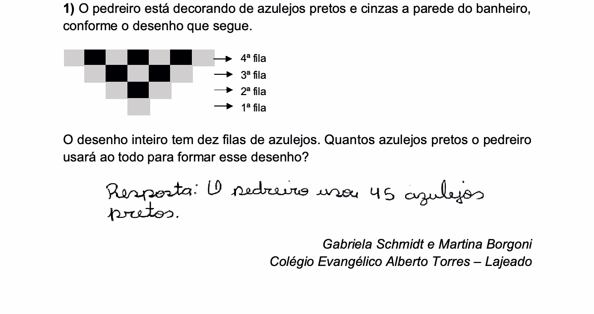

## OMU22-6ANO-Q02
Edição: 22ª | Publicação: 2020 | Páginas: 32, 33

2) A Secretaria de Saúde de um município avalia um programa que disponibiliza,
para cada aluno de uma escola municipal, uma bicicleta, que deve ser usada no
trajeto de ida e volta, entre sua casa e a escola. Na fase de implantação do
programa, o aluno que morava mais distante da escola realizou sempre o mesmo
trajeto, representado na figura a seguir.

Sabendo que 1 cm na figura equivale a 250 m, qual a distância, em km,
percorrida por esse aluno, na fase de implantação do programa, que ocorreu
durante 5 dias?
Antony Stefano Rabaiolli e Frederico Schumacher Alessio
Colégio Evangélico Alberto Torres – Lajeado

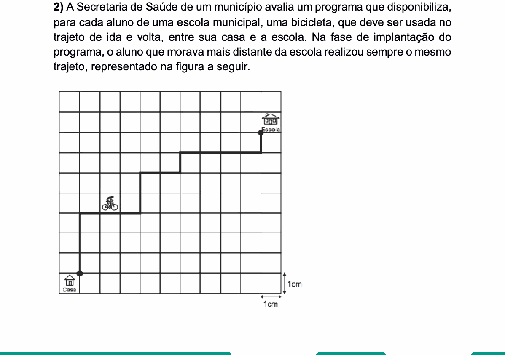
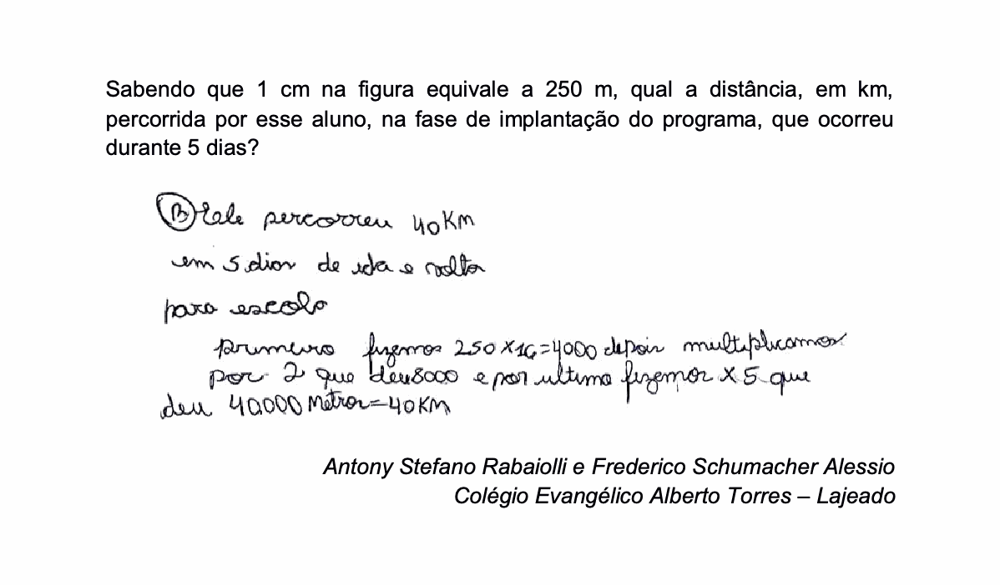

## OMU22-6ANO-Q03
Edição: 22ª | Publicação: 2020 | Páginas: 33

3) Bruno elaborou um código secreto para se comunicar por escrito com seus
amigos. O quadro mostra algumas palavras traduzidas para esse código.
Completar a última linha traduzindo a palavra MEL.
Palavra Tradução no código Bruno
POTE QNUD
TERRA UDSQB
AMOR BLPQ
FOGO GNHN
MEL ___ ___ ___
Rafaela Ames e Princiani de Castilhos Zotti
EEEF Farrapos – Encantado

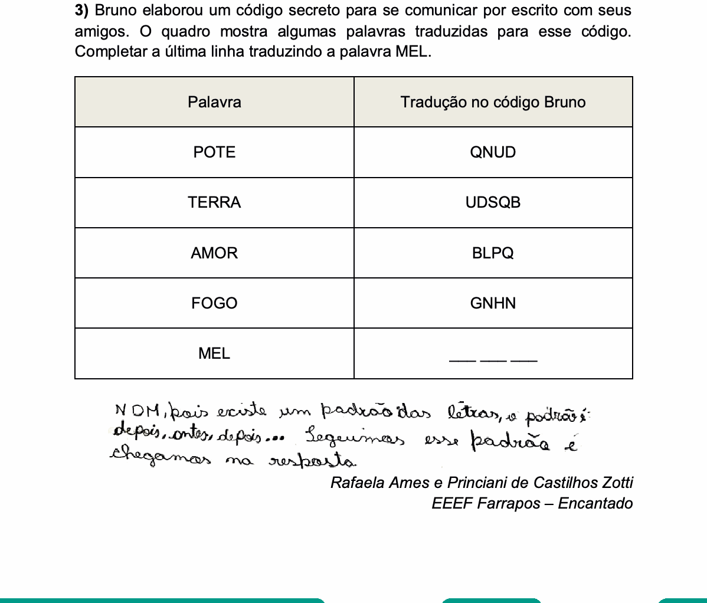

## OMU22-6ANO-Q04
Edição: 22ª | Publicação: 2020 | Páginas: 34

4) Uma indústria tem um reservatório de água com capacidade para 900 m³.
Quando há necessidade de limpeza do reservatório, toda a água precisa ser
escoada. O escoamento da água é feito por seis ralos, e dura 6 horas, quando o
reservatório está cheio. Esta indústria construirá um novo reservatório, com
capacidade de 500 m³, cujo escoamento da água deverá ser realizado em 4
horas, quando o reservatório estiver cheio. Os ralos utilizados no novo
reservatório deverão ser idênticos aos do já existente. Qual a quantidade de ralos
do novo reservatório?
Gabriel Vier Fontana e Valentinna Mottin Fernandes
CNEC Mário Quintana – Encantado

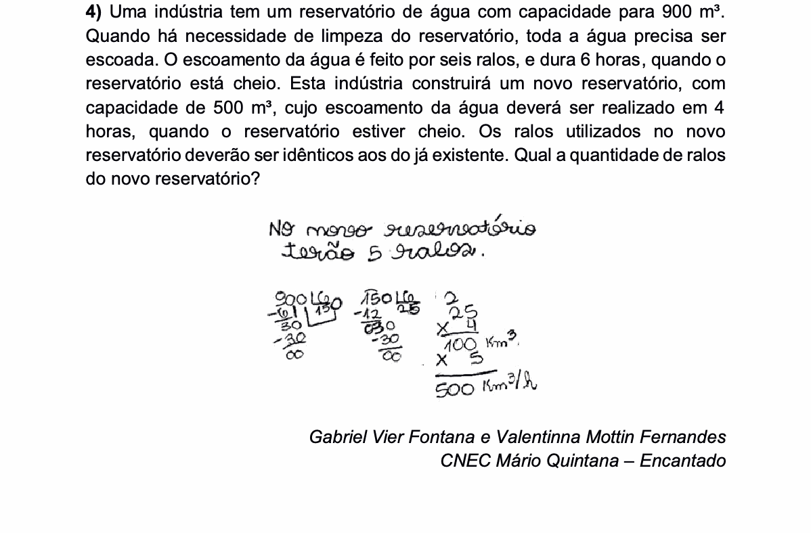

## OMU22-6ANO-Q05
Edição: 22ª | Publicação: 2020 | Páginas: 34

5) Considerar X, Y e Z três algarismos diferentes de zero (1, 2, 3, 4, 5, 6, 7, 8 ou
9) com os quais os números XYZ e YYY satisfazem à seguintes igualdade:
XYZ + XYZ + XYZ = YYY. Preencher os valores de X, Y, Z.
X = ________
Y = ________
Z = ________
Miguel Bruski Vigolo e Pedro Augusto Bertamon Machado de Souza
Colégio Scalabriniano São José – Roca Sales

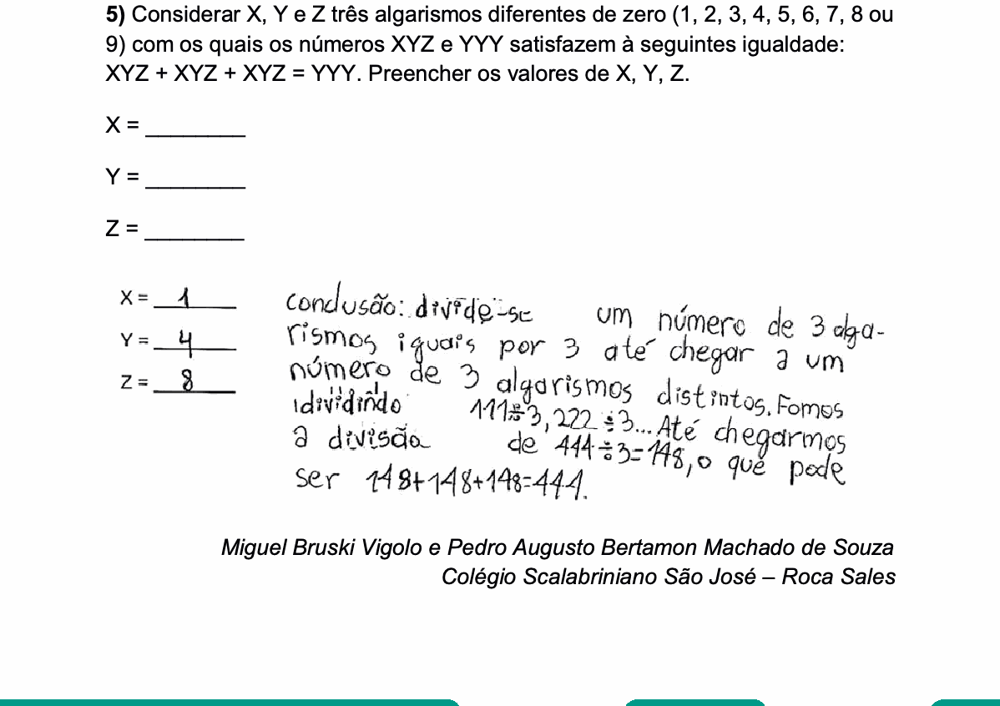

## OMU22-6ANO-Q06
Edição: 22ª | Publicação: 2020 | Páginas: 35

6) Nos últimos anos, a televisão tem passado por uma verdadeira revolução, em
termos de qualidade de imagem, som e interatividade com o telespectador. Essa
transformação se deve à conversão do sinal analógico para o sinal digital.
Entretanto, muitas cidades ainda não contam com essa nova tecnologia.
Buscando levar esses benefícios a três cidades, uma emissora de televisão
pretende construir uma nova torre de transmissão, que envie sinal às antenas A,
B e C, já existentes nessas cidades. As localizações das antenas estão
representadas no plano cartesiano, sendo A representada por (30;20); B por
(70;20) e C por (60;50).
A torre deve estar situada em um local que tenha a mesma distância das três
antenas. O local adequado para a construção dessa torre corresponde ao ponto
representado por:
a) (65;35).
b) (53;30).
c) (45;35).
d) (50;20).
e) (50;30).
Resposta: alternativa e.
João Carlos da Silva Malvessi e Lorenzo Nunes Bunecker
Colégio Martin Luther – Estrela

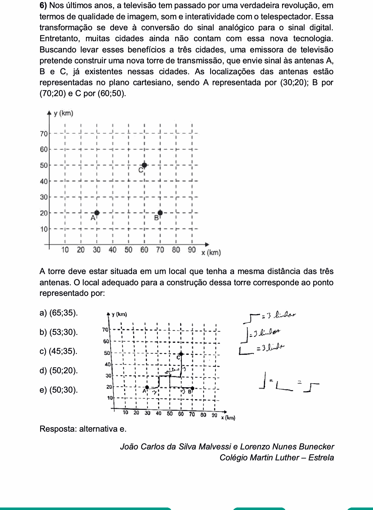

## OMU22-6ANO-Q07
Edição: 22ª | Publicação: 2020 | Páginas: 36, 37

7) A lâmpada incandescente atravessou o século XX, mas, hoje, devido à
preocupação com o aquecimento global, tende a se apagar. Nos anos 90, houve
a expansão dos modelos compactos das lâmpadas fluorescentes; e, em 2008,
foi patenteada a lâmpada LED. O quadro abaixo apresenta os gastos estimados,
ao longo de cinco anos, com o uso desses três tipos de lâmpadas, para uma
casa com vinte lâmpadas.
Incandescente Fluorescente LED
Investimento inicial com
R$ 36,00 R$ 700,00* R$ 1500,00
lâmpadas
Potência média de
60 W 18 W 8 W
consumo das lâmpadas
Consumo de energia 6840 kWh 1944 kWh 1080 kWh
Lâmpadas queimadas 100 14 zero
Gasto com energia R$ 2628,00 R$ 778,00 R$ 345,00
Gasto com lâmpadas R$ 195,00 R$ 140,00 zero
Total R$ 2859,00 R$ 1618,00 R$ 1845,00
*Inclui os reatores
Com base nessas informações, considerar as seguintes afirmações.
I. Quarenta lâmpadas incandescentes custam mais que uma lâmpada LED.
II. O consumo de energia de uma lâmpada LED equivale a do consumo
1
de energia de uma lâmpada incandescente.
6
III. Em média, o tempo que uma lâmpada fluorescente leva para queimar é,
aproximadamente, sete vezes o tempo que uma incandescente leva para
queimar.
Quais estão corretas?
a) Apenas I.
b) Apenas II.
c) Apenas III.
d) Apenas I e II.

e) Apenas II e III.
Resposta: alternativa c.
Ryan Pedro Hauschild e Samuel Lopes Leite Kotz
Colégio Sinodal Gustavo Adolfo – Lajeado

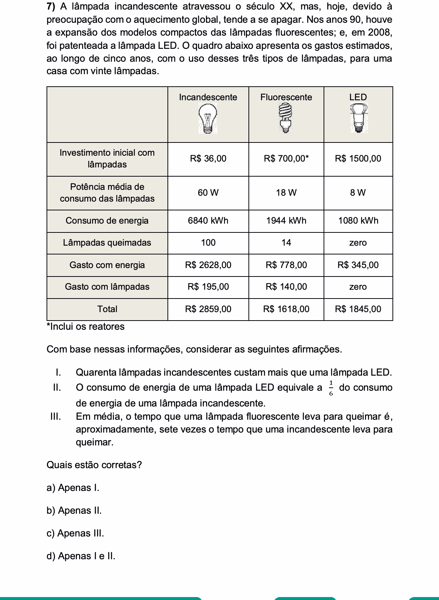
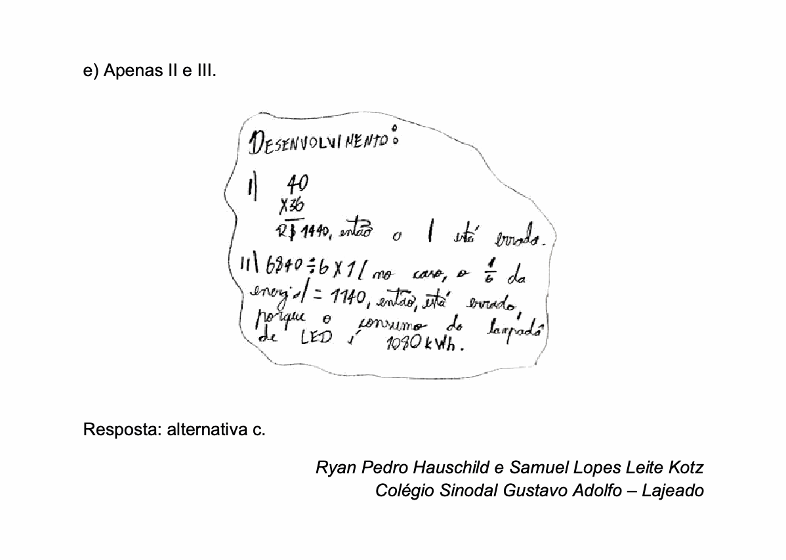

## OMU22-6ANO-Q08
Edição: 22ª | Publicação: 2020 | Páginas: 37

8) Um reservatório é abastecido por uma vazão constante e tem a altura (em
metros), em função do tempo (em dias), descrita pelo seguinte gráfico:
Sabendo que a altura do reservatório mede 12 metros, qual o número de dias
necessários para encher o reservatório inicialmente vazio?
João Francisco Valgui e Lucas Fontana
EEEF Farrapos – Encantado

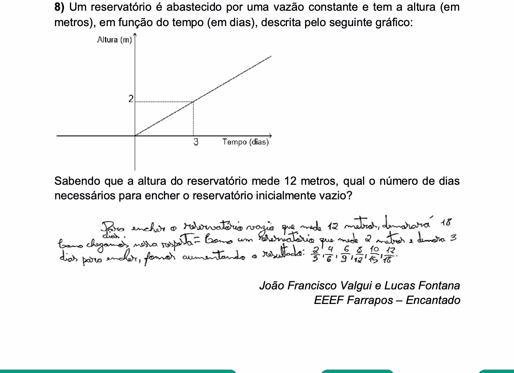

## OMU22-6ANO-Q09
Edição: 22ª | Publicação: 2020 | Páginas: 38

9) Três números naturais e múltiplos consecutivos de 5 são tais que o triplo do
menor é igual ao dobro do maior. Dentre esses números, o maior é:
a) Múltiplo de 3.
b) Ímpar.
c) Múltiplo de 8.
d) Divisor de 500.
e) Divisível por 4.
Resposta: alternativa a.
Eduardo Bruneto Linemann e Vandrey Luís Cornelius
EMEF Carlos Gomes – Marques de Souza

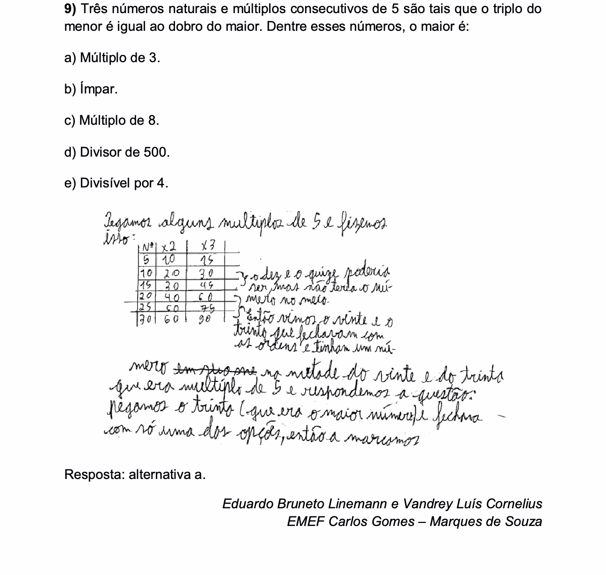

## OMU22-6ANO-Q10
Edição: 22ª | Publicação: 2020 | Páginas: 38, 39

10) Observar a seguinte sucessão de multiplicações:
5 x 5 = 25
35 x 35 = 1 225
335 x 335 = 112 225
3 335 x 3 335 = 11 122 225

Essa sucessão permite que se conclua corretamente que, efetuando
33 333 335 x 33 333 335, obtém-se um número. Qual é a soma dos algarismos
desse número?
Luize Cucioli Brustolin e Valentina Bagatini Bazanella
Colégio Evangélico Alberto Torres - Região Alta – Roca Sales

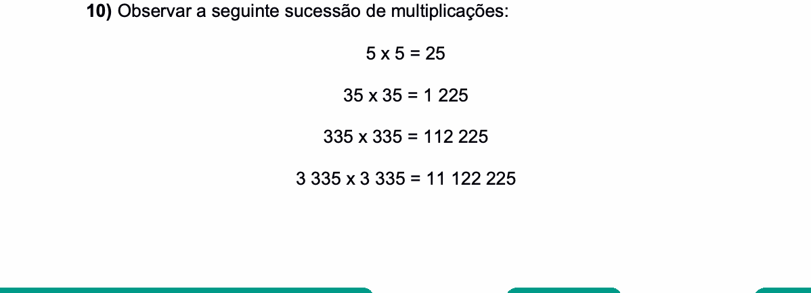
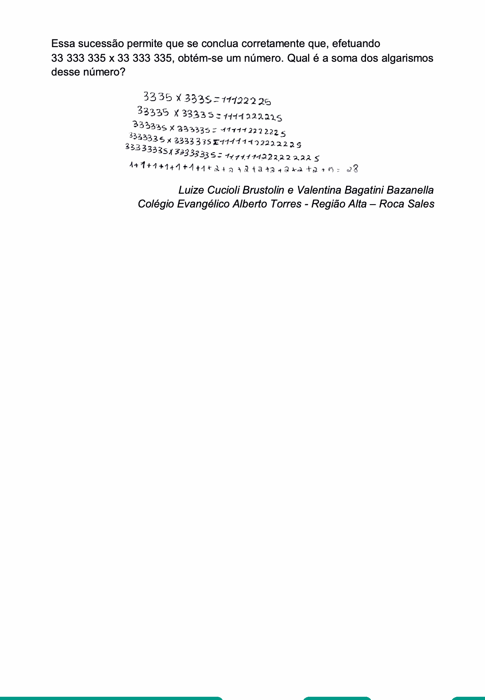

## OMU21-6ANO-Q01
Edição: 21ª | Publicação: 2019 | Páginas: 30

1- Dona Marieta quer dividir igualmente entre seus 6 filhos a quantia de R$ 15,00 e,
para tal, pretende trocar essa quantia em moedas de um único valor. Se cada filho
deverá receber mais do que 5 moedas e menos do que 50 moedas, então ela
poderá trocar o dinheiro por moedas que tenham apenas um dos seguintes valores:
a) 25 ou 50 centavos.
b) 10 ou 25 centavos.
c) 10 ou 50 centavos.
d) 10, 25 ou 50 centavos.
e) 5, 10 ou 25 centavos.
Henrique Nunes Strehl e Laura Hanna Lohmann
Colégio Martin Luther – Estrela

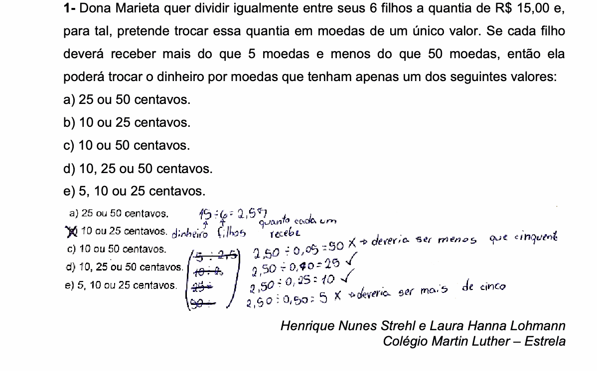

## OMU21-6ANO-Q02
Edição: 21ª | Publicação: 2019 | Páginas: 30, 31

2- No planejamento de uma festa, considera–se que, em média, cada pessoa bebe 3
copos de 300ml de refrigerante. Numa festa, foram servidas integralmente 36
garrafas de 2,5 litros. Com base nesses números e admitindo que todos tomaram
refrigerante, qual o número médio de pessoas nessa festa?

Laura Eidelwein e Vinícius dos Santos Freitas
Escola Municipal de Ensino Fundamental Leo Joas – Estrela

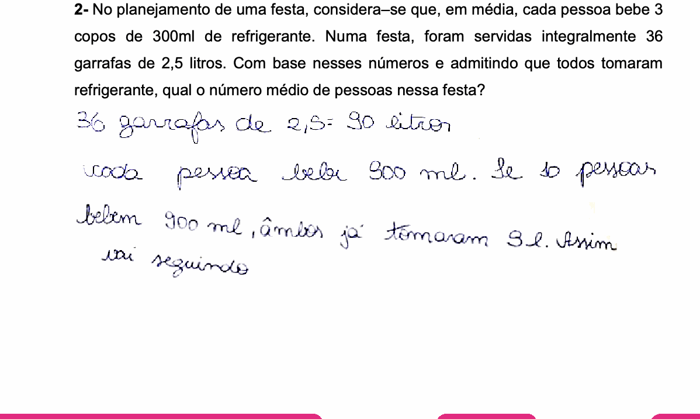
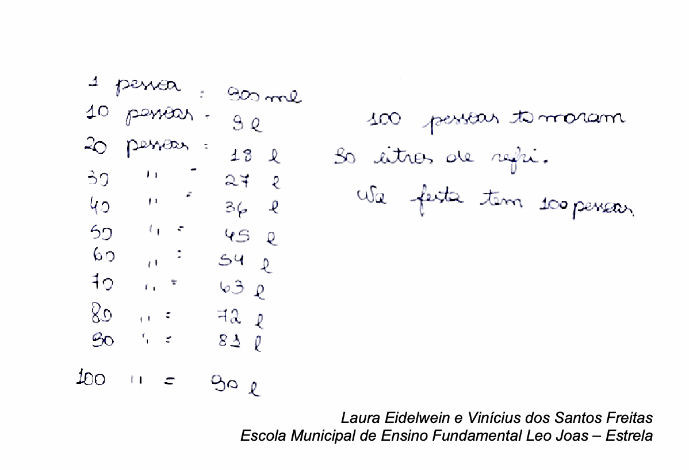

## OMU21-6ANO-Q03
Edição: 21ª | Publicação: 2019 | Páginas: 31, 32

3- No esquema seguinte, que representa a multiplicação de dois números inteiros,
alguns algarismos foram substituídos pelas letras X, Y, Z e T.
Considerando que letras distintas correspondem a algarismos distintos, quais os
valores de X, Y, Z e T para que a multiplicação esteja correta?

Matheus Dagostini Faccini e Eduardo Jaeger
Colégio Evangélico Alberto Torres – Lajeado

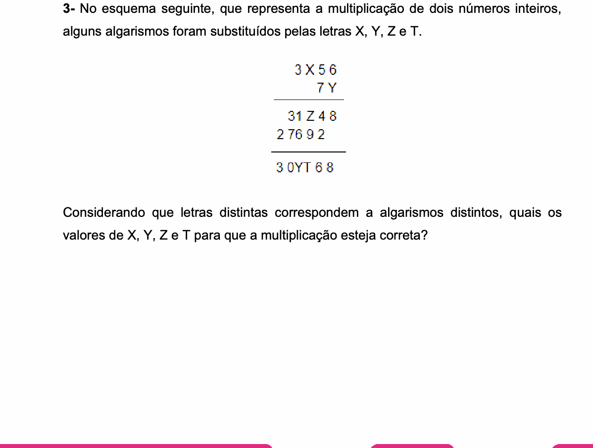
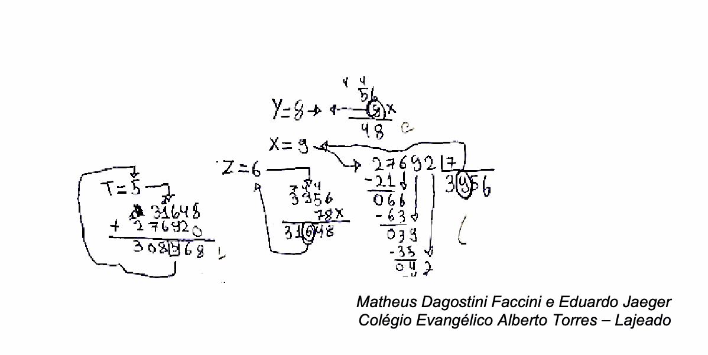

## OMU21-6ANO-Q04
Edição: 21ª | Publicação: 2019 | Páginas: 32

4- A disparidade de volume entre os planetas é tão grande que seria possível
colocá-los uns dentro dos outros. O planeta Mercúrio é o menor de todos. Marte é o
segundo menor: dentro dele cabem três Mercúrios. Terra é o único com vida: dentro
dela cabem sete Martes. Netuno é o quarto maior: dentro dele cabem 58 Terras.
Júpiter é o maior dos planetas: dentro dele cabem 23 Netunos. Seguindo o
raciocínio proposto, quantas Terras cabem dentro de Júpiter?
Henrique Nunes Strehl e Laura Hanna Lohmann
Colégio Martin Luther – Estrela

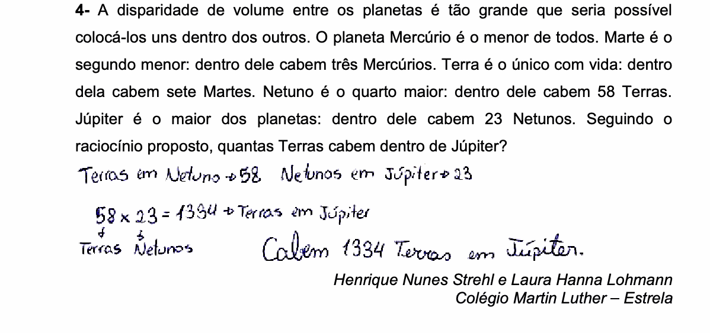

## OMU21-6ANO-Q05
Edição: 21ª | Publicação: 2019 | Páginas: 32, 33

5- Para efetuar um sorteio entre n alunos de uma escola (n> 1), adota-se o seguinte
procedimento: Os alunos são colocados em roda e inicia-se uma contagem da forma
“um, dois, um, dois, um, dois, ...”. Cada vez que se diz “dois”, o aluno
correspondente é eliminado e sai da roda. A contagem prossegue até que sobre um
único aluno, que é o escolhido. Para que valores de n o aluno escolhido é aquele por
quem começou o sorteio?
a) n=5
b) n=6
c) n=8
d) n=9
e) n=12

Nicolas Spada Maurer e Matheus Wallauer Van Ass
Colégio Evangélico Panambi – Panambi

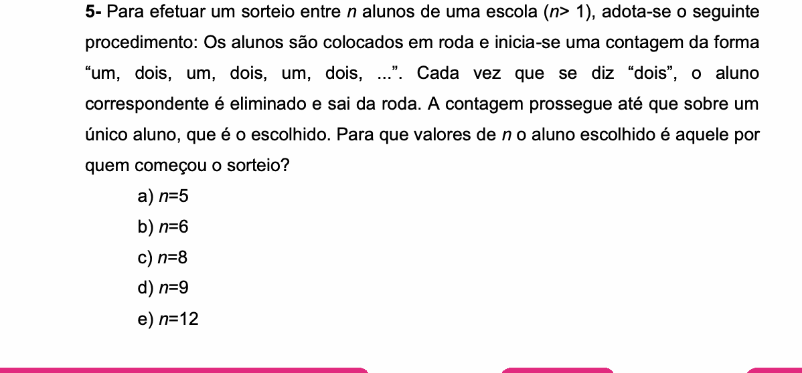
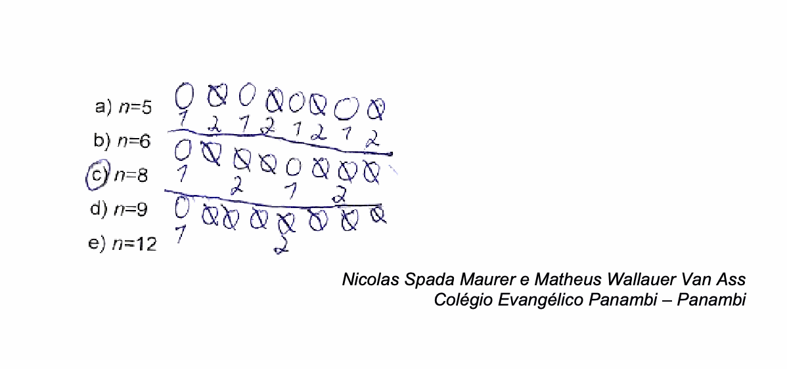

## OMU21-6ANO-Q06
Edição: 21ª | Publicação: 2019 | Páginas: 33

6- Maria e Ana têm, cada uma, um pacote de biscoitos, sendo que cada pacote tem
a mesma quantidade de biscoitos. Se Ana doar 10 biscoitos para Maria, esta ficará
com três vezes mais biscoitos que sua colega. Quantos biscoitos há em cada
pacote?
Arthur Diehl da Rosa e Luiza Barth Schneider
Colégio Santo Antônio – Estrela

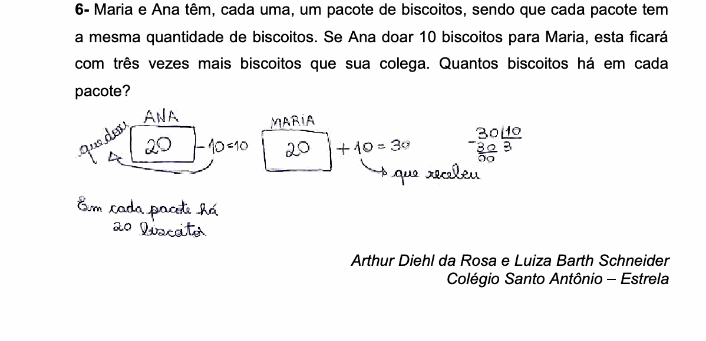

## OMU21-6ANO-Q07
Edição: 21ª | Publicação: 2019 | Páginas: 33, 34

7- Numa sementeira, cinco canteiros quadrados serão preparados para plantar, em
cada um, dois tipos de sementes: A e B. Os canteiros estão representados segundo
as figuras:
Suponha que cada canteiro tem 1m² de área e que nas regiões sombreadas de
cada canteiro serão plantadas as sementes do tipo A. Qual o total da área, em m²,
reservada para as sementes do tipo B?
a) 1,25 b) 2 c) 2,5 d) 3 e) 5

João Vitor Scheeren e Romeu Lagemann Heuert
Colégio Santo Antônio – Estrela

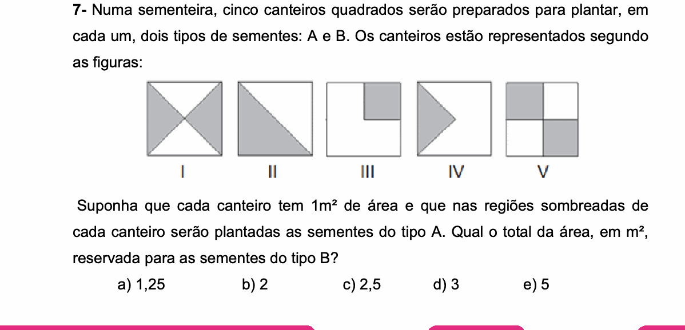
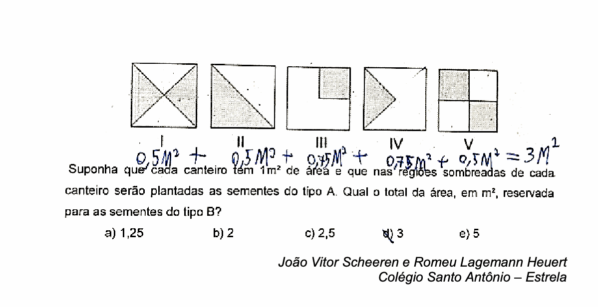

## OMU21-6ANO-Q08
Edição: 21ª | Publicação: 2019 | Páginas: 34

8- Na eleição para a escolha do representante da turma de Carolina, concorreram
três candidatos e todos os 36 alunos votaram, não havendo votos nulos e nem votos
em branco. O 1º colocado obteve o triplo dos votos dados ao 2º colocado. Já o
último colocado recebeu apenas 4 votos. Qual o número de votos conquistados pelo
vencedor?
Matheus Dagostini Faccini e Eduardo Jaeger
Colégio Evangélico Alberto Torres – Lajeado

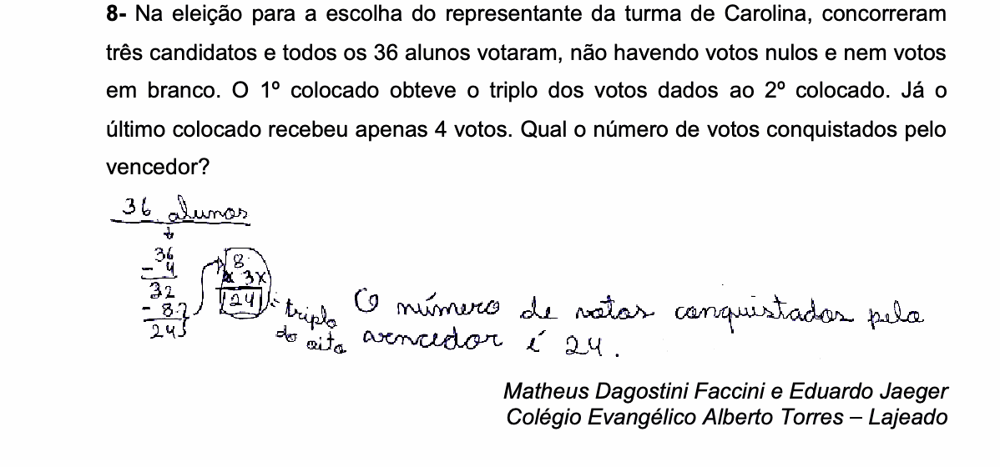

## OMU21-6ANO-Q09
Edição: 21ª | Publicação: 2019 | Páginas: 34, 35

9- Brasil, Colômbia, Argentina, Uruguai, Paraguai e Chile disputam um torneio de
futebol. Na primeira rodada, acontecem, simultaneamente, três jogos desse torneio.
Antes dessa rodada, três amigos deram seus palpites sobre os vencedores dos três
jogos, não necessariamente na ordem dos jogos. Os palpites foram:
Alberto: Brasil, Paraguai e Colômbia.
Cléber: Paraguai, Uruguai e Chile.
Renato: Colômbia, Argentina e Chile.
De acordo com as informações dadas, qual o país que disputou a partida com o
Brasil nessa rodada?

Ana Laura Koefender Führ e Yasmin Dahmer Sanders
Colégio Teutônia – Teutônia

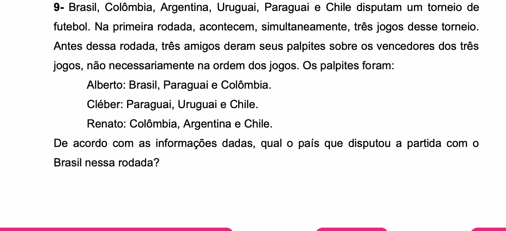
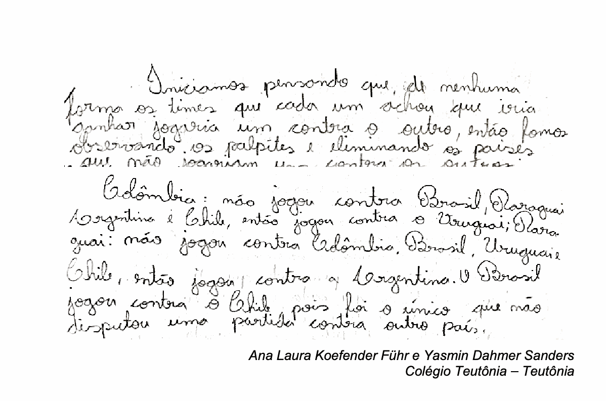

## OMU21-6ANO-Q10
Edição: 21ª | Publicação: 2019 | Páginas: 35, 36

10- Qual é o número máximo de caixas representadas na figura 2 que podem ser
colocadas dentro da caixa representada na figura 1?
figura 1 figura 2

Ana Laura Koefender Führ e Yasmin Dahmer Sanders
Colégio Teutônia – Teutônia

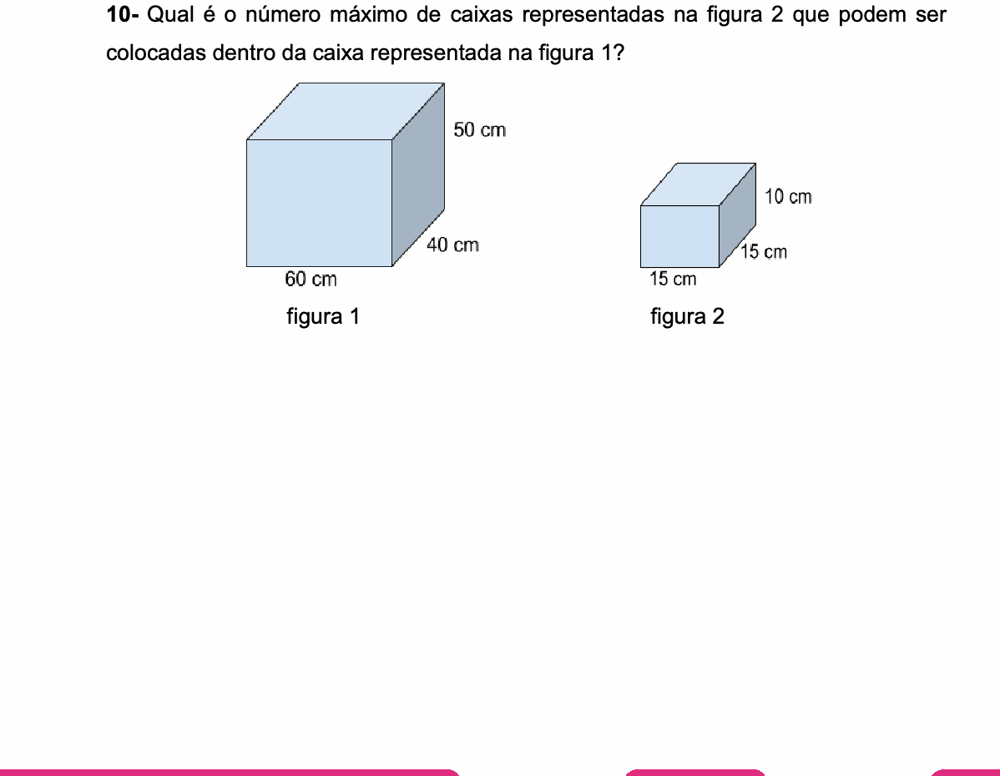
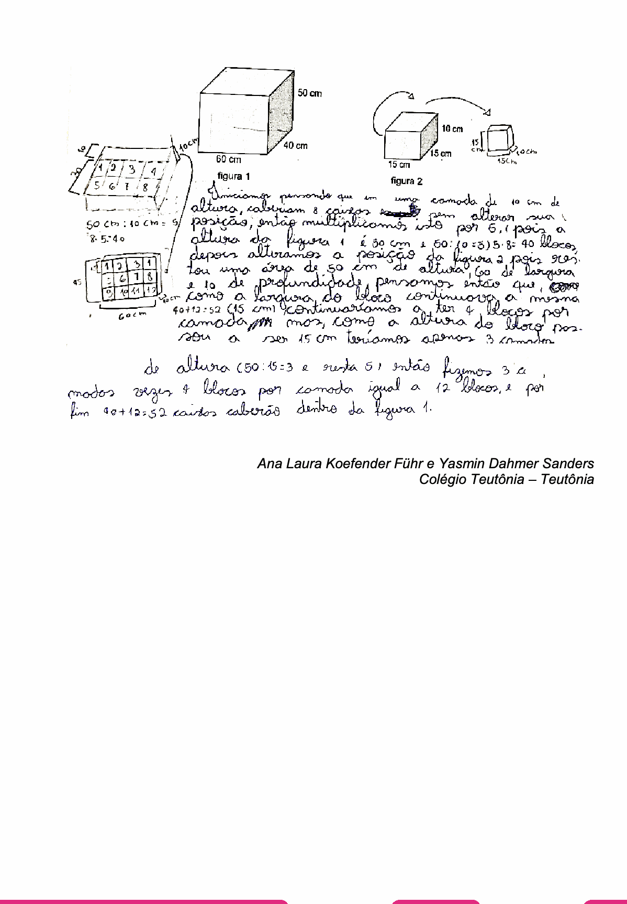

## OMU20-6ANO-Q01
Edição: 20ª | Publicação: 2018 | Páginas: 31

1) Durante uma viagem de 300 km pagam-se dois pedágios de R$ 5,20 cada. Sabe-
se que um certo carro percorre 15 km com um litro de combustível e que um litro de
combustível custa R$ 4,25. Admitindo que este veículo executou essa viagem, qual o
valor gasto pelo motorista?
Gabriela C. de Souza e Gabriela Fernandes Noll
Colégio Sinodal Gustavo Adolfo – Lajeado

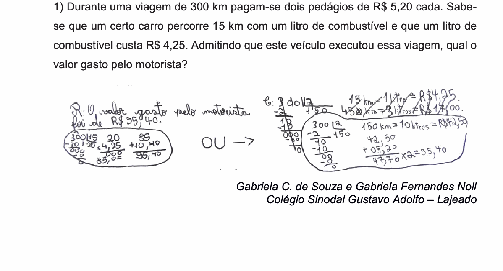

## OMU20-6ANO-Q02
Edição: 20ª | Publicação: 2018 | Páginas: 31

2) A diferença de idade entre pai e filho é 25 anos. Hoje, tendo o filho 10 anos, a idade
do pai é 35 anos, portanto 3,5 vezes a idade do filho. Se ambos viverem muitos anos,
chegará um dia em que a idade do pai será apenas 1,5 vezes a idade do filho. Qual a
idade do pai e a do filho quando isso acontecerá?
Pedro Henrique Ruschel e Eduardo Lenhard Hachler
Colégio Martin Luther – Estrela

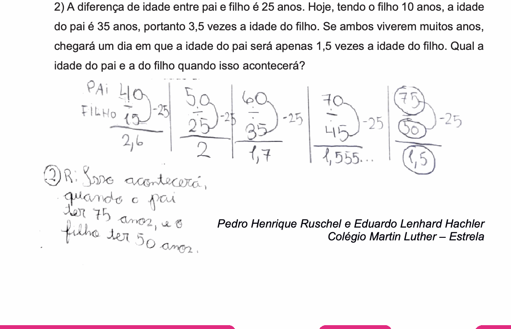

## OMU20-6ANO-Q03
Edição: 20ª | Publicação: 2018 | Páginas: 32

3) Sílvio partiu de avião do Rio de Janeiro para São Paulo às 17h do dia 07 de abril.
O trajeto durou 50 minutos de voo. Chegando lá, transferiu-se para outro avião que,
saindo de São Paulo 40 minutos depois da sua chegada, foi direto a Istambul, na
Turquia, levando para isso 23 horas e 50 minutos. Rio de Janeiro e São Paulo estão
no mesmo fuso horário e têm seis horas de atraso com relação ao horário de Istambul.
Marcar a opção de horário que Sílvio chegou a Istambul:
a) aos 20min do dia 09 de abril, no horário de Istambul.
b) às 23h30min do dia 08 de abril, no horário de Istambul.
c) às 23h20min do dia 08 de abril, no horário de Istambul.
d) às 18h30min do dia 08 de abril, no horário de Istambul.
e) às 18h20min do dia 08 de abril, no horário de Istambul.
Resposta: Alternativa a)
Pedro Henrique Ruschel e Eduardo Lenhard Hachler
Colégio Martin Luther – Estrela

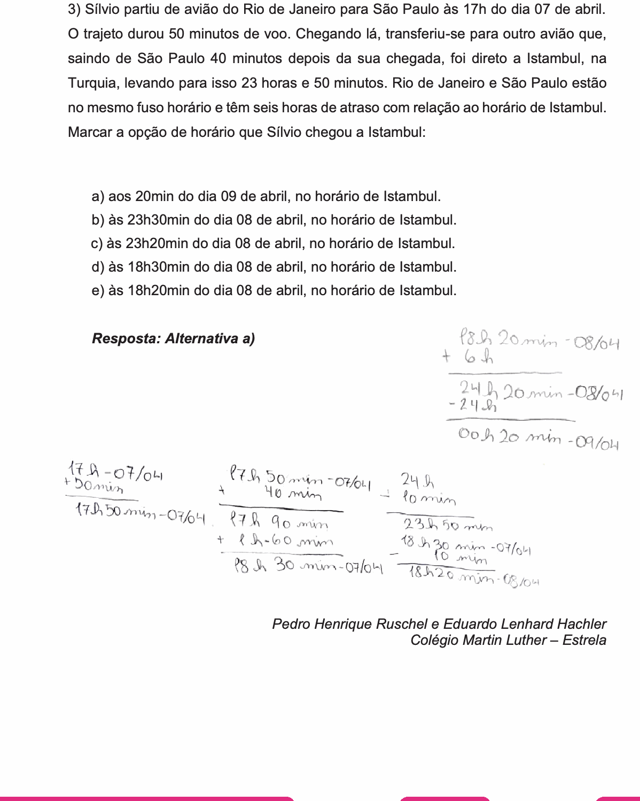

## OMU20-6ANO-Q04
Edição: 20ª | Publicação: 2018 | Páginas: 33, 34

4) Considerar que a seguinte sequência de figuras foi construída segundo um certo
critério.
Se tal critério for mantido para obter as figuras seguintes, qual será o total de pontos
da figura de número 15?
Eduardo Assis Heineck e Gabriel Costa Henz
Escola Municipal de Ensino Fundamental Pedro Pretto – Travesseiro
Gabriel K. Akaishi e Luiza Schumann
Escola Estadual de Ensino Médio Reynaldo Afonso Augustin – Teutônia
Gabriela C. de Souza e Gabriela Fernandes Noll
Colégio Sinodal Gustavo Adolfo – Lajeado

Guilherme Magalhães e Filipe Arthur Drehmer
Colégio Cenecista João Batista de Mello – Lajeado

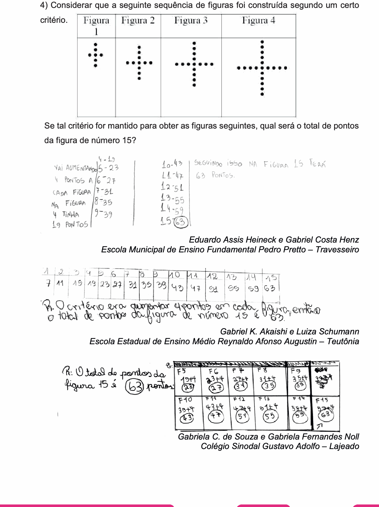
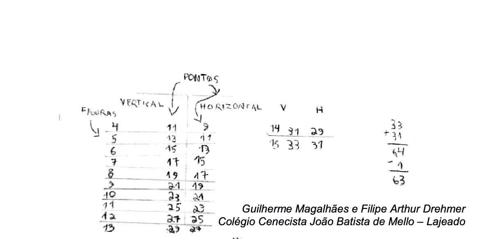

## OMU20-6ANO-Q05
Edição: 20ª | Publicação: 2018 | Páginas: 34

5) Uma empresa contrata dois novos funcionários. O primeiro começará a trabalhar
no dia primeiro de outubro, uma segunda-feira, com um regime de trabalho no qual
ele trabalha quatro dias e folga no quinto dia, volta a trabalhar quatro dias e folga no
quinto, e assim sucessivamente. O segundo funcionário começará a trabalhar no dia
3 desse mesmo mês, uma quarta-feira, com um regime de trabalho no qual ele
trabalha cinco dias e folga no sexto dia, volta a trabalhar cinco dias e folga no sexto
dia, e assim sucessivamente. A segunda vez em que os dois novos funcionários
tirarão a folga no mesmo dia é o dia:
a) 20 de outubro.
b) 4 de novembro.
c) 24 de novembro.
d) 19 de outubro.
e) 19 de novembro.
Resposta: Alternativa e)
Raul Kadu Barth e Eduardo André Gräf
Escola Municipal de Ensino Fundamental Princesa Isabel – Arroio do Meio

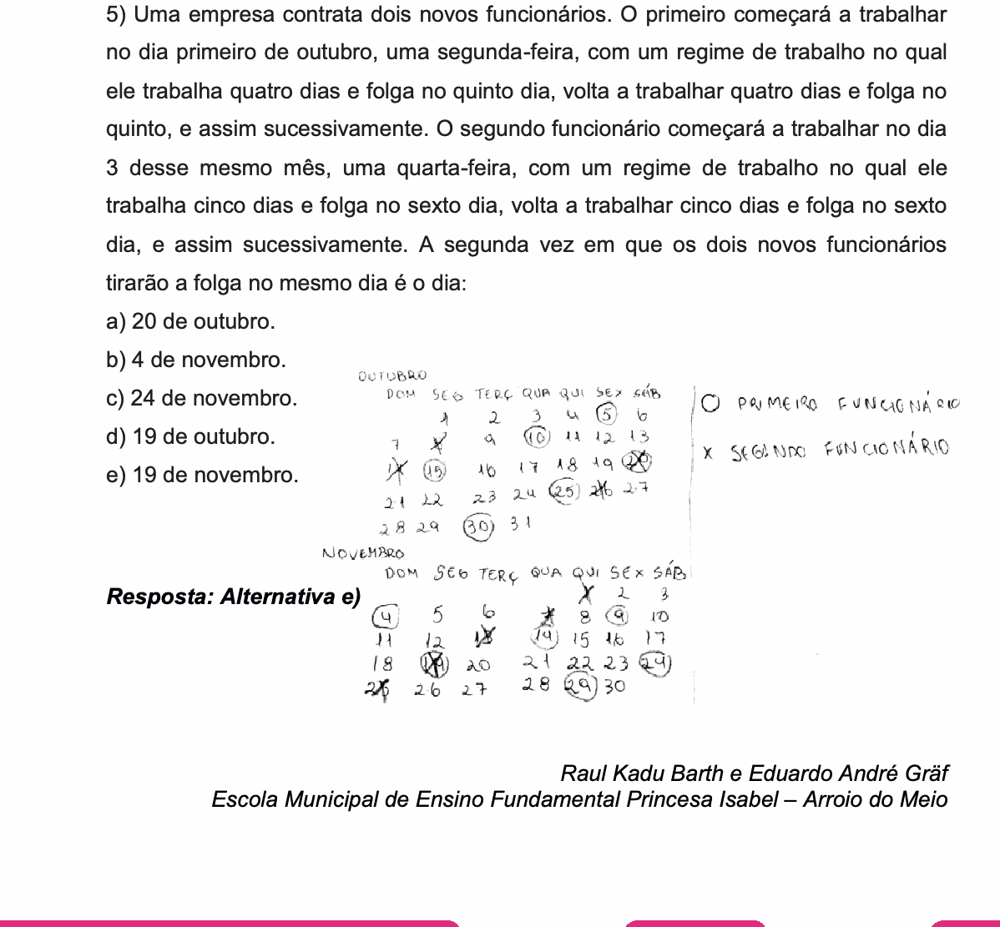

## OMU20-6ANO-Q06
Edição: 20ª | Publicação: 2018 | Páginas: 35

6) Em um jogo de tabuleiro, há 80 peças das quais 35 são verdes e as demais são
amarelas. As peças são todas triangulares ou quadrangulares. Entre as peças verdes,
17 são triangulares e, entre as peças amarelas, a quantidade de peças
quadrangulares é o dobro da quantidade de peças triangulares. Qual a quantidade
total de peças quadrangulares?
Raul Kadu Barth e Eduardo André Gräf
Escola Municipal de Ensino Fundamental Princesa Isabel – Arroio do Meio

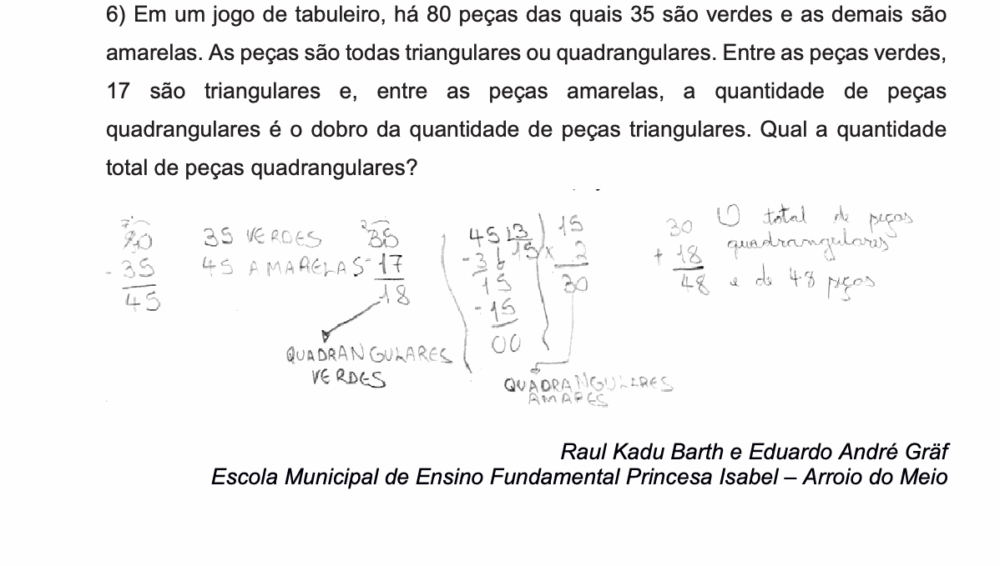

## OMU20-6ANO-Q07
Edição: 20ª | Publicação: 2018 | Páginas: 35

7) As letras da sigla CODEBA foram embaralhadas e a nova sequência dessas
mesmas letras possui as seguintes propriedades:
• nenhuma das seis letras ocupa a sua posição inicial.
• as vogais aparecem juntas, na mesma ordem que estavam: O, E, A.
• a 5ª letra não é D.
• a letra B aparece antes da letra C.
É correto concluir que, na nova sequência,
a) a 3ª letra é E.
b) a 5ª letra é A.
c) a 1ª letra é B.
d) a 4ª letra é C.
e) a 6ª letra é D.
Resposta: Alternativa e)

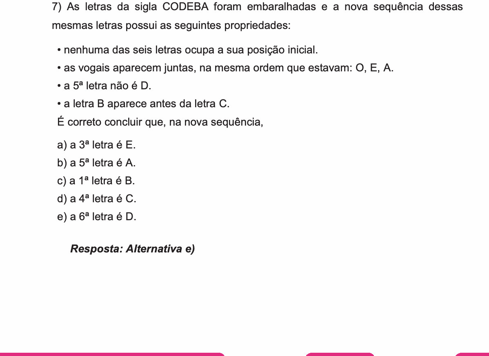

## OMU20-6ANO-Q08
Edição: 20ª | Publicação: 2018 | Páginas: 36

8) Sobre uma superfície plana têm-se três blocos iguais empilhados, com 13 faces
visíveis e expostas. Se forem empilhados da mesma forma 25 desses blocos, qual o
número de faces visíveis e expostas?
Isadora Mendel e Iasmin Messer
Colégio Teutônia – Teutônia

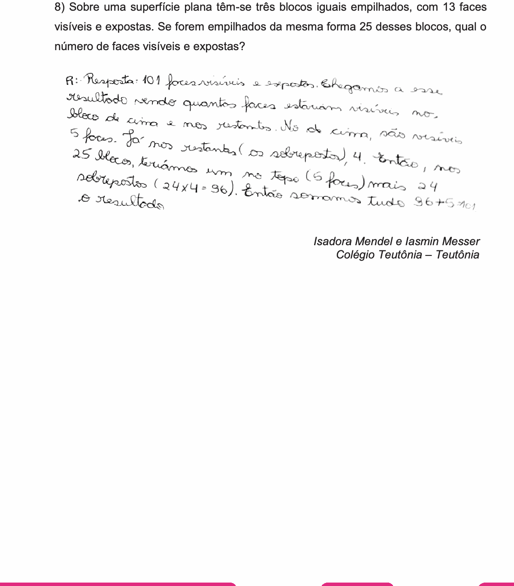

## OMU20-6ANO-Q09
Edição: 20ª | Publicação: 2018 | Páginas: 37

9) Dois agricultores que cultivam frutas compraram uma ilha e agora estão plantando
limões sicilianos, limões verdes e laranjas no padrão específico mostrado na figura
abaixo. Eles não querem que nenhuma das áreas vizinhas tenha a mesma fruta. O
que irão plantar nas áreas A e B?
Isadora Mendel e Iasmin Messer
Colégio Teutônia – Teutônia

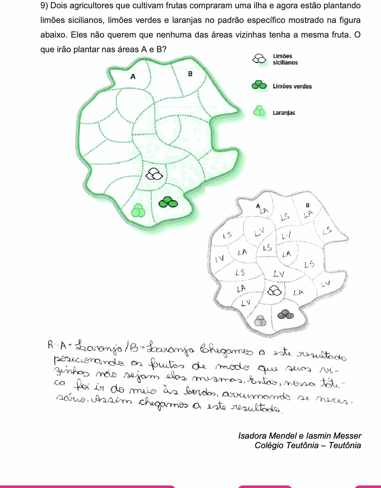

## OMU20-6ANO-Q10
Edição: 20ª | Publicação: 2018 | Páginas: 38

10) Os bilhetes de uma rifa são numerados de 1000 a 9999. Marcelo comprou todos
os bilhetes nos quais o algarismo sete aparece exatamente três vezes e o zero não
aparece. Quantos bilhetes Marcelo comprou?
Pedro Henrique Ruschel e Eduardo Lenhard Hachler
Colégio Martin Luther – Estrela
Isadora Mendel e Iasmin Messer
Colégio Teutônia – Teutônia
Raul Kadu Barth e Eduardo André Gräf
Escola Municipal de Ensino Fundamental Princesa Isabel – Arroio do Meio

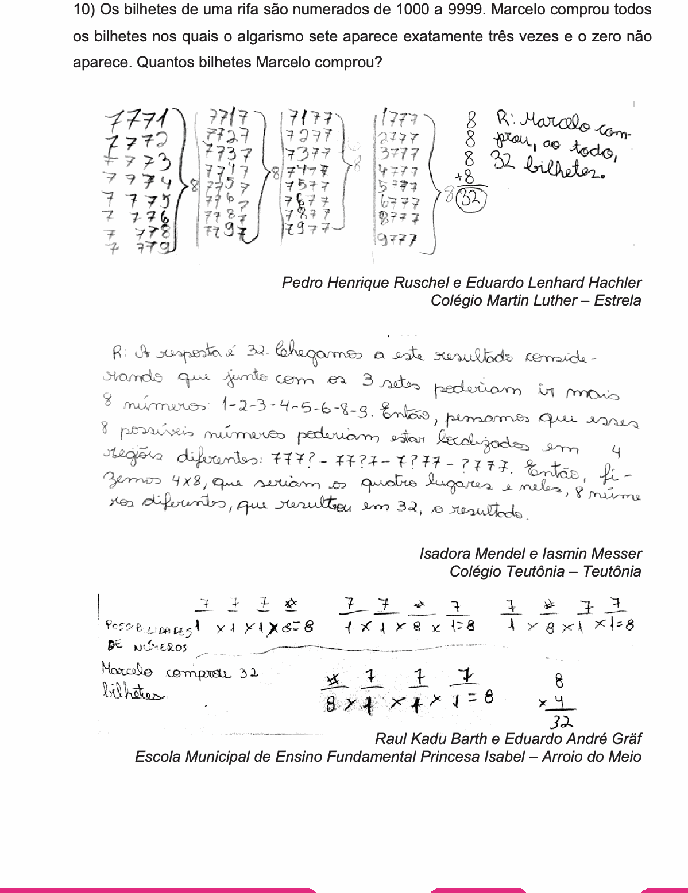

## OMU19-6ANO-Q01
Edição: 19ª | Publicação: 2017 | Páginas: 29

1) Um hotel necessita comprar mesas e cadeiras, sendo utilizadas 6 cadeiras para cada mesa para
transformar um salão em sala de convenções. Esse salão está dividido em 5 setores: A, B, C, D e E.
Nos setores A e B cabem, em cada um, 7 fileiras de mesas e em cada fileira cabem 16 mesas. Nos
setores C, D e E cabem, em cada um, 8 fileiras de mesas e em cada fileira cabem 19 mesas.
Quantas mesas e cadeiras devem ser compradas?
RESPOSTA: 680 Mesas e 4080 Cadeiras

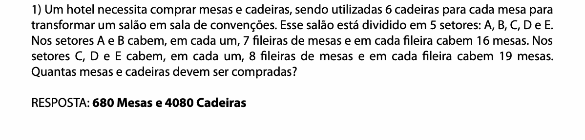

## OMU19-6ANO-Q02
Edição: 19ª | Publicação: 2017 | Páginas: 29

2) O Quadro 1 indica o número de canecas de ração necessárias para alimentar um cão, por dia,
em função de sua massa (na linguagem popular, de seu “peso”):
O Quadro 2 indica o preço a ser pago pela ração em função da quantidade de kg em cada
pacote:
João precisa comprar ração para seu cachorro Rex, que “pesa” 20 kg, para uma semana. Calcular o
valor mínimo que João gastará na loja sabendo que em cada caneca cheia cabem 400 g.
Sofia Geller Sulzbach e Isabella de Vasconcellos
Colégio Gaspar Silveira Martins – Venâncio Aires

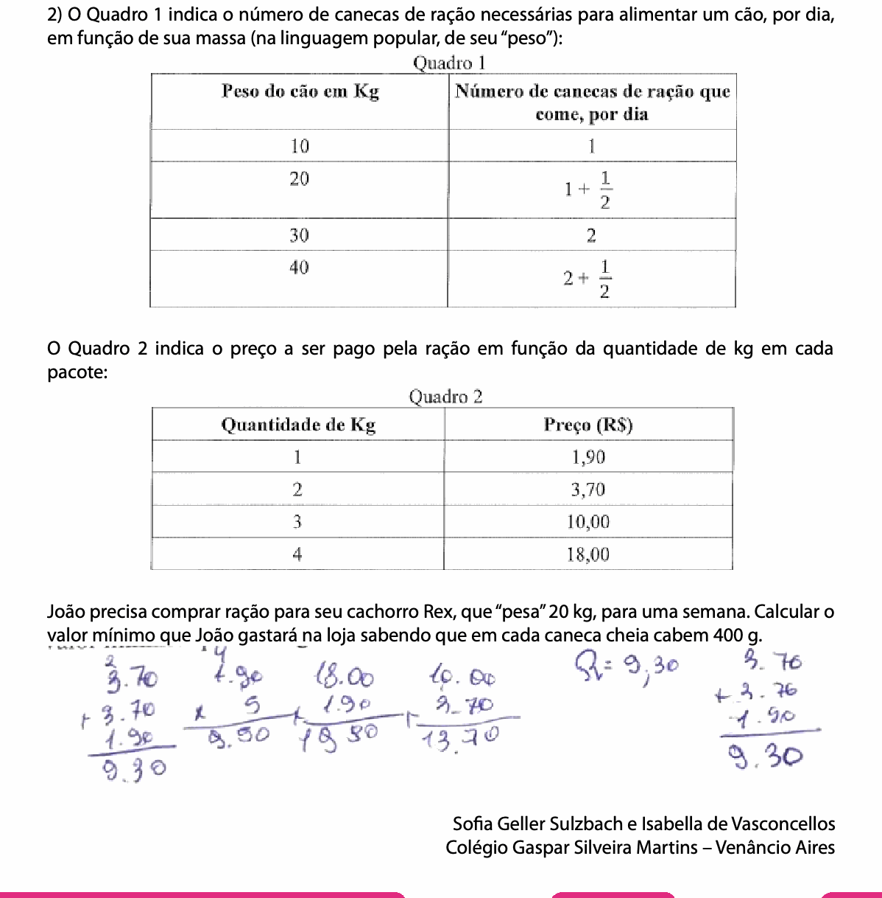

## OMU19-6ANO-Q03
Edição: 19ª | Publicação: 2017 | Páginas: 30

3) Existem casas em volta de uma praça. João e Pedro dão uma volta na praça, caminhando no
mesmo sentido e contando as casas. Como não começaram a contar da mesma casa, a 5ª casa de
João é a 12ª casa de Pedro e a 5ª casa de Pedro é a 30ª de João. Quantas casas existem em volta
da praça?
Sofia Geller Sulzbach e Isabella de Vasconcellos
Colégio Gaspar Silveira Martins – Venâncio Aires

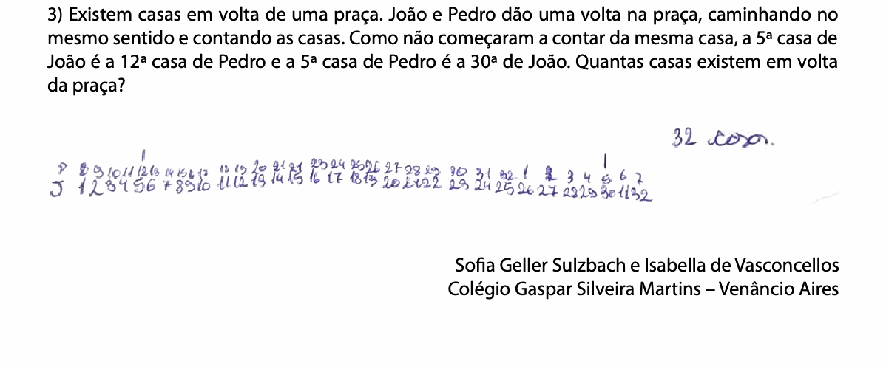

## OMU19-6ANO-Q04
Edição: 19ª | Publicação: 2017 | Páginas: 30

4) Os animais de estimação têm tempos diferentes de vida. Observar alguns exemplos no quadro
abaixo:
Especialistas afirmam que os elefantes costumam viver o sêxtuplo da idade dos cachorros, mais
10 anos. O tigre vive metade da média de anos do catatau. O peixe solea vive o triplo do cágado,
1
mais 10 anos. O macaco vive de um milhar de anos. Determinar o tempo de vida, em
20
média, de cada animal:
Elefante: _____100____________
Tigre: ________20____________
Macaco: ______50____________
Peixe solea: ___70_____________
Arthur Schossler Hausmann e Eduardo Holz Machado
Colégio Martin Luther – Estrela

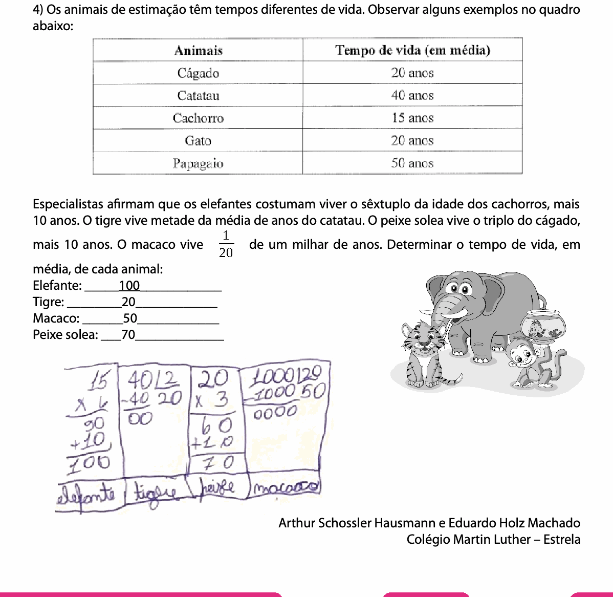

## OMU19-6ANO-Q05
Edição: 19ª | Publicação: 2017 | Páginas: 31

5) Uma senha de computador é formada por três dígitos que não se repetem: 2, 3 e 5, não
necessariamente nessa ordem. Além disso, considerar verdadeira apenas uma das três seguintes
afirmações:

O 1º algarismo é 2.

O 2º algarismo não é 2.

O 3º algarismo não é 5.
A partir das restrições apresentadas, conclui-se que a senha é:
a) 253.
b) 235.
c) 532.
d) 523.
e) 352.
RESPOSTA: LETRA D
Carolina Pezzi Luca e Arthur Henrique Lutz Amaral
Colégio Evangélico Alberto Torres Região Alta – Roca Sales

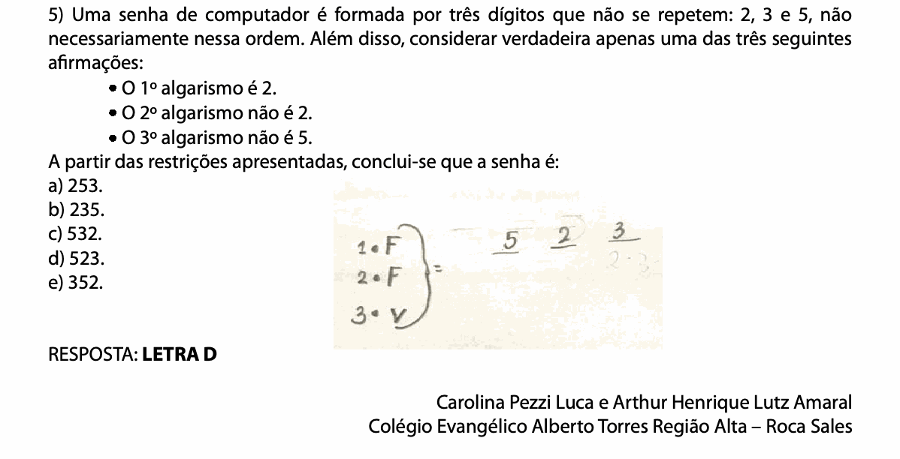

## OMU19-6ANO-Q06
Edição: 19ª | Publicação: 2017 | Páginas: 31, 32

6) A área total de criação de bois, ovelhas, galinhas, porcos e cavalos de uma fazenda está
representada na malha quadricular a seguir.

Considerando que o quadriculado inteiro representa a fazenda, pode-se afirmar que:
1
a) a área da região destinada à criação de galinhas corresponde a da área total da fazenda.
6
1
b) a área da região destinada à criação de cavalos corresponde a da área total da fazenda.
10
1
c) a área da região destinada à criação de porcos corresponde a da área total da fazenda.
15
1
d) a área da região destinada à criação de bois corresponde a da área total da fazenda.
10
1
e) a área da região destinada à criação de ovelhas corresponde a da área total da fazenda.
20
Bianca Faleiro e Cindy Träsel
Colégio Evangélico Alberto Torres – Lajeado
RESPOSTA: LETRA C

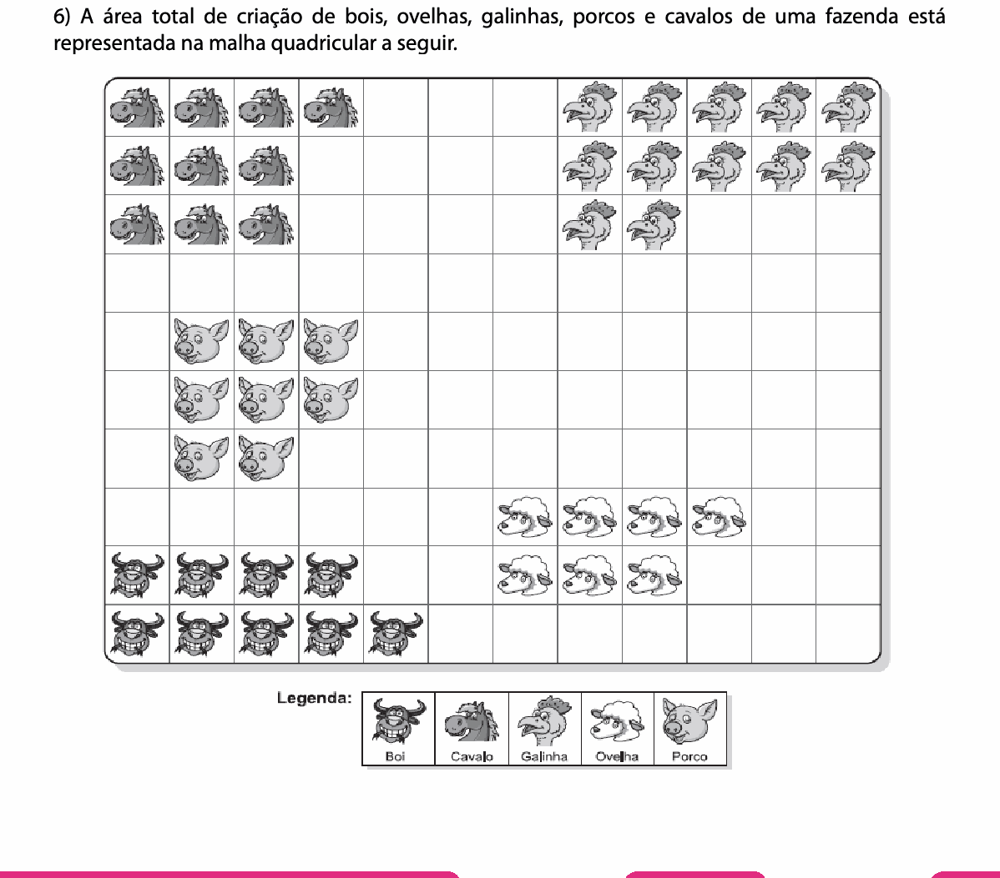
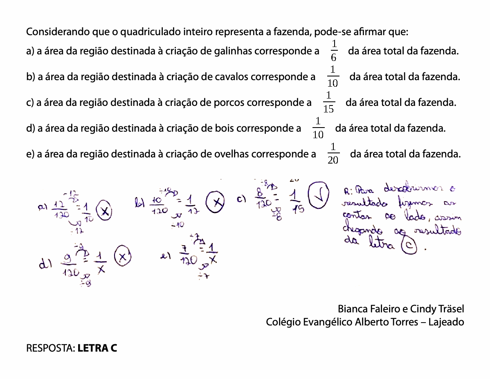

## OMU19-6ANO-Q07
Edição: 19ª | Publicação: 2017 | Páginas: 32, 33

7) Cinco amigos foram a um rodízio de pizza. Escrever a quantidade de fatias que cada um
comeu nos respectivos espaços, seguindo as dicas:
1

João comeu a mais que Pedro.
3
2

Lucas comeu do dobro do que João comeu.
3
3

Pedro comeu do que Breno comeu.
5
1

Breno comeu de 60 fatias.
4
1

Rafael comeu do que comeu João.
2

__12__ ___16__ ___9___ ___15__ ___6___
Fernanda Allebrandt Werlang e Maiara Klepker Fascina
Colégio Teutônia – Teutônia

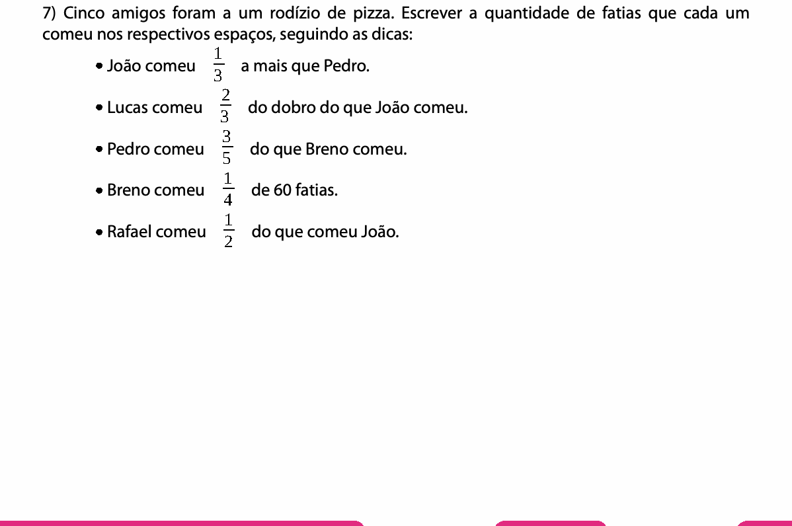
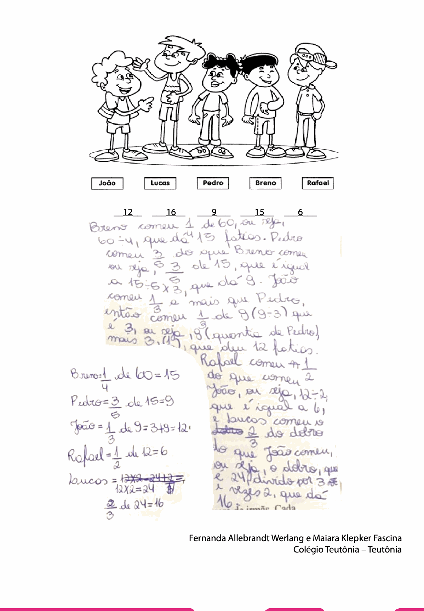

## OMU19-6ANO-Q08
Edição: 19ª | Publicação: 2017 | Páginas: 34

8) Um casal tem filhos e filhas. Cada filho tem o número de irmãos igual ao número de irmãs.
Cada filha tem o número de irmãos igual ao dobro do número de irmãs. Qual o número total de
filhos e filhas do casal?
Tiago Steffler e Samuel Steffler
Colégio Cenecista João Batista de Mello – Lajeado

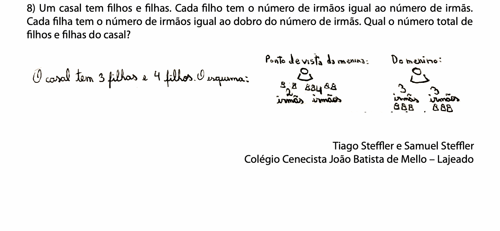

## OMU19-6ANO-Q09
Edição: 19ª | Publicação: 2017 | Páginas: 34

9) As afirmativas a seguir correspondem a condições para a formação de um determinado
número de três algarismos.

429 não tem nenhum algarismo em comum com esse número.

479 tem apenas um algarismo em comum com esse número, mas ele não está em seu
devido lugar.

756 tem apenas um algarismo em comum com esse número e ele está em seu devido
lugar.

543 tem apenas um algarismo em comum com esse número, mas ele não está em seu
devido lugar.

268 tem apenas um algarismo em comum com esse número e ele está em seu devido
lugar.
Qual o número que satisfaz todas essas condições?
Gabriel Magagnin Fernandes Leu Lcuccac ea GCaoburtiienlh Foe rHneainndeceks
Colégio Madre Bárbara – Lajeado

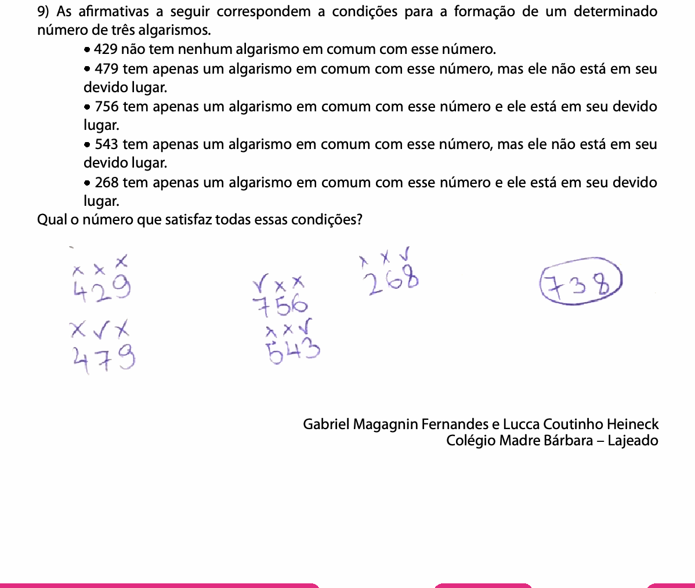

## OMU19-6ANO-Q10
Edição: 19ª | Publicação: 2017 | Páginas: 35

10) A imobiliária Lopes & Almeida está anunciando dois modelos de casas com opções para
pagamentos à vista ou a prazo.
O Sr. Mauro possui renda mensal de R$ 18.000,00. Ele precisa comprar um imóvel, mas as
1
prestações não podem ultrapassar de sua renda mensal.
6
Observar as condições de pagamento oferecidas pela imobiliária Lopes & Almeida e assinalar a
opção correta.
a) O Sr. Mauro poderá comprar a casa B, pois as prestações são de R$ 3.000,00, o que
1
corresponde a da renda mensal.
6
b) O Sr. Mauro poderá comprar a casa A ou a casa B, pois as prestações são de
1
R$ 4.200,00, o que corresponde a da renda mensal.
6
c) O Sr. Mauro poderá comprar a casa A, pois as prestações são de R$ 3.000,00, o que
1
corresponde a da renda mensal.
6
d) O Sr. Mauro poderá comprar a casa A, pois as prestações são de R$ 4.200,00, o que
1
corresponde a da renda mensal.
6
e) O Sr. Mauro poderá comprar a casa B, pois as prestações são de R$ 3.100,00, o que
1
corresponde a da renda mensal.
6
João Pedro Schneider Prediger e Pedro Henrique Maciel
Colégio Sinodal Gustavo Adolfo – Lajeado
RESPOSTA: LETRA C

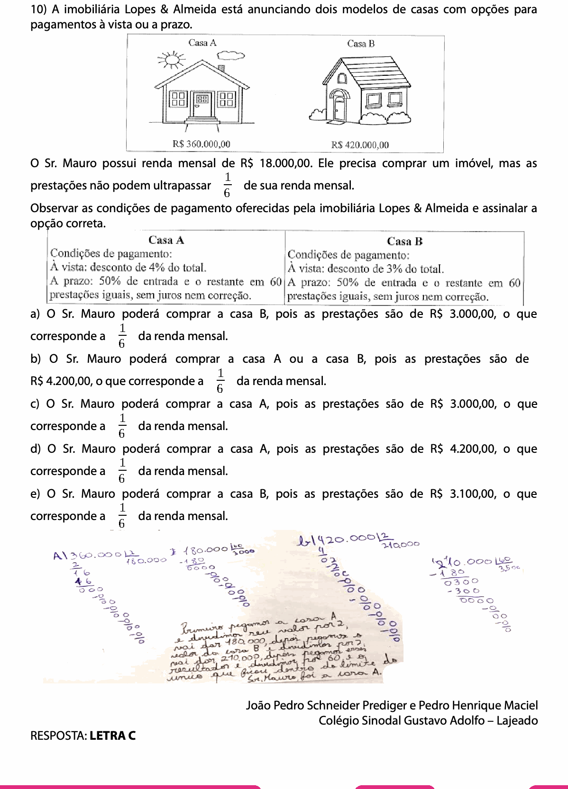

## OMU18-6ANO-Q01
Edição: 18ª | Publicação: 2015 | Páginas: 26

1 – Pedro, Paulo e João construíram juntos um clube recreativo. Pedro mora a 2 de quilômetro
3
7 5
do clube. João a e Paulo a de quilômetro. No diagrama abaixo, A representa a casa do
5 8
que mora mais próximo do clube, B o seguinte e C, o que mora mais longe.
De quanto B está mais distante do clube do que A?
Cezar Júnior Pereira Garcia e Ângelo Arthur Wenzel
Colégio Evangélico Alberto Torres – Lajeado
Eduarda Medeiros dos Santos e Rafaela Porto de Souza
Centro de Ensino Médio Pastor Dohms – Taquari

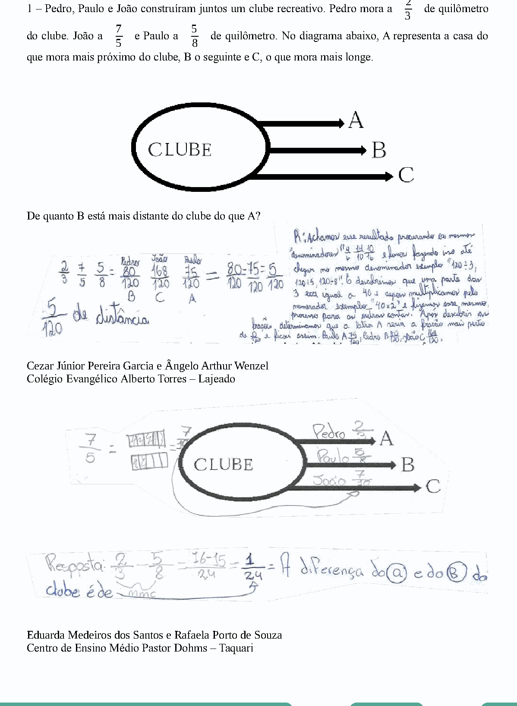

## OMU18-6ANO-Q02
Edição: 18ª | Publicação: 2015 | Páginas: 27

2 – A tela de um microcomputador apresenta números de 1 a 20 e há um programa que faz o
seguinte:
1. No primeiro toque aparecem todos os números.
2. No segundo toque apagam-se todos os números pares e permanecem os demais.
3. No terceiro toque os números múltiplos de três que estavam na tela desaparecem, permanecem os
demais e os múltiplos de três que estavam apagados aparecem na tela.
4. No quarto toque repete-se o processo anterior com os múltiplos de quatro e assim,
sucessivamente, com os múltiplos de cinco, seis, etc., até vinte.
Depois do vigésimo toque, quais são os números que aparecerão na tela do microcomputador?
RESPOSTA: 1, 4, 9 e 16.

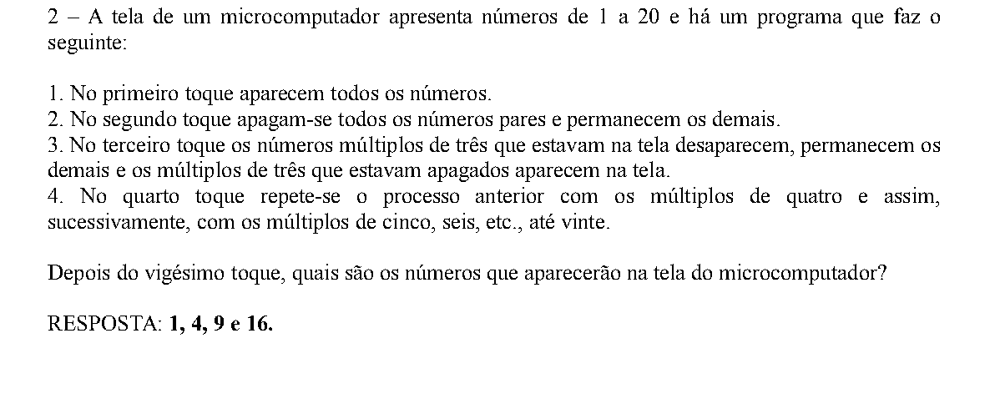

## OMU18-6ANO-Q03
Edição: 18ª | Publicação: 2015 | Páginas: 27

3 – Uma picape, para ir da cidade A para a cidade B, gasta dois tanques e meio de óleo diesel. Se a
distância entre a cidade A e a cidade B é de 500 km e neste percurso ele faz 100 km com 25 litros de
óleo diesel, quantos litros de óleo diesel cabem no tanque da picape?
Helena Vallér e Cecilia Laumo
Colégio Evangélico Alberto Torres – Lajeado
Isabela Wagner Cardoso e Isadora Daniel dos Santos
Centro de Ensino Médio Pastor Dohms – Taquari

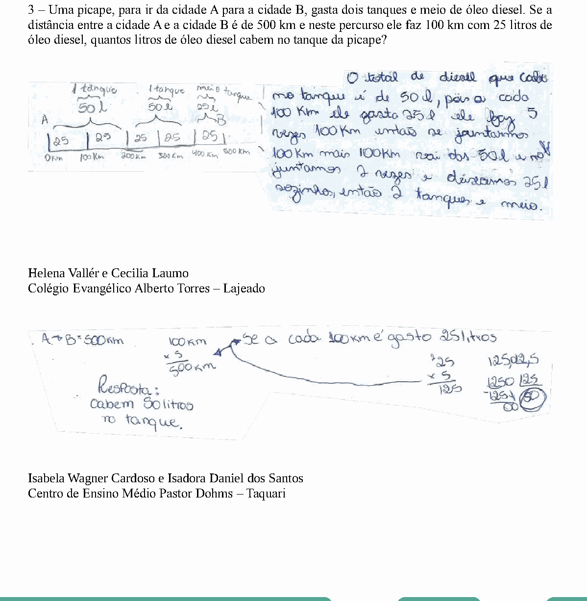

## OMU18-6ANO-Q04
Edição: 18ª | Publicação: 2015 | Páginas: 28

4 – Um estado possui 11 cidades e estradas de mão única que ligam essas cidades. Onze amigos
decidiram viajar, cada um saindo de uma cidade diferente. Cada um deles percorre exatamente uma
estrada por dia. O quadro abaixo mostra as estradas que os amigos usam para viajar.
Saindo de 1 2 3 4 5 6 7 8 9 10 11
Chegando em 6 9 10 7 2 8 11 1 4 3 5
Os amigos viajam todos os dias e param de viajar apenas quando todos eles estiverem no mesmo
dia na cidade onde começaram. Por exemplo, o amigo que começar na cidade 1, após um dia estará
na cidade 6 e após dois dias estará na cidade 8. Após quantos dias eles vão parar de viajar?
Isabela Wagner Cardoso e Isadora Daniel dos Santos
Centro de Ensino Médio Pastor Dohms – Taquari

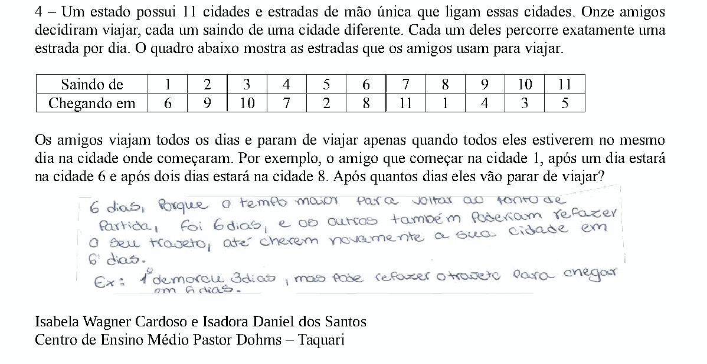

## OMU18-6ANO-Q05
Edição: 18ª | Publicação: 2015 | Páginas: 28, 29

5 – O quadrado abaixo foi repartido em quatro regiões, representadas pelas letras A, B, C, e D. Duas
delas têm a mesma área. Quais são elas?
Mariana Hennicka e Nicolly B. Hammes
Escola Municipal Princesa Isabel - Arroio do Meio

Vinícius Kappler e Lucca M. Schneider
Colégio Evangélico Alberto Torres – Lajeado

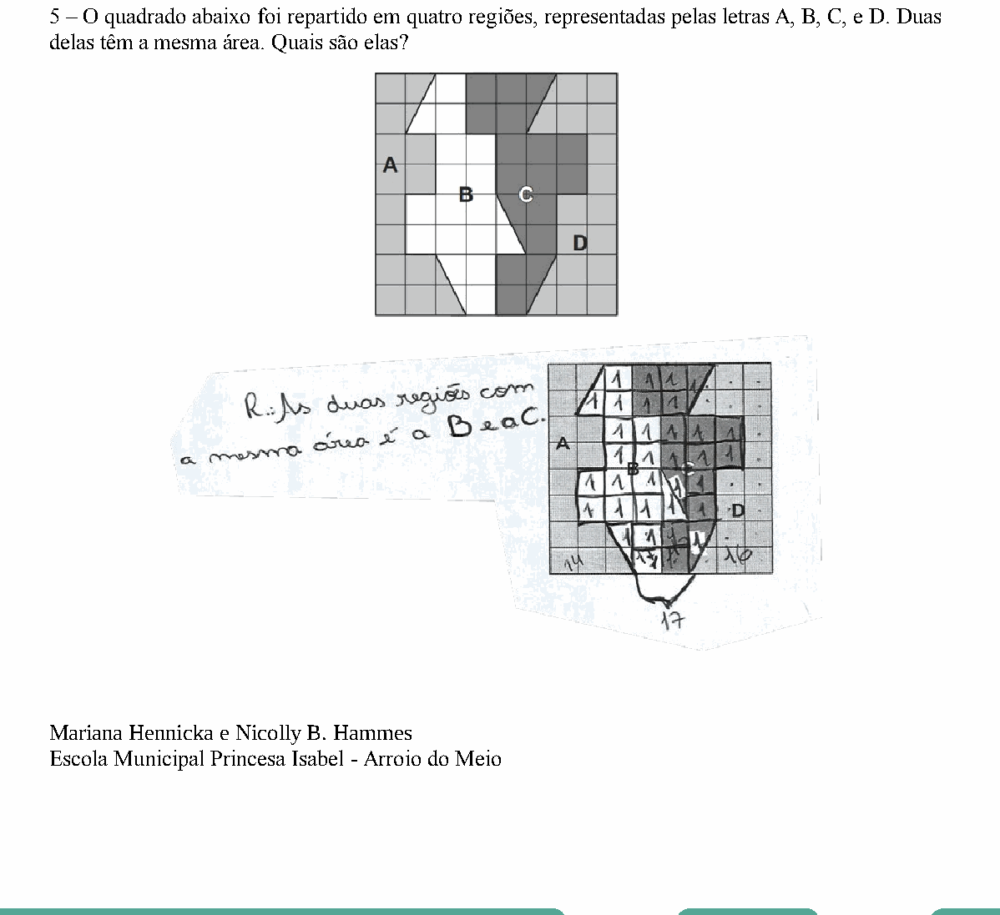
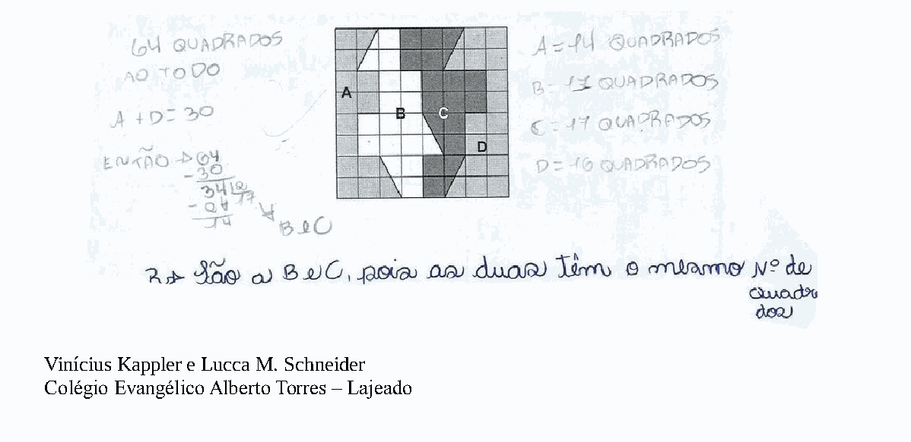

## OMU18-6ANO-Q06
Edição: 18ª | Publicação: 2015 | Páginas: 29, 30

6 – Henrique e Leonor estão explorando uma região do Brasil com suas respectivas equipes. Ambos
começaram a exploração partindo do mesmo ponto. Henrique percorreu 1 km para Norte, seguido
de 2 km para Oeste, 4 km para Sul e finalmente mais 1 km para Oeste. Por sua vez, Leonor seguiu 1
km para Leste, 4 km para Sul e 4 km para Oeste. Qual é o último percurso que Leonor precisa fazer
para encontrar Henrique no seu ponto final?
A) Leonor já está no mesmo ponto que Henrique.
B) 1 km para Norte.
C) 1 km para Noroeste.
D) Mais de 1 km para Noroeste.
E) 1 km para Oeste.
RESPOSTA: LETRA B
Cezar Júnior Pereira Garcia e Ângelo Arthur Wenzel
Colégio Evangélico Alberto Torres – Lajeado

Vinícius Kappler e Lucca M. Schneider
Colégio Evangélico Alberto torres – Lajeado

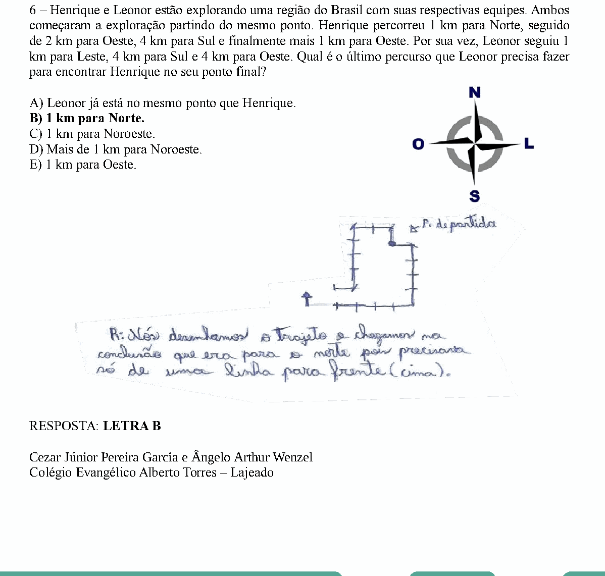
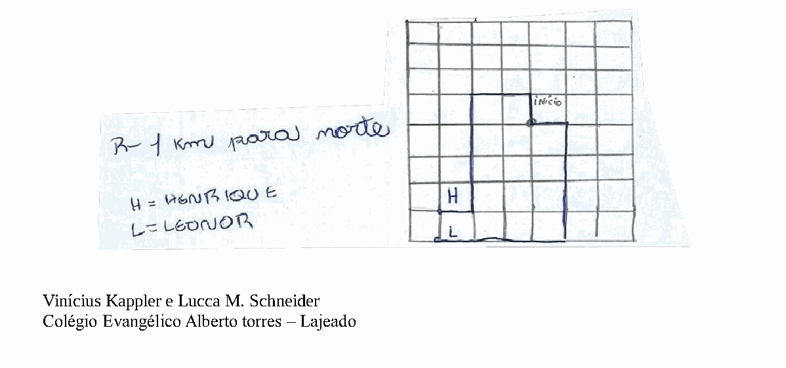

## OMU18-6ANO-Q07
Edição: 18ª | Publicação: 2015 | Páginas: 30

7 – Observar os anúncios e responder:
R$11,00 R$6,00
A) Qual o preço de cada bala?
B) Qual o preço de cada bombom?
Eduardo Weiad Schneider e Guilherme P. Reinaldo
Colégio Martin Luther – Estrela

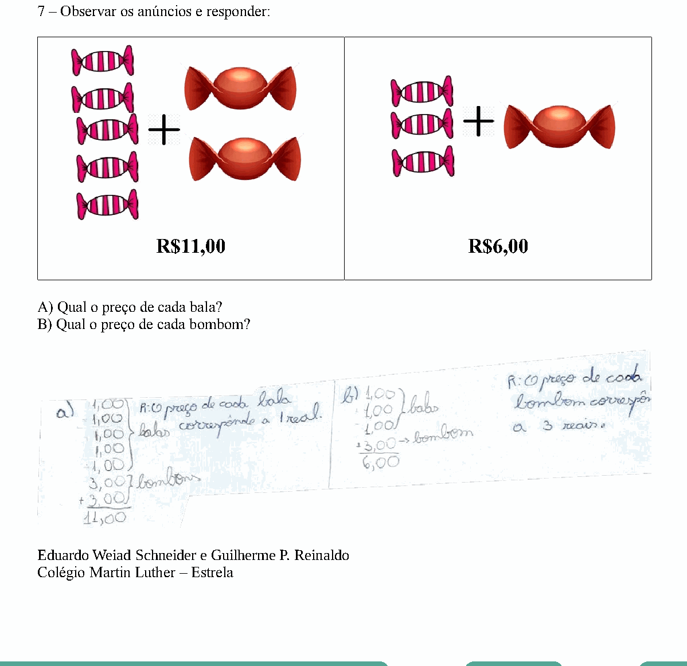

## OMU18-6ANO-Q08
Edição: 18ª | Publicação: 2015 | Páginas: 31

8 – Um documento, representado por uma folha de papel, foi dobrado 3 vezes. Depois, foram feitos
4 furos e cada perfuração atravessou todas as superfícies do papel dobrado.
O número de furos que se observa, quando se desdobra completamente a folha de papel,
corresponde à expressão matemática:
A) 4 + 4 + 4 + 4
B) 2 x 2 x 2 x 4
C) 2 x 2 x 2 x 2 x 4
D) 6 x 4
E) 4 + 4
Gabriel L. Boher e Marcelo Welzel
Colégio Evangélico Alberto Torres – Lajeado
Eduarda Medeiros dos Santos e Rafaela Porto de Souza
Centro de Ensino Médio Pastor Dohms – Taquari

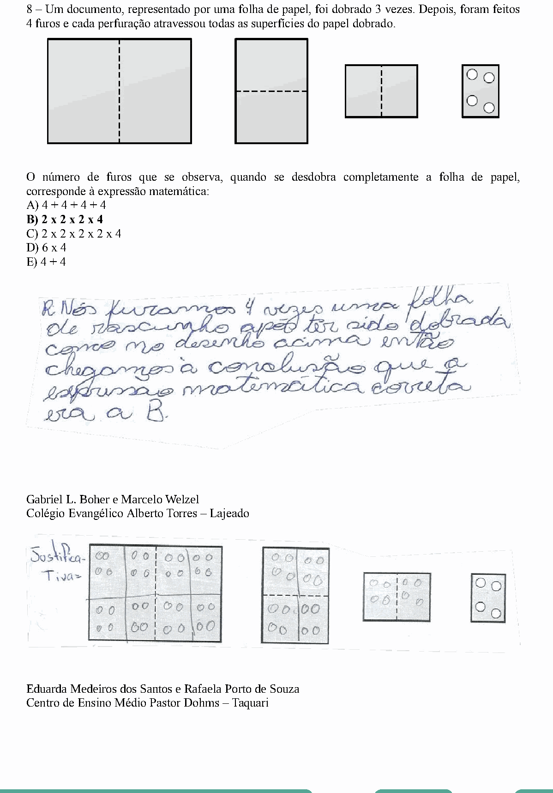

## OMU18-6ANO-Q09
Edição: 18ª | Publicação: 2015 | Páginas: 32

9 – Em um sistema de codificação, AB representa os algarismos do dia do nascimento de uma
pessoa e CD os algarismos de seu mês de nascimento. Nesse sistema, a data trinta de julho, por
exemplo, corresponderia a:
A = 3 B = 0 C = 0 D = 7
Admita uma pessoa cuja data de nascimento obedeça à seguinte condição:
A + B + C + D = 20
Qual o mês de nascimento dessa pessoa?
Eduardo Weiad Schneider e Guilherme P. Reinaldo
Colégio Martin Luther – Estrela

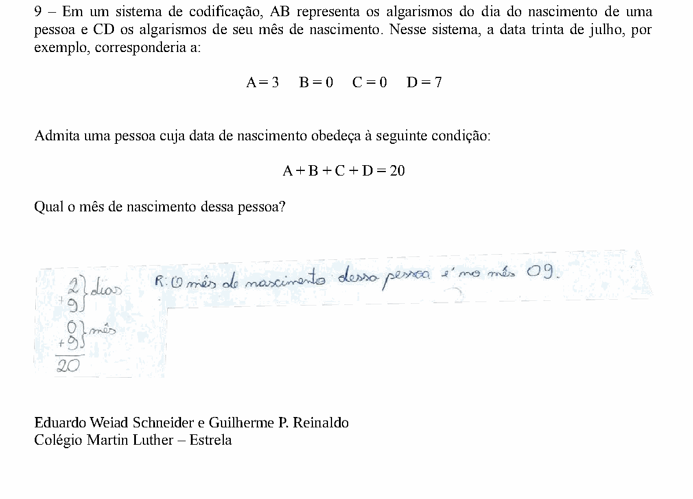

## OMU18-6ANO-Q10
Edição: 18ª | Publicação: 2015 | Páginas: 32

10 – Considerar as seguintes equivalências:
2 = J = %
V = 5 = @
8 = ? = X
& = L = 3
H = 7 = #
Relacionar a coluna da esquerda com a coluna da direita, com os símbolos respectivamente
equivalentes, e assinalar a opção que contém a numeração correta:
(1) J 3 # X V ( ) % L H 5 X
(2) 2 H @ L 8 ( ) 2 H 3 ? @
(3) J & 7 V ? ( ) J # V & X
(4) % # L 8 5 ( ) % L 7 8 @
A) 3 – 4 – 2 – 1
B) 2 – 4 – 3 – 2
C) 3 – 2 – 4 – 1
D) 4 – 3 – 2 – 1
E) 1 – 4 – 3 – 2
RESPOSTA: LETRA A

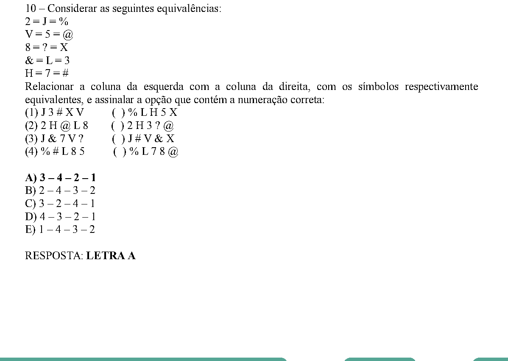

## OMU17-6ANO-Q01
Edição: 17ª | Publicação: 2014 | Páginas: 27, 28

1 – Produtos alimentícios, como os que estão abaixo representados pelos desenhos de suas
embalagens, foram comprados por Dona Clara (mãe de Marcela), para que fosse possível preparar,
entre outros pratos, uma torta de ervilhas e camarões, em comemoração ao Dia do Amigo.
Veja abaixo, a lista de produtos comprados por Dona Clara e veja, também a relação dos
ingredientes (e suas respectivas quantidades) necessários para o preparo de apenas uma torta.
Verificar atentamente, a quantidade usada de cada um dos ingredientes no preparo da torta. Se Dona
Clara colocar todas estas sobras em uma balança, quantos gramas esta balança marcará?

Otávio Maassen e Rafael Redecker
Centro de Ensino Médio Pastor Dohms - Taquari
Maísa Batista Flores e Maiara Taís Schmidt
Escola Municipal de Ensino Fundamental Leopoldo Klepker - Teutônia

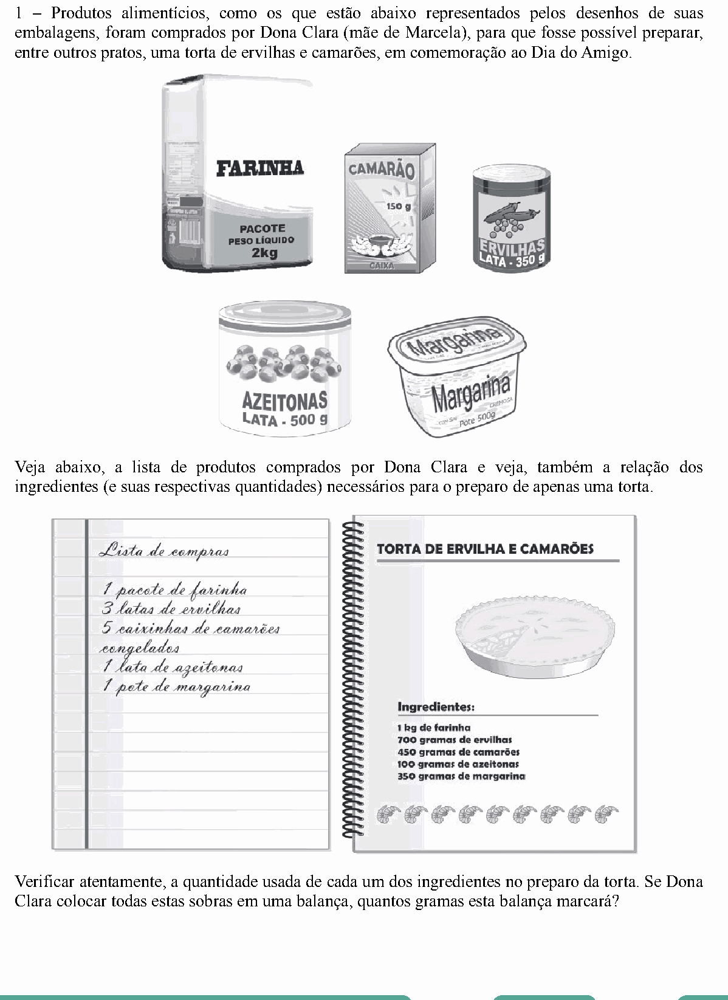
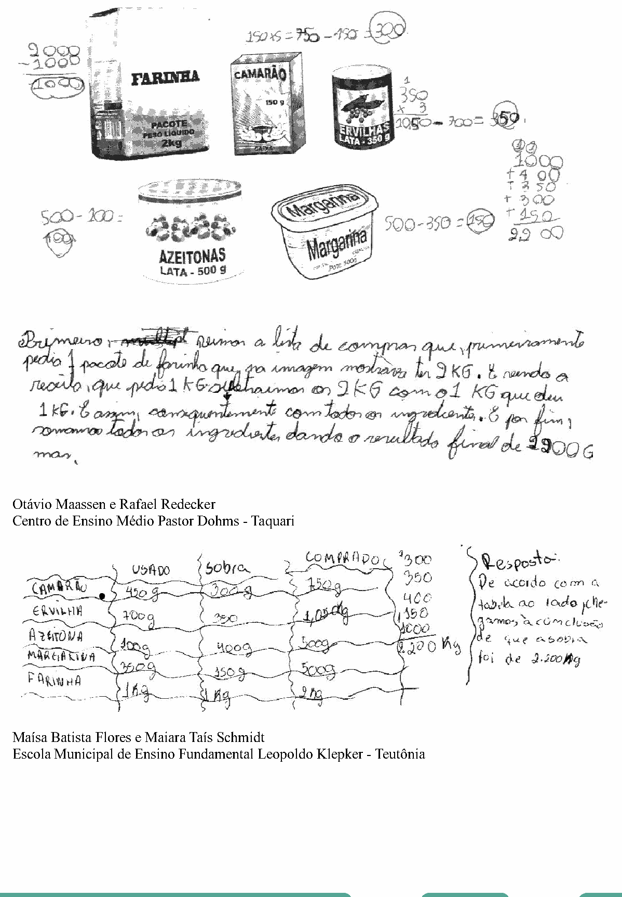

## OMU17-6ANO-Q02
Edição: 17ª | Publicação: 2014 | Páginas: 29

2 – Cada quadradinho na figura deve ser preenchido com um sinal de adição ( +) ou de
multiplicação (x). Qual é o maior valor possível da expressão obtida depois de preenchidos todos os
quadradinhos?
Nicoly Wolschick e Jamine Schmitt
Colégio Sinodal Gustavo Adolfo - Lajeado

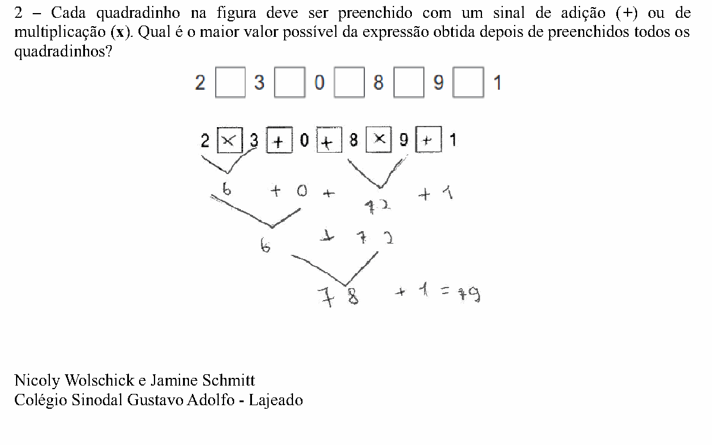

## OMU17-6ANO-Q03
Edição: 17ª | Publicação: 2014 | Páginas: 29, 30

3 – Dona Benta dividiu o Sítio do Picapau Amarelo entre seis personagens, mantendo uma parte do
Sítio como reserva florestal. A divisão está indicada na figura, onde a área de cada personagem é
dada em hectares e a área sombreada é a reserva florestal. O Sítio tem formato retangular e AB é
uma diagonal. Qual é a área da reserva florestal?

Maísa Batista Flores e Maiara Taís Schmidt
Escola Municipal de Ensino Fundamental Leopoldo Klepker - Teutônia

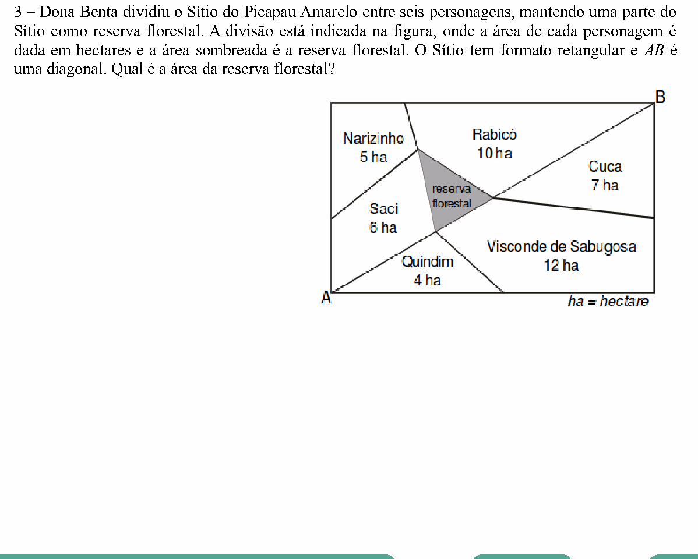
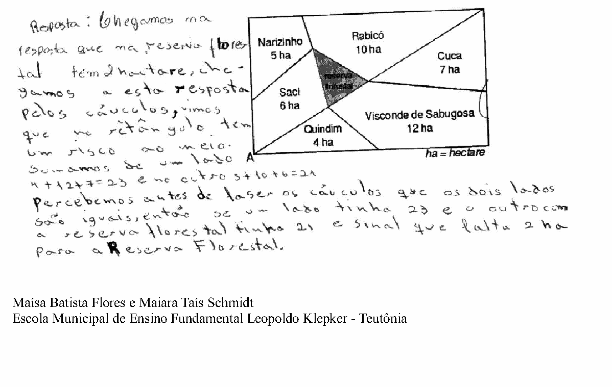

## OMU17-6ANO-Q04
Edição: 17ª | Publicação: 2014 | Páginas: 30

4 – Numa empresa de ônibus, o bilhete simples custa R$ 2,50 e o passe mensal custa R$ 67,50.
Num determinado mês, Maria comprou o passe e fez duas viagens por dia, durante 20 dias. Quanto
teria gasto a mais se tivesse comprado bilhetes simples para todas as viagens efetuadas durante esse
mês?
R: R$ 32,50

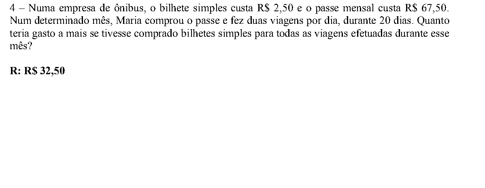

## OMU17-6ANO-Q05
Edição: 17ª | Publicação: 2014 | Páginas: 30, 31, 32

5 – A Cantina Esperança, que funciona na escola de Marcela, demonstra responsabilidade social
ajudando um asilo em suas comemorações. De fevereiro a maio, já doou 2300 minipizzas. O
pictograma abaixo mostra o número de mini pizzas doadas.

Qual, dos gráficos seguintes, pode representar as informações do pictograma?

Otávio Maassen e Rafael Redecker
Centro de Ensino Médio Pastor Dohms - Taquari

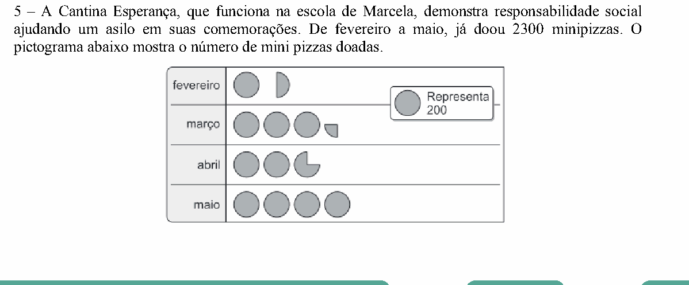
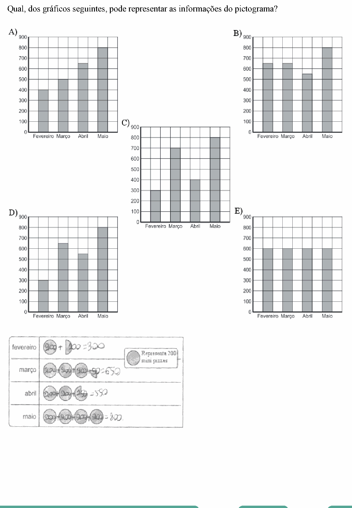
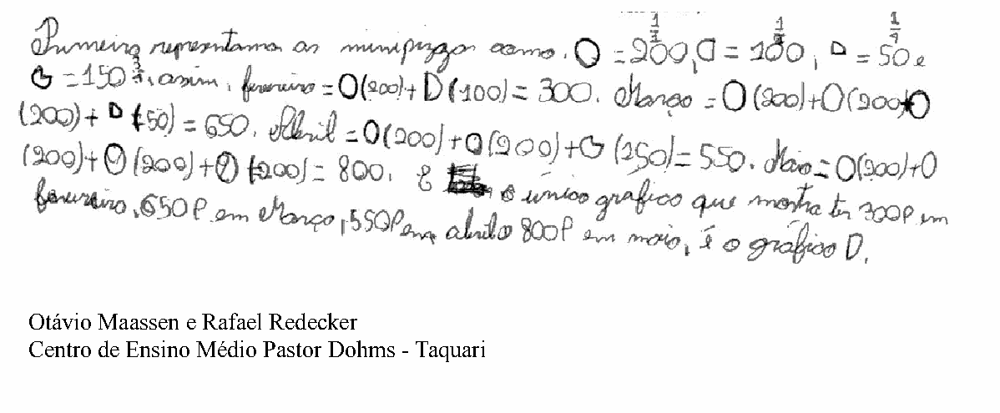

## OMU17-6ANO-Q06
Edição: 17ª | Publicação: 2014 | Páginas: 32

6 – João tem péssima memória para guardar números, mas ótima para lembrar sequências de
operações. Por isso, para lembrar de seu código bancário de 5 algarismos, ele consegue se lembrar
que nenhum algarismo é zero, os dois primeiros algarismos formam uma potência de 5, os dois
últimos formam uma potência de 2, o do meio é um múltiplo de 3 e a soma de todos os algarismos é
um número ímpar. Agora ele não precisa mais decorar o número porque sabe que é o maior número
que satisfaz essas condições e que não tem algarismos repetidos. Qual é esse código?
Gabriel Ziem Cardoso de Siqueira e Odin Purper
Colégio Madre Bárbara - Lajeado

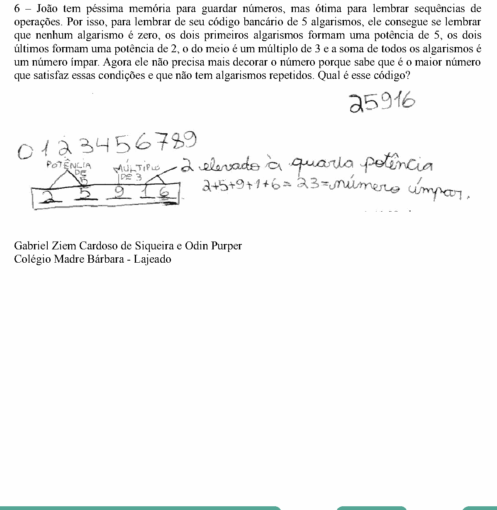

## OMU17-6ANO-Q07
Edição: 17ª | Publicação: 2014 | Páginas: 33

7 – Alice foi à perfumaria e viu a tabela de preços, como na figura abaixo. Com R$ 10,00 ela
comprou um sabonete, um creme dental e um desodorante e ainda sobrou dinheiro. Nessas
condições, podemos afirmar que entre os artigos comprados havia obrigatoriamente
A) um sabonete pequeno.
B) um creme dental médio.
C) um desodorante pequeno.
D) um sabonete médio.
E) um creme dental pequeno.

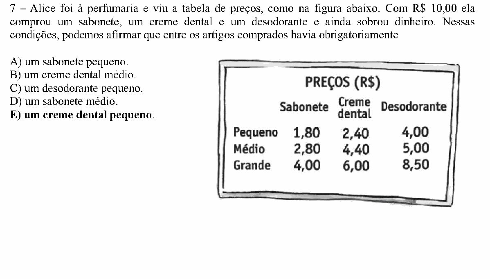

## OMU17-6ANO-Q08
Edição: 17ª | Publicação: 2014 | Páginas: 33

8 – Cada uma das 5 xícaras da figura abaixo está cheia só com café, só com leite ou só suco. No
total, a quantidade de café é o dobro da de suco. Nenhuma das bebidas está em mais de 2 xícaras
diferentes. Quais as xícaras que contêm leite?
A) apenas a xícara I.
B) as xícaras III e IV.
C) as xícaras II e V.
D) as xícaras III e V.
E) as xícaras IV e V.

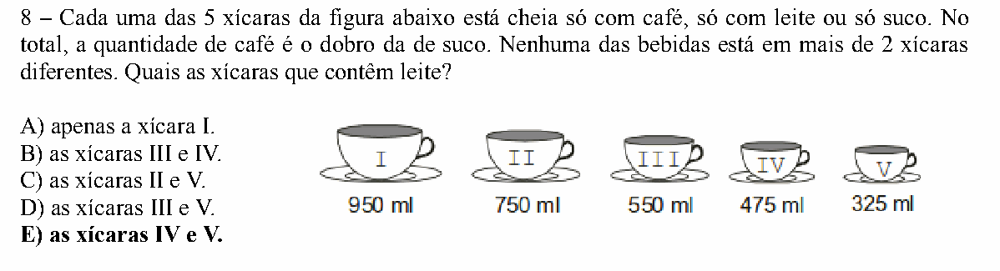

## OMU17-6ANO-Q09
Edição: 17ª | Publicação: 2014 | Páginas: 33

9 - A calculadora de Raquel é um pouco diferente. Além das 10 teclas numéricas de 0 a 9, ela só tem
três teclas de operações:
• A tecla Q, que multiplica o número do visor por ele mesmo;
• A tecla D, que multiplica o número do visor por 2;
• A tecla C, que divide o número do visor por 5.
Raquel se diverte colocando um número inteiro no visor e produzindo novos números usando
apenas as teclas de operações. Por exemplo, começando com o número 20 e usando a sequência de
teclas CDQ, Raquel obteve o número 64, como se pode ver na figura.
Raquel começou com 15 e obteve 18 apertando três teclas de operações. Qual foi a sequência de
teclas que ela usou?
R: C,Q,D

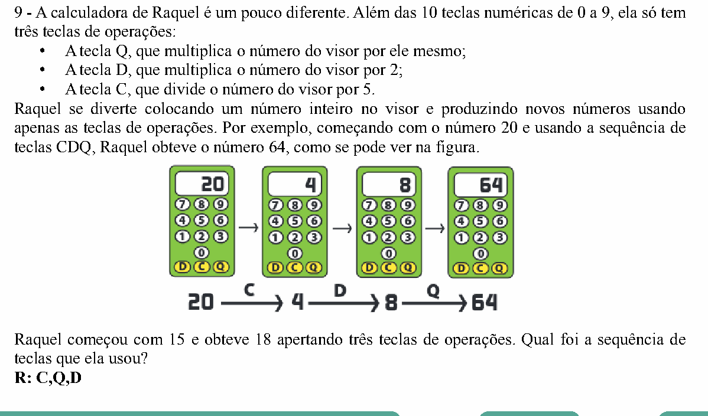

## OMU17-6ANO-Q10
Edição: 17ª | Publicação: 2014 | Páginas: 34

10 – A pista de corrida da figura tem 6 km de comprimento. Mário e João partiram do ponto P,
correndo em sentidos contrários. Mário correu 8 km e parou para descansar, enquanto João correu
15 km e também parou. Qual é a menor distância, ao longo da pista, que João deve andar até o
ponto em que Mário parou?
Gabriel Ziem Cardoso de Siqueira e Odin Purper
Colégio Madre Bárbara - Lajeado

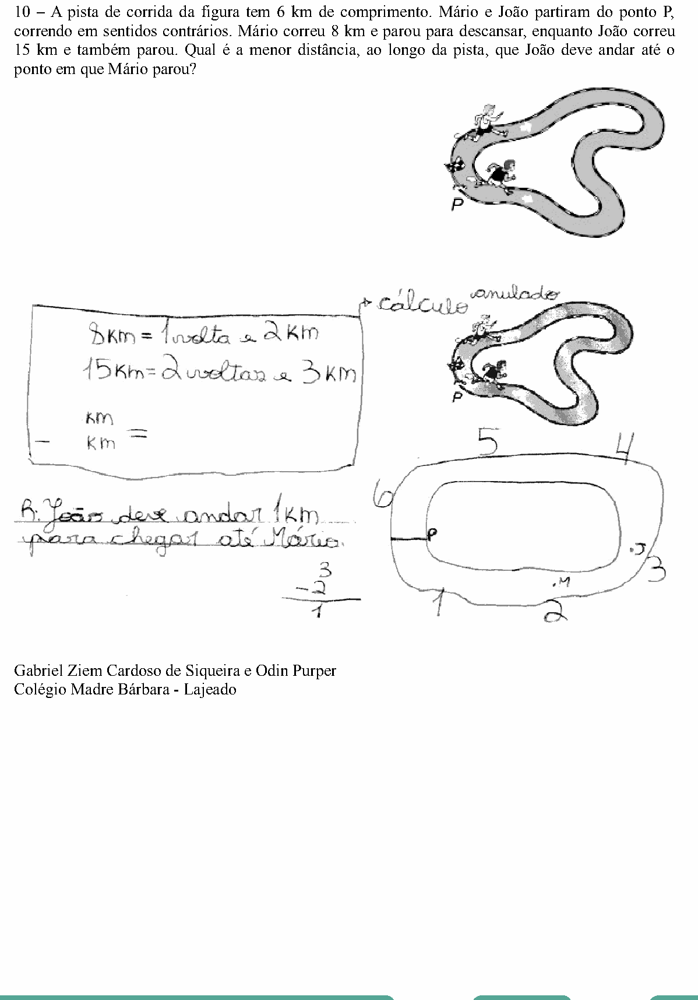
