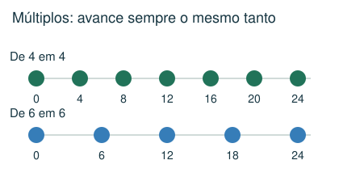
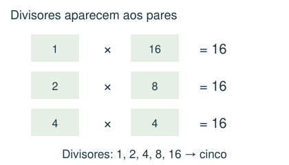
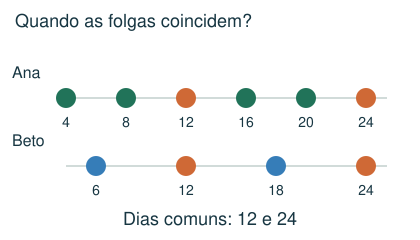
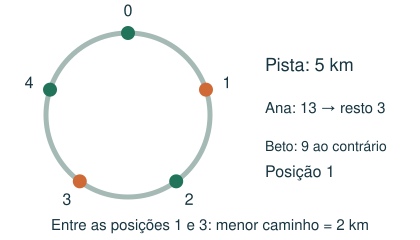

# Divisibilidade, restos e ciclos

Reconhecer repetições, múltiplos e encontros periódicos.

## Observe e compreenda 1

### Múltiplos, divisores e critérios
Múltiplos de 5: 0, 5, 10, 15... Divisores de 12: 1, 2, 3, 4, 6 e 12. Divisibilidade por 2: unidade par; por 3: soma dos algarismos divisível por 3; por 5: termina em 0 ou 5; por 9: soma divisível por 9; por 10: termina em 0. Por 11, a diferença entre somas de posições alternadas é múltipla de 11, incluindo zero.

### Algarismos e potências
Um número de dois algarismos AB vale 10A + B, não A × B. AB + BA = 11 × (A + B); logo é múltiplo de 11. Quadrados perfeitos como 1, 4, 9 e 16 têm uma quantidade ímpar de divisores, pois um dos pares de fatores é formado por números iguais.

### MMC e início deslocado
O mínimo múltiplo comum é o menor múltiplo positivo comum. Ciclos de 4 e 6 dias que começam juntos se reencontram a cada 12 dias. Se começam em datas diferentes, liste os primeiros eventos de cada sequência até achar um encontro; o MMC dá o intervalo entre encontros, não necessariamente a data do primeiro.

## Observe e compreenda 2

### Restos, voltas e casas numa roda
Na divisão 17 = 3 × 5 + 2, o resto 2 representa o avanço depois de 3 voltas de comprimento 5. Para sentidos contrários, marque os pontos numa mesma orientação. A distância menor entre posições numa pista de comprimento L é o menor valor entre d e L − d.

### Ciclos de trocas e eliminação
Em itinerários, siga uma cidade até voltar a ela, determine o tamanho de cada ciclo e calcule o MMC. Em alternância ligado/desligado, conte quantas vezes cada posição muda. Em uma roda que elimina a cada segunda pessoa, simule casos pequenos: com início da contagem em 1, potências de 2 deixam o primeiro como sobrevivente. Não use essa regra se a contagem for diferente.

## Exemplo 1: Folgas
Ana folga nos dias 4, 8, 12...; Beto nos dias 6, 12, 18... Qual a segunda folga comum?

A primeira é 12; o intervalo é MMC(4,6) = 12. A segunda é 24.

## Exemplo 2: Corrida circular
Numa pista de 5 km, Ana anda 13 km no sentido horário e Beto 9 km no sentido contrário, saindo do mesmo ponto.

Ana termina na posição 3. Beto avança 4 no sentido contrário, isto é, posição 1 na orientação de Ana. As distâncias possíveis são 2 e 3 km; a menor é 2 km.

## Fique atento
- Usar o MMC como data do primeiro encontro apesar de inícios diferentes.
- Esquecer que uma volta inteira retorna à mesma posição.
- Confundir um algarismo com seu valor posicional.

## Atividades
### 1. Qual dos valores não pode ser a soma de dois números de dois algarismos não nulos que tenham os algarismos em ordem invertida?
A) 154
B) 125
C) 66
D) 99

### 2. Duas luzes piscam a cada 6 e 8 segundos. Elas piscaram juntas agora. Em quantos segundos piscarão juntas novamente?
A) 24
B) 14
C) 48
D) 12

### 3. Numa pista circular de 5 km, Ana corre 13 km no sentido horário e Beto 9 km no sentido contrário, saindo do mesmo ponto. Qual a menor distância entre eles ao longo da pista?
A) 1 km
B) 3 km
C) 4 km
D) 2 km

### 4. Números de 1 a 16 começam apagados. Para cada k de 1 a 16, todos os múltiplos de k trocam de estado: apagado vira aceso e aceso vira apagado. Quais terminam acesos?
A) 1, 3, 5 e 7
B) 4, 8, 12 e 16
C) 1, 4, 9 e 16
D) 2, 4, 8 e 16

### 5. Ana folga nos dias 4, 9, 14, 19... Beto folga nos dias 6, 12, 18, 24... A primeira folga comum é no dia 24. Qual é o dia da segunda folga comum, contando os dias continuamente?
A) 60
B) 54
C) 30
D) 48

## Gabarito comentado
1. B) 125. AB + BA = 11 × (A + B). 125 não é múltiplo de 11. Os outros são possíveis: 15+51, 18+81 e 59+95.

2. A) 24. O primeiro múltiplo positivo comum de 6 e 8 é 24.

3. D) 2 km. Ana termina na posição 3 km. Beto anda 4 km no sentido contrário após uma volta, terminando na posição 1 km na orientação de Ana. Os caminhos entre eles medem 2 e 3 km.

4. C) 1, 4, 9 e 16. Cada número muda uma vez por divisor. Só os quadrados perfeitos têm quantidade ímpar de divisores.

5. B) 54. Os ciclos têm 5 e 6 dias. Entre encontros há MMC(5,6)=30 dias. A segunda coincidência ocorre em 24 + 30 = 54.
