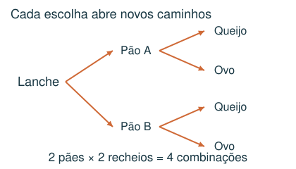
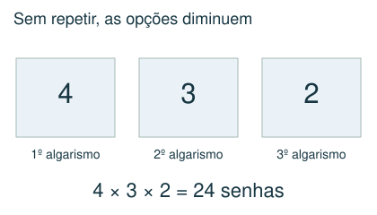
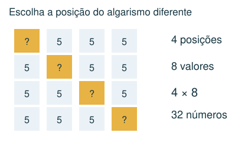
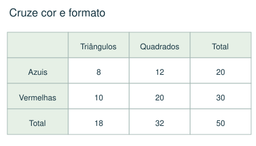

# Contagem e organização de casos

Contar sem repetir nem esquecer possibilidades.

## Observe e compreenda 1

### Listas e árvores
Uma lista organizada é uma ferramenta matemática. Separe casos por primeiro algarismo, posição ou categoria. Cada possibilidade deve entrar uma única vez. Uma árvore mostra as escolhas sucessivas, especialmente quando algumas deixam de estar disponíveis.

### Princípio multiplicativo
Se há 3 escolhas para a primeira etapa e, para cada uma, 4 para a segunda, existem 3 × 4 = 12 combinações. Sem repetição, o número de opções diminui: senhas de 3 dígitos distintos escolhidos entre 1, 2, 3 e 4 dão 4 × 3 × 2 = 24.

### Exatamente e pelo menos
Em um número de quatro algarismos com exatamente três algarismos 7, escolha a posição do algarismo diferente (4 opções) e seu valor. Se zero é proibido, esse valor tem 8 opções: 1 a 9, exceto 7. Total: 4 × 8 = 32. “Pelo menos três” incluiria também 7777.

## Observe e compreenda 2

### Tabelas de dupla entrada
Quando há duas classificações, como cor e formato, faça uma tabela. Totais de linhas e colunas precisam concordar. Preencha primeiro os valores conhecidos; use subtração para os complementos e relações como “o dobro” para dividir um subtotal.

### Limites e conferência
Códigos podem começar por zero se isso for permitido; números de quatro algarismos não podem. Ao terminar, compare seu total com uma contagem alternativa ou enumere um exemplo menor. Não use uma fórmula cujo significado não consiga explicar.

## Exemplo 1: Rifa
Quantos números de quatro algarismos usam exatamente três algarismos 5 e outro algarismo de 1 a 9 diferente de 5?

Há 4 posições para o diferente e 8 escolhas para seu valor. Total: 32.

## Exemplo 2: Peças
Há 50 peças: 20 azuis e 30 vermelhas. Das azuis, 8 são triângulos. Das vermelhas, há o dobro de quadrados que triângulos. Quantos quadrados existem?

Azuis: 20 − 8 = 12 quadrados. Vermelhas: 30 ÷ 3 = 10 triângulos e 20 quadrados. Total: 32 quadrados.

## Fique atento
- Contar a mesma configuração em duas ordens diferentes.
- Incluir o caso com quatro algarismos iguais quando a regra exige exatamente três.
- Esquecer a proibição de zero na primeira posição.

## Atividades
### 1. Quantas senhas de 3 algarismos distintos podem ser feitas com 1, 2, 3 e 4?
A) 64
B) 16
C) 24
D) 12

### 2. Quantos números de quatro algarismos, sem zero, têm exatamente três algarismos iguais a 7?
A) 33
B) 32
C) 36
D) 24

### 3. Há 60 peças: 24 azuis e 36 vermelhas. Entre as azuis, 10 são triângulos. Entre as vermelhas, o número de quadrados é o dobro do de triângulos. Todas são quadrados ou triângulos. Quantos quadrados há?
A) 38
B) 24
C) 36
D) 42

### 4. Um lanche é formado por um pão, um recheio e uma bebida. Há 2 tipos de pão, 3 recheios e 4 bebidas, sem restrições. Quantos lanches diferentes são possíveis?
A) 9
B) 12
C) 18
D) 24

### 5. Quantos números de 3 algarismos distintos podem ser formados usando apenas 0, 1, 2 e 3?
A) 12
B) 16
C) 18
D) 24

## Gabarito comentado
1. C) 24. Há 4 escolhas para o primeiro, 3 para o segundo e 2 para o terceiro: 4 × 3 × 2 = 24.

2. B) 32. Escolha a posição do algarismo diferente: 4 opções. Ele pode ser 1,2,3,4,5,6,8 ou 9: 8 opções. Total 4 × 8 = 32.

3. A) 38. Quadrados azuis: 24 − 10 = 14. Vermelhos: 36 ÷ 3 × 2 = 24. Total: 38.

4. D) 24. Cada escolha de pão permite 3 recheios; cada par permite 4 bebidas. 2 × 3 × 4 = 24.

5. C) 18. A centena não pode ser zero: 3 opções. Sobram 3 opções para a dezena, incluindo zero, e 2 para a unidade: 3 × 3 × 2 = 18.
