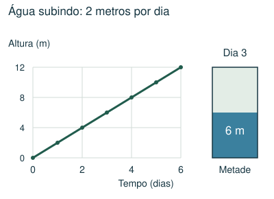
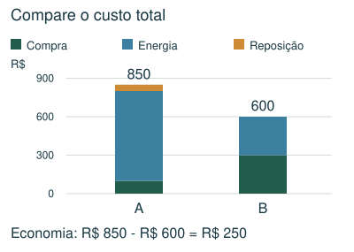
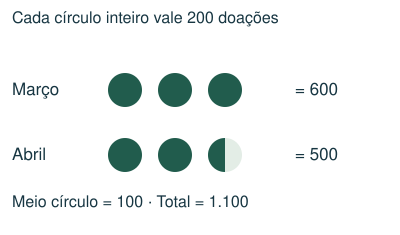
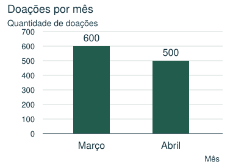
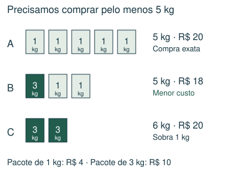

# Gráficos, tabelas e decisões

Ler escalas e legendas e justificar comparações.

## Observe e compreenda 1

### Leia antes de calcular
Identifique título, eixos, unidades e legenda. Confira se o eixo começa em zero e quanto representa cada intervalo. Em uma tabela, cruze a linha e a coluna corretas. Não compare altura visual de barras se as escalas forem diferentes.

### Pictogramas e partes de símbolos
Se um símbolo representa 200 unidades, meio símbolo representa 100. Para descobrir a legenda a partir de um total, some quantos símbolos inteiros equivalentes aparecem e divida o total por essa quantidade. Ao trocar pictograma por barras, preserve as quantidades e a ordem das categorias.

### Crescimento e vazão constante
Num gráfico de altura por tempo, compare a variação vertical com a horizontal. Se a altura cresce de 2 m a 6 m em 2 dias, a taxa é 2 m/dia. Se começa vazio e mantém a taxa, atinge 12 m em 6 dias. Se já começou com água, use apenas a altura que falta.

## Observe e compreenda 2

### Verificação de afirmações
Calcule cada afirmação separadamente. Custo inicial, reposição e gasto de energia são parcelas diferentes. Divida valores totais pelo número de lâmpadas para obter valores por unidade. “Aproximadamente” permite arredondamento coerente; não transforma valores claramente distintos em iguais.

### Compras em pacotes e menor custo
Primeiro determine a necessidade diária e multiplique pelo número de dias. Depois liste combinações de pacotes que atendem à quantidade. Pode valer a pena comprar um pouco a mais se o preço for menor. Compare custo total de combinações viáveis; menor preço por kg não resolve sozinho toda compra com pacotes indivisíveis.

## Exemplo 1: Legenda desconhecida
Um pictograma tem 3 símbolos em março e 2,5 em abril, representando 1.100 doações no total. Quanto vale um símbolo?

São 5,5 símbolos equivalentes. Cada um vale 1.100 ÷ 5,5 = 200 doações. Março: 600; abril: 500.

## Exemplo 2: Pacotes de ração
São necessários 5 kg. Pacotes de 1 kg custam R$ 4 e os de 3 kg custam R$ 10. Qual a compra mais barata?

Cinco pequenos custam R$ 20. Um grande e dois pequenos custam R$ 18. Dois grandes custam R$ 20. A melhor combinação custa R$ 18 e fornece 5 kg.

## Fique atento
- Ignorar a legenda ou usar metade do valor errado.
- Confundir valor total e valor por unidade.
- Escolher uma compra barata que não atende à quantidade mínima.

## Atividades
### 1. Num pictograma, cada estrela inteira representa 120 livros. Uma turma aparece com 2 estrelas e meia. Quantos livros ela arrecadou?
A) 240
B) 180
C) 360
D) 300

### 2. A tabela mostra a altura da água num reservatório inicialmente vazio. O crescimento continua à mesma taxa. Em que dia a altura chega a 15 m?
Tempo (dias) | 0 | 2 | 4
Altura (m) | 0 | 3 | 6
A) 8º dia
B) 12º dia
C) 10º dia
D) 5º dia

### 3. Considere os custos de duas opções de lâmpadas na tabela. Qual é a economia total ao escolher B no período mostrado?
Custo | A | B
Compra | R$ 100 | R$ 300
Energia | R$ 700 | R$ 300
Reposição | R$ 50 | R$ 0
A) R$ 150
B) R$ 250
C) R$ 400
D) R$ 450

### 4. São necessários pelo menos 7 kg de ração. Pacotes de 1 kg custam R$ 4; pacotes de 3 kg custam R$ 9. Qual é o menor custo possível?
A) R$ 22
B) R$ 21
C) R$ 27
D) R$ 28

### 5. Um pictograma mostra 2 símbolos para abril, 3 para maio e 1,5 para junho. Ao todo são 1.300 doações. Quantas doações correspondem a maio?
A) 300
B) 650
C) 400
D) 600

## Gabarito comentado
1. D) 300. Duas estrelas valem 240; meia vale 60. Total: 300.

2. C) 10º dia. A taxa é 3 ÷ 2 = 1,5 m/dia. Para 15 m, são 15 ÷ 1,5 = 10 dias.

3. B) R$ 250. A: 100 + 700 + 50 = 850. B: 300 + 300 + 0 = 600. Economia: 850 − 600 = 250.

4. A) R$ 22. Dois pacotes grandes e um pequeno fornecem 7 kg por 18 + 4 = 22. Um grande e quatro pequenos custam 25; três grandes custam 27; sete pequenos custam 28.

5. D) 600. São 6,5 símbolos no total. Um símbolo vale 1.300 ÷ 6,5 = 200. Maio tem 3 × 200 = 600.
