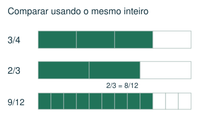
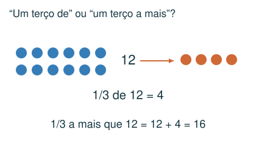
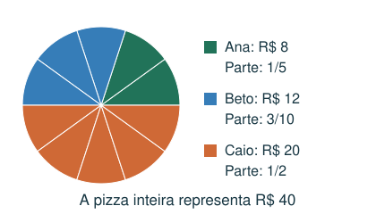
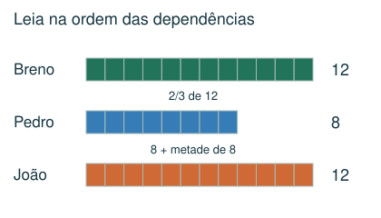

# Frações e partes de um todo

Comparar, operar e interpretar frações em áreas, capacidades e partilhas.

## Observe e compreenda 1

### Qual é o todo?
Em a/b, o denominador b indica em quantas partes iguais o todo foi dividido e a indica quantas são consideradas. A mesma fração pode representar quantidades diferentes se os todos forem diferentes. Numa malha, fração da região = quadradinhos da região ÷ quadradinhos totais.

### Equivalência, comparação e operações
Multiplicar numerador e denominador pelo mesmo número mantém a fração. Para somar, subtrair ou comparar, use denominador comum: 2/3 − 5/8 = 16/24 − 15/24 = 1/24. Na multiplicação, multiplique numeradores e denominadores. Para dividir por uma fração não nula, multiplique por sua inversa.

### Fração de uma quantidade e de outra fração
3/5 de 20 = 20 ÷ 5 × 3 = 12. Se um copo pequeno é 2/3 de um médio e o médio é 3/4 de um grande, o pequeno é 2/3 × 3/4 = 1/2 do grande. Para combinar capacidades, expresse todas na mesma referência.

## Observe e compreenda 2

### A mais, partilha, orçamento e voltas
1/3 a mais que 12 significa 12 + 12/3 = 16; não significa 12/3. Numa divisão proporcional, a parte de cada um é sua contribuição dividida pela soma das contribuições. Limite de 1/6 da renda é renda ÷ 6. Para uma fração de várias voltas, calcule o percurso total antes de localizar a posição.

### Decimais e porcentagem como apoio
1/2 = 0,5 = 50%; 1/4 = 0,25 = 25%; 3/4 = 0,75 = 75%. Porcentagem significa uma fração de denominador 100. Essa conversão ajuda a interpretar dados, embora o acervo use principalmente frações.

## Exemplo 1: Divisão de uma pizza
Três amigos pagaram R$ 8, R$ 12 e R$ 20. Como dividir proporcionalmente?

Total: 40. Partes: 8/40 = 1/5; 12/40 = 3/10; 20/40 = 1/2. Conferência: 2/10 + 3/10 + 5/10 = 1.

## Exemplo 2: Frações encadeadas
Breno comeu 1/4 de 48 fatias. Pedro comeu 2/3 do que Breno comeu; João comeu 1/2 a mais que Pedro.

Breno: 12. Pedro: 8. João: 8 + 4 = 12. Siga a ordem das dependências.

## Fique atento
- Somar denominadores: 1/2 + 1/3 não é 2/5.
- Comparar só os numeradores de frações com denominadores diferentes.
- Confundir “metade de” com “metade a mais”.

## Atividades
### 1. Qual é a diferença entre 3/4 e 2/3?
A) 1/12
B) 1/7
C) 1/3
D) 5/12

### 2. Um copo pequeno corresponde a 2/3 de um médio. O médio corresponde a 3/4 de um grande. Que fração do grande corresponde ao pequeno?
A) 5/7
B) 2/4 de um médio
C) 8/9
D) 1/2

### 3. Ana, Beto e Caio pagaram R$ 6, R$ 9 e R$ 15 por uma pizza de R$ 30. A divisão foi proporcional ao pagamento. Qual fração coube a Beto?
A) 1/2
B) 3/5
C) 3/10
D) 1/5

### 4. Pedro comeu 12 fatias. João comeu 1/3 a mais que Pedro. Rafael comeu metade do que João comeu. Quantas fatias Rafael comeu?
A) 18
B) 8
C) 2
D) 6

### 5. Uma pessoa pretende dar 6 voltas numa pista. Ela já percorreu 3/8 da distância planejada. Quantas voltas completas e que fração da próxima volta ela percorreu?
A) 2 voltas e 1/4
B) 3 voltas e 1/8
C) 2 voltas e 3/8
D) 1 volta e 3/4

## Gabarito comentado
1. A) 1/12. Use denominador 12: 9/12 − 8/12 = 1/12.

2. D) 1/2. 2/3 × 3/4 = 6/12 = 1/2 do copo grande.

3. C) 3/10. Beto contribuiu com 9 de 30 reais. Sua fração é 9/30 = 3/10.

4. B) 8. Um terço de 12 é 4. João comeu 16 e Rafael comeu 16 ÷ 2 = 8.

5. A) 2 voltas e 1/4. 6 × 3/8 = 18/8 = 9/4 = 2 + 1/4.
