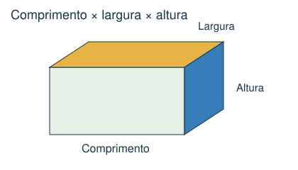
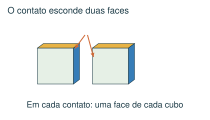
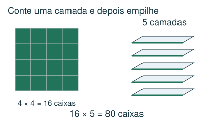
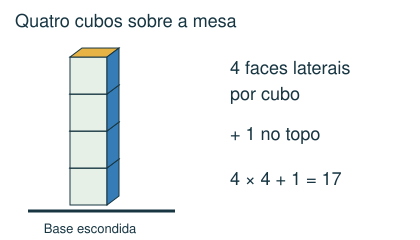

# Geometria espacial

Contar caixas, camadas e faces expostas.

## Observe e compreenda 1

### Dimensões e volume
Um bloco retangular tem comprimento, largura e altura. Seu volume é o produto dessas três medidas em unidades compatíveis. Um cubo de aresta 3 cm tem volume 27 cm³. Volume mede espaço ocupado; uma face tem área, não volume.

### Quantas caixas cabem?
Para encaixe alinhado às arestas, conte quantas caixas cabem em cada direção e multiplique. Numa caixa de 12 × 8 × 6 cm, caixas de 3 × 2 × 2 cm cabem em 4 × 4 × 3 = 48 posições. Verifique se girar a caixa muda o encaixe.

### Volume dá um limite, não garante encaixe
Dividir o volume grande pelo pequeno fornece um limite superior para a quantidade. O formato e as medidas podem impedir atingir esse limite. Quando as medidas se dividem exatamente em cada direção, uma montagem em camadas mostra que o limite é alcançado. Em outros casos, justifique o arranjo, sem supor que a divisão de volumes resolve tudo.

## Observe e compreenda 2

### Faces expostas
Cada cubo tem 6 faces. Duas faces ficam escondidas em cada contato entre cubos; cada face apoiada na mesa também deixa de ficar exposta. Numa coluna vertical de n cubos sobre a mesa: 6n − 2(n − 1) − 1 = 4n + 1 faces expostas. O resultado depende da montagem.

### Desenhe camadas
Use vistas de cima, de frente ou uma lista de camadas. Diferencie faces expostas ao ar de faces que aparecem de um único ponto de vista: a expressão usada no problema importa.

## Exemplo 1: Caixas menores
Uma caixa de 20 × 12 × 10 cm recebe caixas de 5 × 3 × 2 cm, alinhadas. Quantas cabem?

4 no comprimento, 4 na largura e 5 na altura. Total: 4 × 4 × 5 = 80. Os volumes confirmam: 2.400 ÷ 30 = 80.

## Exemplo 2: Torre de cubos
Quatro cubos formam uma coluna sobre uma mesa. Quantas faces ficam expostas ao ar?

Existem 16 faces laterais e 1 face no topo. Total: 17. A face de baixo e as de contato ficam escondidas.

## Fique atento
- Dividir volumes sem verificar se as dimensões permitem o encaixe.
- Esquecer que cada contato esconde duas faces.
- Contar a base apoiada na mesa como face exposta.

## Atividades
### 1. Uma caixa de 12 × 8 × 6 cm será preenchida com blocos de 3 × 2 × 2 cm, alinhados às arestas e sem espaço entre eles. Quantos blocos cabem?
A) 48
B) 24
C) 96
D) 36

### 2. Cinco cubos estão empilhados em uma única coluna sobre uma mesa. Quantas faces ficam expostas ao ar, incluindo as laterais de trás?
A) 25
B) 30
C) 20
D) 21

### 3. Qual é o volume de um cubo de aresta 4 cm?
A) 24 cm³
B) 48 cm³
C) 64 cm³
D) 16 cm³

### 4. Dois cubos iguais estão lado a lado sobre uma mesa, encostados por uma face inteira. Quantas faces ficam expostas ao ar?
A) 12
B) 8
C) 9
D) 10

### 5. Uma caixa tem dimensões internas 10 × 10 × 3 cm. Blocos rígidos medem 4 × 4 × 4 cm. Eles devem ficar inteiros e alinhados às arestas da caixa. Quantos cabem completamente dentro dela?
A) 0
B) 4
C) 3
D) 1

## Gabarito comentado
1. A) 48. Cabem 12/3 = 4, 8/2 = 4 e 6/2 = 3 blocos nas três direções. Total 4 × 4 × 3 = 48.

2. D) 21. Há 4 faces laterais por cubo: 20. Some a face do topo: 21. A base toca a mesa.

3. C) 64 cm³. Volume = 4 × 4 × 4 = 64 cm³.

4. B) 8. Comece com 12 faces. Tire 2 do contato entre os cubos e 2 das bases sobre a mesa: 12 − 2 − 2 = 8.

5. A) 0. A altura interna é 3 cm e qualquer orientação alinhada do cubo exige 4 cm. Não cabe nenhum, apesar de a razão dos volumes ser maior que 4.
