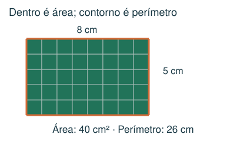
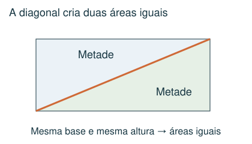
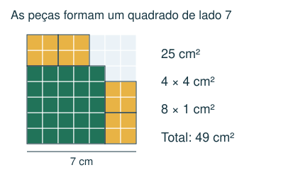
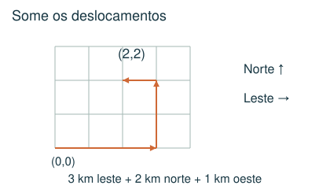

# Geometria plana e localização

Comparar áreas, interpretar malhas e acompanhar deslocamentos.

## Observe e compreenda 1

### Área e perímetro
Perímetro é o comprimento do contorno; área é a medida da superfície. Retângulo: área = base × altura, perímetro = 2 × (base + altura). Quadrado de lado l: área = l × l e perímetro = 4l. Se a área é 49 cm², o lado é 7 cm, porque 7 × 7 = 49.

### Decomposição e equivalência
Uma região pode ser cortada e rearranjada sem mudar sua área. Numa malha, conte quadrados inteiros e junte partes iguais. Um triângulo ocupa metade de um retângulo com mesma base e altura. Uma diagonal divide um retângulo em duas áreas iguais.

### Área que sobra
Se um quadrado é preenchido sem sobreposições nem espaços por peças de áreas conhecidas, some as áreas para descobrir a área total. A área de uma reserva dentro de um triângulo pode ser encontrada subtraindo as áreas conhecidas daquela metade do retângulo. 1 hectare = 10.000 m².

## Observe e compreenda 2

### Coordenadas e orientação
No par (x, y), leia primeiro o deslocamento horizontal, depois o vertical. Use leste para a direita, oeste para a esquerda, norte para cima e sul para baixo. Some deslocamentos opostos com sinais contrários. Distância percorrida pode ser maior que o deslocamento entre início e fim.

### Mesma distância de vários pontos
Pontos equidistantes das extremidades de um segmento ficam em sua mediatriz: reta perpendicular que passa pelo meio. Em uma questão com alternativas numa malha, use simetria e compare deslocamentos. Para aprofundamento, o quadrado da distância é (diferença horizontal)² + (diferença vertical)²; comparar esses quadrados evita calcular raízes.

## Exemplo 1: Peças num quadrado
Um quadrado maior foi coberto por uma peça de área 25 cm², quatro de 4 cm² e oito de 1 cm². Qual seu lado?

Área total: 25 + 16 + 8 = 49 cm². O lado mede 7 cm.

## Exemplo 2: Orientação
Saindo de (0,0), uma pessoa anda 3 km para leste, 2 para norte e 1 para oeste. Onde termina?

Horizontal: 3 − 1 = 2. Vertical: 2. Termina em (2,2), isto é, 2 km a leste e 2 km ao norte da origem. Andou 6 km ao todo.

## Fique atento
- Confundir área em cm² com lado em cm.
- Contar quadradinhos pela aparência sem verificar partes fracionadas.
- Trocar a ordem de x e y ou distância percorrida por deslocamento.

## Atividades
### 1. Um quadrado foi preenchido sem lacunas nem sobreposições por uma peça de 16 cm², cinco de 4 cm² e treze de 1 cm². Quanto mede seu lado?
A) 8 cm
B) 7 cm
C) 49 cm
D) 14 cm

### 2. Um retângulo mede 8 cm por 5 cm. Qual é seu perímetro?
A) 26 cm
B) 40 cm
C) 13 cm
D) 80 cm

### 3. Uma diagonal divide um terreno retangular em duas partes. Em uma delas há uma reserva e dois lotes de 8 e 12 hectares. A outra metade tem 30 hectares. Qual é a área da reserva?
A) 20 hectares
B) 30 hectares
C) 40 hectares
D) 10 hectares

### 4. Saindo da origem, Lia anda 2 km para norte, 3 km para oeste e 5 km para sul. Em que posição termina? Considere leste e norte positivos.
A) (−3, 7) km
B) (−5, 2) km
C) (−3, −3) km
D) (3, −3) km

### 5. As antenas A, B e C estão em (0,0), (6,0) e (3,3). Qual ponto está à mesma distância das três?
A) (6,3)
B) (3,0)
C) (3,1)
D) (0,3)

## Gabarito comentado
1. B) 7 cm. Área: 16 + 5 × 4 + 13 = 49 cm². Como 7 × 7 = 49, o lado mede 7 cm.

2. A) 26 cm. Some os quatro lados: 8 + 5 + 8 + 5 = 26 cm. 40 cm² seria a área.

3. D) 10 hectares. A diagonal divide o retângulo em duas áreas iguais. Reserva + 8 + 12 = 30; reserva = 10 hectares.

4. C) (−3, −3) km. Horizontal: 3 km a oeste, x = −3. Vertical: 2 − 5 = −3. Posição (−3, −3).

5. B) (3,0). Do ponto (3,0), A fica 3 unidades à esquerda, B 3 à direita e C 3 acima. Todas as distâncias são 3.
