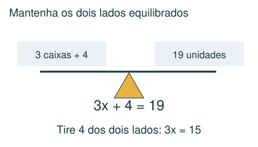
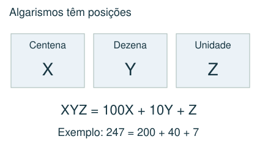
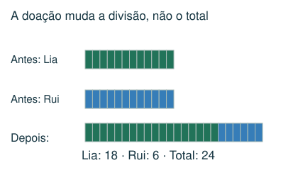
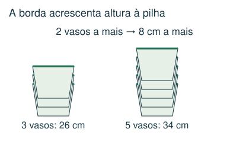

# Relações e valores desconhecidos

Usar desenhos, tentativas organizadas e igualdades.

## Observe e compreenda 1

### Uma letra representa uma quantidade
Se uma quantidade é desconhecida, chame-a de x ou desenhe uma caixa. “O triplo de um número mais 4 é 19” vira 3x + 4 = 19. Desfaça as operações na ordem inversa: subtraia 4 e divida por 3. Também é possível usar barras de tamanhos iguais.

### Conservação e transferência
Se duas pessoas têm x objetos e uma doa 6 à outra, ficam com x − 6 e x + 6. O total continua 2x. Se a segunda passa a ter o triplo da primeira, escreva x + 6 = 3(x − 6). Não confunda “o triplo” com “três a mais”.

### Diferenças que permanecem
A diferença entre as idades de duas pessoas não muda com o tempo. Se a diferença é 20 e a pessoa mais velha tem o dobro da idade da mais nova, esta tem 20 e aquela 40. Em problemas com irmãos, cada pessoa não conta a si mesma: com h meninos e m meninas, um menino tem h − 1 irmãos.

## Observe e compreenda 2

### Pilhas e comparação de pacotes
Um vaso sozinho tem altura H; cada vaso encaixado acrescenta b. Uma pilha de n vasos tem H + (n − 1)b. Subtraia as alturas de duas pilhas para descobrir b. Em pacotes de doces, subtraia duas ofertas para eliminar itens iguais; depois encontre o preço de cada tipo.

### Criptoaritmética
Na soma ou multiplicação com letras, cada letra representa um algarismo. Use valor posicional, contas por coluna e os “vai um”. O primeiro algarismo de um número não pode ser zero. Letras diferentes só precisam ter valores distintos se isso for exigido. Teste a solução na conta original.

## Exemplo 1: Biscoitos
Lia e Rui têm a mesma quantidade. Rui doa 6 a Lia, que fica com o triplo de Rui. Quanto cada um tinha?

x + 6 = 3(x − 6). Então x + 6 = 3x − 18; 24 = 2x; x = 12. Depois da doação: 18 e 6.

## Exemplo 2: Vasos encaixados
Uma pilha de 3 vasos mede 26 cm e uma de 5 vasos mede 34 cm. Qual a altura de um vaso?

Dois vasos extras acrescentam 8 cm, então cada borda acrescenta 4 cm. H + 2 × 4 = 26; H = 18 cm.

## Fique atento
- Contar a própria pessoa como irmão ou irmã.
- Achar que cada vaso acrescenta sua altura inteira à pilha.
- Encontrar valores que não conferem na relação inicial.

## Atividades
### 1. Duas pessoas têm a mesma quantidade de figurinhas. Uma doa 8 à outra, que passa a ter o triplo da quantidade da primeira. Quantas cada pessoa tinha antes?
A) 16
B) 8
C) 24
D) 32

### 2. Um pai é 24 anos mais velho que a filha. Qual será a idade do pai quando ele tiver o dobro da idade dela?
A) 36 anos
B) 24 anos
C) 72 anos
D) 48 anos

### 3. Uma pilha de 3 vasos encaixados mede 30 cm e uma de 7 vasos mede 46 cm. Os vasos são idênticos e cada novo vaso acrescenta a mesma altura. Quanto mede um vaso sozinho?
A) 10 cm
B) 26 cm
C) 22 cm
D) 4 cm

### 4. Uma eleição teve 44 votos, todos válidos, para três candidatos. O último recebeu 4 votos; o vencedor recebeu o triplo dos votos do segundo. Quantos votos teve o vencedor?
A) 40
B) 30
C) 33
D) 10

### 5. Um casal tem meninos e meninas. Cada menino tem tantos irmãos quanto irmãs. Cada menina tem o dobro de irmãos em relação às irmãs. Quantos filhos o casal tem ao todo?
A) 7
B) 5
C) 6
D) 8

## Gabarito comentado
1. A) 16. Se cada uma tinha x, ficam x − 8 e x + 8. x + 8 = 3x − 24; 32 = 2x; x = 16.

2. D) 48 anos. Se a filha tem x, o pai tem x + 24. Na ocasião, x + 24 = 2x, então x = 24 e o pai tem 48.

3. C) 22 cm. Quatro vasos extras acrescentam 16 cm: cada um acrescenta 4 cm. H + 2 × 4 = 30; H = 22.

4. B) 30. Restam 40 votos para primeiro e segundo. São 4 partes iguais: 3 do primeiro e 1 do segundo. Cada parte vale 10; vencedor: 30.

5. A) 7. Com h meninos e m meninas: h − 1 = m e h = 2(m − 1). Resulta m = 3 e h = 4. Total 7.
