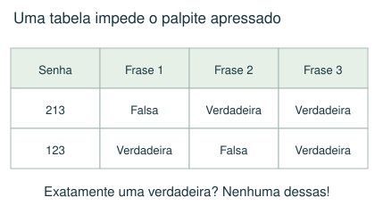
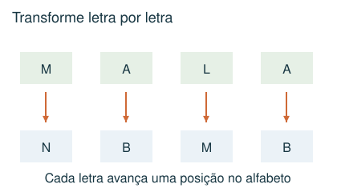
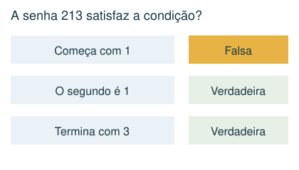
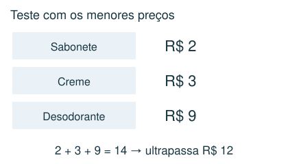

# Lógica, códigos e restrições

Eliminar possibilidades e justificar a escolha.

## Observe e compreenda 1

### Traduza cada pista
Faça uma lista curta de condições. “Exatamente uma” não significa “pelo menos uma”. Para cada candidato, marque verdadeiro ou falso em cada pista; elimine aquele que descumprir qualquer condição obrigatória. Em senhas, separe “algarismo presente” de “posição correta”.

### Organize sem adivinhar
Use tabela de possibilidades, uma linha por candidato. Comece pelas pistas que proíbem mais opções. Depois de achar uma resposta, volte a todas as pistas. Uma solução que funciona pode não ser a única; continue verificando se a pergunta exigir unicidade.

### Posições, blocos e vizinhança
Se três vogais precisam ficar juntas numa ordem fixa, trate-as primeiro como um bloco. Depois posicione as demais letras. Em mapas, regiões que compartilham uma fronteira não podem repetir a cor quando essa é a regra; um ponto de encontro isolado não é necessariamente uma fronteira. Em torneios, equipes que aparecem juntas no palpite de vencedores de jogos simultâneos não podem ter se enfrentado nessa rodada.

## Observe e compreenda 2

### Códigos e equivalências
Substitua símbolos por valores usando uma tabela. Em códigos de letras, teste avanço e recuo no alfabeto e a posição da letra na palavra. Uma equivalência deve preservar a sequência inteira, não apenas o conjunto de símbolos. Em códigos com datas, respeite meses de 01 a 12 e os dias válidos de cada mês.

### Orçamento e combinação de volumes
Quando uma compra precisa custar menos de um limite, teste o item suspeito com os menores preços dos outros produtos. Se até essa soma ultrapassa o limite, o item é impossível. Para xícaras ou recipientes, use somas das capacidades e restrições sobre quantos recipientes contêm cada líquido.

## Exemplo 1: Uma única afirmação verdadeira
Uma senha usa 1, 2 e 3, uma vez cada. As frases são: “começa com 1”; “o segundo algarismo é 1”; “termina com 3”. A senha 213 é permitida se exatamente uma frase deve ser verdadeira?

Não. A primeira frase é falsa, mas a segunda e a terceira são verdadeiras. Duas frases verdadeiras violam a regra.

## Exemplo 2: Uma compra possível
Sabonetes custam R$ 2 ou R$ 4; cremes R$ 3 ou R$ 5; desodorantes R$ 6 ou R$ 9. Para comprar um de cada com até R$ 12, qual desodorante é obrigatório?

O de R$ 6. Mesmo com os outros itens mais baratos, o de R$ 9 levaria a 2 + 3 + 9 = R$ 14. Com o de R$ 6 há compra de R$ 11.

## Fique atento
- Aceitar uma resposta que satisfaz só parte das pistas.
- Trocar “menos de” por “no máximo”.
- Interpretar igualdade de símbolos como liberdade para trocar a ordem.

## Atividades
### 1. A senha usa 2, 3 e 5, uma vez cada. Exatamente uma frase é verdadeira: “o primeiro algarismo é 2”; “o segundo não é 2”; “o terceiro não é 5”. Qual das senhas abaixo serve?
A) 235
B) 253
C) 352
D) 523

### 2. Num código, cada letra é substituída pela seguinte no alfabeto, sem acentos. Como fica a palavra MALA?
A) NBNB
B) MBLA
C) NBMB
D) LZKZ

### 3. A senha tem 3 algarismos distintos e não começa com zero. Pistas: nenhum de 4, 2, 9 aparece; em 479 há exatamente um algarismo da senha, fora de posição; em 756 há exatamente um, na posição correta; em 543 há exatamente um, fora de posição; em 268 há exatamente um, na posição correta. Qual senha atende a tudo?
A) 736
B) 738
C) 783
D) 358

### 4. Um produto A custa R$ 2 ou R$ 4; B custa R$ 3 ou R$ 5; C custa R$ 6 ou R$ 9. Você compra um de cada e gasta menos de R$ 12. O que é obrigatório?
A) Escolher C de R$ 6
B) Escolher A de R$ 4
C) Escolher B de R$ 5
D) Gastar exatamente R$ 12

### 5. Use dia e mês com dois algarismos. A soma dos quatro algarismos de uma data é 20. Em qual mês essa data pode ocorrer?
A) Agosto
B) Novembro
C) Dezembro
D) Setembro

## Gabarito comentado
1. D) 523. Em 523: a primeira é falsa, a segunda é falsa e a terceira é verdadeira. As outras opções têm duas ou três frases verdadeiras.

2. C) NBMB. M vira N, A vira B, L vira M, A vira B. Resultado NBMB.

3. B) 738. 4,2,9 são excluídos; 7 está na senha, mas não no meio. Em 756, 7 ocupa corretamente o início e 5,6 são excluídos. De 543 sobra 3 fora da última posição; de 268 sobra 8 no fim. Logo 738.

4. A) Escolher C de R$ 6. Com C de R$ 9, até a combinação mais barata custa 2 + 3 + 9 = 14. Com C de R$ 6, a combinação 2 + 3 + 6 = 11 é possível.

5. D) Setembro. A maior soma dos algarismos de um dia válido é 11, no dia 29. O mês precisa somar pelo menos 9; entre 01 e 12, só 09 chega a 9. A data 29/09 soma 20.
