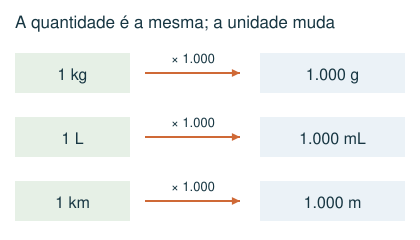
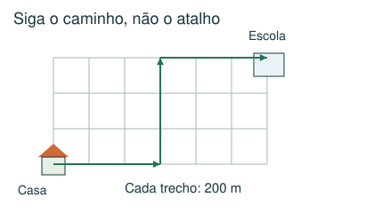
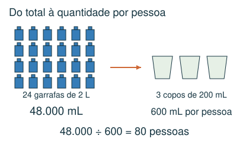
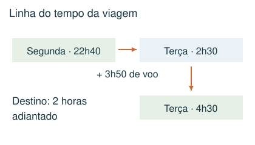

# Medidas, escalas e tempo

Converter unidades, interpretar trajetos e atravessar a meia-noite.

## Observe e compreenda 1

### Comprimento, massa e capacidade
1 km = 1.000 m; 1 m = 100 cm; 1 kg = 1.000 g; 1 L = 1.000 mL. Passe tudo para uma unidade comum antes de somar ou comparar. Para converter 2,5 L em mL, multiplique por 1.000: 2.500 mL. Para passar 750 g a kg, divida por 1.000: 0,75 kg.

### Receitas e quantidades por pessoa
Calcule separadamente o total disponível e o consumo de cada pessoa. Divida o total pelo consumo individual. Em receitas, sobra = comprado − utilizado, ingrediente por ingrediente. Some as sobras apenas depois de converter as massas.

## Observe e compreenda 2

### Escalas e trajetos
Se 1 cm no desenho representa 200 m reais, um caminho de 7 cm representa 1.400 m. Meça o caminho indicado, não uma linha reta que não faz parte do trajeto. Ida e volta multiplicam por 2; vários dias exigem outra multiplicação.

### Relógios, duração e fuso
1 hora tem 60 minutos e 1 dia tem 24 horas. Faça uma linha do tempo com partidas, esperas e viagens. Primeiro some a duração no horário de origem; depois aplique a diferença de fuso. Destino adiantado: some. Atrasado: subtraia. A mudança de data faz parte da resposta.

## Exemplo 1: Bebida para uma festa
Foram consumidas 24 garrafas de 2 L. Cada pessoa bebeu 3 copos de 200 mL. Quantas pessoas foram atendidas?

Total: 48 L = 48.000 mL. Por pessoa: 600 mL. Pessoas: 48.000 ÷ 600 = 80.

## Exemplo 2: Chegada no dia seguinte
Um voo parte às 22h40 de segunda-feira, dura 3h50 e chega a uma cidade 2 horas adiantada.

No horário de origem, chega às 2h30 de terça. No destino são 4h30 de terça-feira.

## Fique atento
- Misturar litros com mililitros ou quilogramas com gramas.
- Tratar 1h30 como 1,30 hora; ela corresponde a 1,5 hora.
- Aplicar o fuso duas vezes ou esquecer a data.

## Atividades
### 1. Uma receita usa 750 g de farinha de um pacote de 2 kg. Quantos gramas sobram?
A) 250 g
B) 1.250 g
C) 1.750 g
D) 1,25 g

### 2. Foram consumidas 18 garrafas de 2 L de suco. Cada pessoa bebeu exatamente 3 copos de 200 mL. Quantas pessoas beberam suco?
A) 60
B) 30
C) 90
D) 120

### 3. Num mapa, 1 cm representa 250 m. O trajeto de casa até a escola mede 6 cm no mapa. Qual a distância de ida e volta percorrida em 4 dias?
A) 6 km
B) 1,5 km
C) 24 km
D) 12 km

### 4. Um voo parte às 23h20 de segunda-feira e dura 2h50. O destino está 3 horas adiantado em relação à origem. Qual é a hora local da chegada?
A) 23h10 de segunda-feira
B) 6h10 de terça-feira
C) 5h10 de terça-feira
D) 3h10 de terça-feira

### 5. Uma viagem começa às 8h45. São 1h35 de ônibus, 25 minutos de espera e 50 minutos de trem, sem mudança de fuso. A que horas termina?
A) 12h15
B) 11h35
C) 10h55
D) 11h05

## Gabarito comentado
1. B) 1.250 g. 2 kg = 2.000 g. Sobra: 2.000 − 750 = 1.250 g.

2. A) 60. Total: 36 L = 36.000 mL. Cada pessoa: 600 mL. 36.000 ÷ 600 = 60.

3. D) 12 km. Uma ida mede 6 × 250 = 1.500 m. Em 4 dias, são 8 trajetos: 12.000 m = 12 km.

4. C) 5h10 de terça-feira. No horário de origem: 23h20 + 2h50 = 2h10 de terça. Somando 3 h de fuso: 5h10 de terça.

5. B) 11h35. 8h45 + 1h35 = 10h20. Espera: 10h45. Trem: 11h35.
