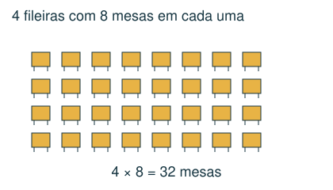
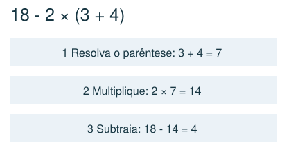
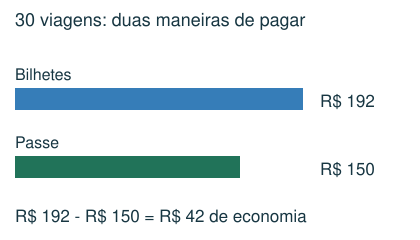
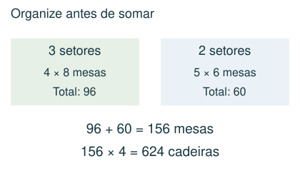

# Operações e dinheiro

Escolher operações, respeitar sua ordem e comparar custos.

## Observe e compreenda 1

### Traduza a situação antes de calcular
Adição reúne quantidades; subtração compara ou encontra o que sobra; multiplicação reúne grupos iguais; divisão reparte igualmente ou conta quantos grupos cabem. Escreva o que cada resultado representa. Para vários setores, calcule cada tipo de setor e só depois some.

### A ordem das operações
Resolva parênteses, depois potências, depois multiplicações e divisões da esquerda para a direita, e por fim adições e subtrações. Em 2 + 3 × 4, o resultado é 14, não 20. Inserir sinais para maximizar uma expressão exige considerar essa ordem; multiplicar por 1 não aumenta o número.

## Observe e compreenda 2

### Dinheiro e escolhas econômicas
Use reais e centavos na mesma unidade: R$ 4,50 = 450 centavos. Custo total = custo por item × quantidade + taxas fixas. Economia = custo da opção mais cara − custo da mais barata. Compare o custo total, não apenas uma parcela.

### Operações em cadeia e estimativa
Quando uma caixa contém 12 pacotes e cada pacote contém 8 peças, são 12 × 8 peças. Dados extras podem não ser necessários. Em calculadoras especiais, registre o visor depois de cada tecla; a ordem muda a resposta. Faça uma estimativa antes e use a operação inversa para conferir.

## Exemplo 1: Custo de uma excursão
Um ônibus cobra R$ 6,40 por viagem. Um estudante faz 2 viagens por dia durante 15 dias. Um passe custa R$ 150. Qual a economia?

São 2 × 15 = 30 viagens. Bilhetes: 30 × 6,40 = R$ 192. Economia: 192 − 150 = R$ 42.

## Exemplo 2: Montagem de um salão
Há 3 setores com 4 fileiras de 8 mesas e 2 setores com 5 fileiras de 6 mesas. Cada mesa usa 4 cadeiras.

Mesas: 3 × 4 × 8 + 2 × 5 × 6 = 96 + 60 = 156. Cadeiras: 156 × 4 = 624.

## Fique atento
- Somar antes de multiplicar sem que haja parênteses.
- Esquecer o trajeto de volta, uma taxa ou um dos setores.
- Confundir economia com custo total.

## Atividades
### 1. Um salão tem 4 fileiras com 9 mesas cada. Cada mesa precisa de 6 cadeiras. Quantas cadeiras serão usadas?
A) 144
B) 240
C) 216
D) 54

### 2. Uma passagem custa R$ 3,20. Bia faz 2 viagens por dia durante 20 dias. Um passe para todas essas viagens custa R$ 110. Qual é a economia ao comprar o passe?
A) R$ 128,00
B) R$ 18,00
C) R$ 46,00
D) R$ 64,00

### 3. Qual é o valor de 18 − 2 × (3 + 4)?
A) 4
B) 112
C) −28
D) 16

### 4. Uma calculadora tem as teclas M (multiplica por 3), S (soma 4) e Q (eleva ao quadrado). Começando em 2, qual valor aparece após S, M, Q, nessa ordem?
A) 100
B) 40
C) 108
D) 324

### 5. Sem acrescentar parênteses, substitua cada □ por + ou × em 2 □ 3 □ 1 □ 4. Qual é o maior resultado possível?
A) 20
B) 36
C) 24
D) 28

## Gabarito comentado
1. C) 216. São 4 × 9 = 36 mesas. Cada uma usa 6 cadeiras: 36 × 6 = 216.

2. B) R$ 18,00. São 40 viagens. Bilhetes: 40 × 3,20 = R$ 128. Economia: 128 − 110 = R$ 18.

3. A) 4. Primeiro os parênteses: 3 + 4 = 7. Depois 2 × 7 = 14. Por fim 18 − 14 = 4.

4. D) 324. 2 → S → 6 → M → 18 → Q → 18 × 18 = 324.

5. C) 24. Usando × em todos os espaços, temos 24. As outras combinações resultam em 9, 10, 11 ou 14. A ordem usual das operações deve ser mantida.
