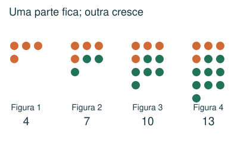
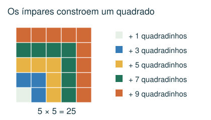
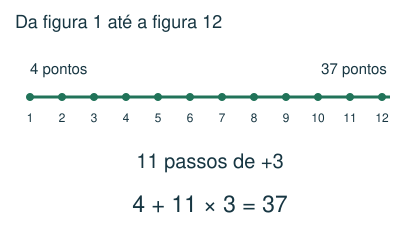
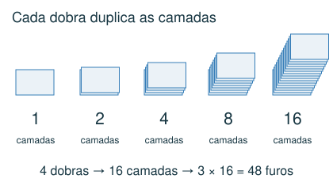

# Sequências, padrões e potências

Descrever uma regra e prever termos distantes.

## Observe e compreenda 1

### Monte uma tabela
Escreva posição e quantidade nas primeiras figuras. Procure diferenças constantes, grupos que se repetem ou uma multiplicação fixa. Em 5, 9, 13, 17, cada termo cresce 4. O termo de posição n é 5 + 4 × (n − 1).

### Crescimento não é total acumulado
Se a fila n tem 2n − 1 peças, a décima fila tem 19 peças. Mas as dez filas juntas têm 1 + 3 + ... + 19 = 100. Em desenhos, separe o que permanece fixo do que é acrescentado em cada etapa.

### Operações inventadas e códigos
Um símbolo novo pode representar uma regra própria. Se a regra é a # b = (a + 1) × b, então 3 # 7 = 28. Confira a regra em todos os exemplos. Poucos exemplos podem admitir várias regras: em exercícios escolares, procure a regra simples coerente com todos eles, sem tratá-la como prova de unicidade.

## Observe e compreenda 2

### Potências e dobraduras
a elevado a n representa n fatores iguais a a. Cada dobra ao meio duplica as camadas. Após k dobras, são 2 elevado a k camadas. Se f furos atravessam todas as camadas, longe das bordas e sem sobreposição ao abrir, haverá f × 2 elevado a k furos.

### Padrões de algarismos
Faça contas menores, observe repetições e confira mais um caso. Soma dos algarismos não é soma dos números da sequência. Em padrões de quadrados, observe separadamente quantos algarismos de cada tipo surgem.

## Exemplo 1: Figura distante
Uma figura tem 4 pontos; cada figura seguinte acrescenta 3. Quantos pontos tem a figura 12?

Há 11 acréscimos entre a primeira e a décima segunda: 4 + 11 × 3 = 37.

## Exemplo 2: Camadas
Uma folha é dobrada ao meio 4 vezes. Fazem-se 3 furos separados que atravessam todas as camadas, fora das dobras.

São 2 × 2 × 2 × 2 = 16 camadas. Ao abrir: 3 × 16 = 48 furos.

## Fique atento
- Multiplicar o acréscimo por n em vez de n − 1.
- Confundir a quantidade na última fila com a soma das filas.
- Generalizar um padrão sem testar todos os exemplos fornecidos.

## Atividades
### 1. Uma sequência começa em 7 e aumenta 4 a cada termo: 7, 11, 15... Qual é o décimo termo?
A) 47
B) 44
C) 43
D) 40

### 2. Um desenho tem 8 filas. Da primeira à oitava, elas contêm 1, 3, 5, 7... azulejos pretos. Quantos azulejos pretos há no desenho inteiro?
A) 72
B) 64
C) 15
D) 56

### 3. Define-se a operação a # b = (a + 1) × b. Qual é o valor de 4 # 9?
A) 45
B) 36
C) 40
D) 49

### 4. Uma folha é dobrada ao meio 3 vezes. Fazem-se 5 furos distintos que atravessam todas as camadas, longe das dobras e das bordas, sem coincidirem ao abrir. Quantos furos aparecem na folha aberta?
A) 15
B) 30
C) 80
D) 40

### 5. Observe: 5² = 25; 35² = 1225; 335² = 112225. Calculando 3335², qual é a soma de seus algarismos?
A) 17
B) 20
C) 16
D) 14

## Gabarito comentado
1. C) 43. Do primeiro ao décimo há 9 aumentos: 7 + 9 × 4 = 43.

2. B) 64. Some os 8 primeiros ímpares: 1 + 3 + 5 + 7 + 9 + 11 + 13 + 15 = 64.

3. A) 45. Substitua: (4 + 1) × 9 = 5 × 9 = 45.

4. D) 40. Três dobras formam 2 × 2 × 2 = 8 camadas. 5 × 8 = 40 furos.

5. C) 16. 3335² = 11.122.225. Soma: 1 + 1 + 1 + 2 + 2 + 2 + 2 + 5 = 16.
