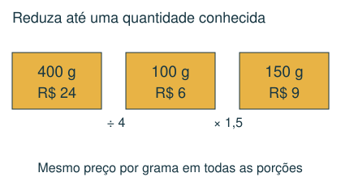
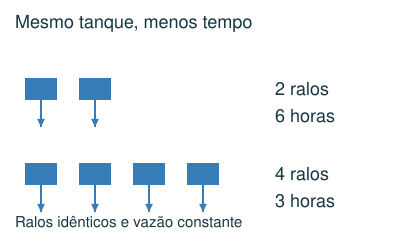
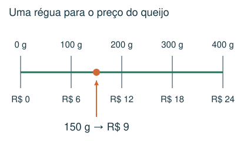
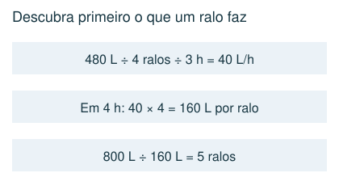

# Proporcionalidade e taxas

Relacionar preço, consumo, vazão e quantidade.

## Observe e compreenda 1

### Grandezas diretamente proporcionais
Se dobrar a quantidade dobra o custo, mantendo o preço por unidade, há proporcionalidade direta. Descubra primeiro o valor de uma unidade. Exemplo: 300 g custam R$ 12; 100 g custam R$ 4; 500 g custam R$ 20.

### Consumo e taxas
Se um carro faz 15 km por litro, litros necessários = distância ÷ 15. Se a informação é litros por 100 km, calcule quantos grupos de 100 km existem. A unidade esclarece qual operação usar. Pedágios são custos adicionais, não combustível.

## Observe e compreenda 2

### Trabalho conjunto e relação inversa
Com a mesma quantidade de água, mais ralos idênticos reduzem o tempo. Calcule a vazão de um ralo: volume ÷ número de ralos ÷ tempo. Depois, número de ralos = novo volume ÷ tempo desejado ÷ vazão de um ralo. Isso pressupõe vazão constante e ralos funcionando juntos.

### O que não é proporcional
Uma taxa fixa somada ao preço por unidade quebra a proporcionalidade do custo total: dobrar a compra não dobra a taxa. Em pilhas de vasos encaixados, a altura inicial também é diferente do acréscimo de cada vaso; esse caso pertence ao estudo de relações e incógnitas.

## Exemplo 1: Preço por massa
400 g de queijo custam R$ 24. Quanto custam 150 g?

Preço de 1 g: 24 ÷ 400 = R$ 0,06. Preço de 150 g: 150 × 0,06 = R$ 9.

## Exemplo 2: Reservatórios
4 ralos esvaziam 480 L em 3 h. Quantos ralos iguais esvaziam 800 L em 4 h?

Cada ralo retira 480 ÷ 4 ÷ 3 = 40 L/h. Em 4 h, um retira 160 L. São necessários 800 ÷ 160 = 5 ralos.

## Fique atento
- Inverter km/L com L/km.
- Aplicar regra de três sem analisar o significado dos números.
- Supor que mais ralos exigem mais tempo para o mesmo volume.

## Atividades
### 1. 500 g de queijo custam R$ 30. Mantendo o preço por grama, quanto custam 150 g?
A) R$ 4,50
B) R$ 15,00
C) R$ 10,00
D) R$ 9,00

### 2. Um carro percorre 12 km por litro. Uma viagem tem 180 km e o litro custa R$ 6. Há dois pedágios de R$ 7. Qual é o gasto total?
A) R$ 97,00
B) R$ 118,00
C) R$ 104,00
D) R$ 90,00

### 3. 3 ralos iguais esvaziam 360 L em 4 horas. Quantos desses ralos esvaziam 600 L em 5 horas, com vazão constante?
A) 6
B) 4
C) 3
D) 5

### 4. Um veículo usa 20 L a cada 100 km. Uma viagem de 500 km consome exatamente 2,5 tanques. Qual é a capacidade do tanque?
A) 40 L
B) 50 L
C) 100 L
D) 25 L

### 5. Uma loja cobra R$ 8 por caderno mais uma taxa fixa de entrega de R$ 6 por pedido. Um pedido com 3 cadernos custa R$ 30. Quanto custa um pedido com 6 cadernos?
A) R$ 60,00
B) R$ 48,00
C) R$ 66,00
D) R$ 54,00

## Gabarito comentado
1. D) R$ 9,00. Cada 100 g custa R$ 6. Logo, 150 g custam R$ 9.

2. C) R$ 104,00. Combustível: 180 ÷ 12 = 15 L; custo R$ 90. Pedágios: R$ 14. Total R$ 104.

3. B) 4. Um ralo retira 360 ÷ 3 ÷ 4 = 30 L/h. Em 5 h retira 150 L. 600 ÷ 150 = 4 ralos.

4. A) 40 L. A viagem consome 5 × 20 = 100 L. Um tanque contém 100 ÷ 2,5 = 40 L.

5. D) R$ 54,00. São 6 × 8 + 6 = 54 reais. Dobrar o número de cadernos não dobra a taxa fixa.
